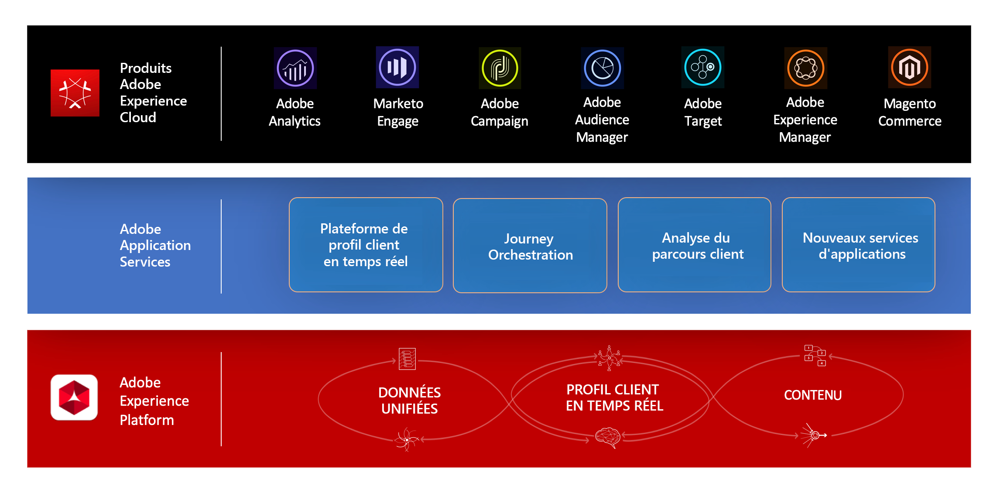

# À propos de [!DNL Journey Orchestration]{#concept_nd3_mqt_52b}

Créez des cas d’utilisation d’orchestration en temps réel à l’aide de données contextuelles stockées dans des événements ou des sources de données.

[!DNL Journey Orchestration] est un service d’applications intégré au Adobe Experience Platform.

[!DNL Journey Orchestration] permet une orchestration en temps réel et s’appuie sur les données contextuelles issues d’événements, les informations provenant d’Adobe Experience Platform ou les données issues de services d’API tiers. Vous pouvez configurer une action personnalisée si vous utilisez un système tiers pour envoyer vos messages. Si vous disposez d’Adobe Campaign Standard, vous pourrez envoyer des emails, des notifications push et des SMS à l’aide des [fonctionnalités de messagerie transactionnelle](https://docs.adobe.com/content/help/fr-FR/campaign-standard/using/communication-channels/transactional-messaging/about-transactional-messaging.html) de cette plate-forme.

L’onglet de configuration des événements permet à un **utilisateur technique** de configurer les événements prévus dans les parcours. Les données des événements entrants sont normalisées conformément au modèle de données Adobe Experience (XDM). Les événements authentifiés et non authentifiés proviennent des API d’ingestion en flux continu (notamment ceux issus du kit de développement Adobe Mobile SDK).

Dans l’onglet de configuration des sources de données, un **utilisateur technique** configure les éléments suivants :

* Les différents champs accessibles à partir d’Adobe Experience Platform dans le concepteur de parcours pour créer et personnaliser des conditions.
* Les sources de données personnalisées supplémentaires exploitées dans le concepteur de parcours. Les sources de données personnalisées sont des connexions entre [!DNL Journey Orchestration] et des systèmes ou des services tiers via l’API. Vous pouvez connecter un système tiers, par exemple un système de gestion de la fidélité. Vous pouvez aussi accéder à un service tiers, par exemple une API météorologique.

Avec le concepteur de parcours, un **utilisateur chargé de la conception de parcours** peut facilement faire glisser un événement d’entrée, ajouter des conditions et spécifier l’action à exécuter.

Il est ensuite possible de créer des conditions basées sur :

* le temps ;
* des données provenant de la payload de l’événement ;
* des informations provenant de sources de données : profil client en temps réel ou sources personnalisées.

Vous pouvez utiliser la condition de répartition pour orienter les personnes engagées dans le parcours vers différentes directions.

Les activités d’action vous permettent ensuite d’envoyer un message via un système tiers. Si vous disposez d’Adobe Campaign Standard, il est possible d’envoyer en temps réel des SMS personnalisés, des notifications push ou des emails.

[!DNL Journey Orchestration] comportant plusieurs étapes, vous pouvez créer des scénarios avancés. Par exemple, après une action et un événement initiaux, vous pouvez placer d’autres événements à l’aide de la souris. Vous pouvez ensuite ajouter une deuxième action, placer une activité d’attente pendant une certaine durée, ajouter une condition de division pour orienter les personnes vers deux chemins différents, puis envoyer des messages distincts.

>[!NOTE]
>
>Cette documentation est fréquemment mise à jour pour prendre en compte les modifications récentes du produit. Cependant, certaines captures d’écran peuvent être légèrement différentes de l’interface du produit.
