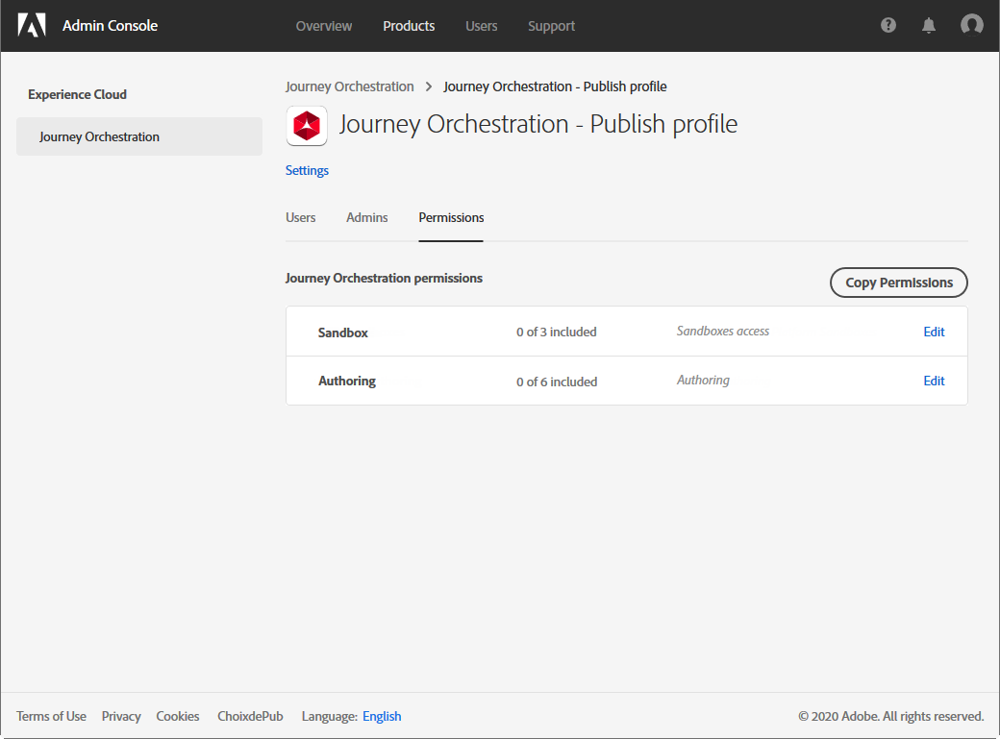

# Gestion des accès{#concept_rfj_wpt_52b}

## Gestion des accès {#about-access-management}

[!DNL Journey Orchestration] permet d’affecter un ensemble d’autorisations aux utilisateurs afin de définir la partie de l’interface à laquelle ils ont accès.

Ils peuvent être gérés par des administrateurs qui ont accès à Admin Console. Pour plus d’informations sur Admin Console, consultez cette [documentation](https://helpx.adobe.com/fr/enterprise/managing/user-guide.html).

Pour pouvoir accéder à [!DNL Journey Orchestration], un utilisateur doit :

* faire partie d’un [!DNL Journey Orchestration] **[!UICONTROL profil de produit]** associé aux autorisations de [!DNL Journey Orchestration] ;
* faire partie d’un [!DNL Adobe Experience Platform] **[!UICONTROL profil de produit]**. Il n’y a pas d’autorisation obligatoire à posséder. L’utilisateur doit disposer de l’autorisation de **[!UICONTROL gestion des profils]** pour pouvoir créer et modifier des segments de plateforme à partir de l’interface de [!DNL Journey Orchestration]. Pour plus d&#39;informations à ce sujet, consultez cette [page](https://docs.adobe.com/content/help/fr-FR/experience-platform/access-control/home.html#adobe-admin-console).

Admin console permet d’attribuer aux utilisateurs l’un des profils de produit d’usine suivants :

* **[!UICONTROL Utilisateur à accès limité]** : utilisateur disposant d’un accès en lecture seule aux parcours et aux rapports. Ce profil de produit comprend les autorisations suivantes :
   * Lire les parcours
   * Lire les rapports

* **[!UICONTROL Administrateur]** : utilisateur ayant accès aux menus d’administration avec la possibilité de gérer les parcours, les événements et les rapports. Ce profil de produit comprend les autorisations suivantes :
   * Gérer les parcours
   * Publier les parcours
   * Gérer les événements, les sources de données et les actions
   * Gérer les rapports

   >[!NOTE]
   >
   >Les **[!UICONTROL administrateurs]** sont le seul profil de produit qui permet la création, l’édition et la publication de messages transactionnels (ou de modèles de message) dans Adobe Campaign Standard. Ce profil de produit est nécessaire si vous utilisez Adobe Campaign Standard pour envoyer des messages dans vos parcours.

* **[!UICONTROL Utilisateur standard]** : utilisateur disposant d’un accès de base, tel que la gestion des parcours. Ce profil de produit comprend les autorisations suivantes :
   * Gérer les parcours
   * Publier les parcours
   * Gérer les rapports

Vous pouvez également créer vos propres profils de produit si les profils d’usine ne suffisent pas pour gérer vos utilisateurs.
Les utilisateurs doivent toujours être liés à un profil de produit, ce qui vous permet de leur attribuer des autorisations intégrées spécifiques, telles que :

* **[!UICONTROL Lire les parcours]**
* **[!UICONTROL Lire les rapports]**
* **[!UICONTROL Gérer les événements, les sources de données et les actions]**
* **[!UICONTROL Lire les événements, les sources de données et les actions]**
* **[!UICONTROL Gérer les parcours]**
* **[!UICONTROL Publier les parcours]**
* **[!UICONTROL Gérer les rapports]**

Vous trouverez ci-dessous des informations relatives à la compatibilité entre les droits et les différentes fonctionnalités de [!DNL Journey Orchestration].

## Création d’un profil de produit {#create-product-profile}

[!DNL Journey Orchestration] vous permet de créer vos propres profils de produit et d’attribuer un ensemble de droits et d’environnements Sandbox à vos utilisateurs. Avec les profils de produit, vous pouvez autoriser ou refuser l’accès à certaines fonctionnalités ou à certains objets de l’interface.

Pour plus d’informations sur la création et la gestion des environnements Sandbox, voir la [documentation d’Adobe Experience Platform](https://docs.adobe.com/content/help/fr-FR/experience-platform/sandbox/ui/user-guide.html).

Pour créer un profil de produit et attribuer un ensemble d’autorisations et d’environnements Sandbox :

1. Sélectionnez **[!UICONTROL Journey Orchestration]** dans Admin console. Dans l’onglet **[!UICONTROL Profil produit]**, cliquez sur **[!UICONTROL Nouveau profil]**.

   

1. Ajoutez un **[!UICONTROL nom de profil]** et une **[!UICONTROL description]** à votre nouveau profil de produit. Si vous souhaitez que le **[!UICONTROL Nom d’affichage]** du profil soit différent, désélectionnez **[!UICONTROL Identique au nom de profil]** et saisissez le **[!UICONTROL Nom d’affichage]**.

1. Dans la catégorie **[!UICONTROL Notifications utilisateur]**, indiquez si les utilisateurs seront avertis par email lorsqu’ils seront ajoutés ou supprimés de ce profil de produit.

1. Lorsque vous avez terminé, cliquez sur **[!UICONTROL Terminé]**. Votre nouveau profil de produit est maintenant créé.

   

1. Sélectionnez votre nouveau profil de produit pour commencer à gérer les autorisations. Dans l’onglet **[!UICONTROL Utilisateurs]**, ajoutez des utilisateurs à votre profil de produit. Pour plus d’informations à ce propos, consultez cette [page](../about/access-management.md#assigning-product-profile).

1. Procédez comme décrit ci-dessus pour ajouter l’**[!UICONTROL Administrateur]** à votre profil de produit.

1. Dans l’onglet **[!UICONTROL Autorisations]**, sélectionnez l’une des deux catégories **[!UICONTROL Sandbox]** ou **[!UICONTROL Création]** pour ouvrir la page **[!UICONTROL Modifier les autorisations]** et ajouter ou supprimer des autorisations pour votre profil de produit.

   

1. Dans la catégorie d’autorisation **[!UICONTROL Sandbox]**, sélectionnez un ou plusieurs environnements Sandbox à affecter à votre profil de produit. Dans **[!UICONTROL Éléments d’autorisations disponibles]**, cliquez sur l’icône plus (+) pour affecter des environnements Sandbox à votre profil. Pour plus d’informations sur les environnements Sandbox, consultez cette [section](../about/access-management.md#sandboxes).

   

1. Si nécessaire, dans **[!UICONTROL Éléments d’autorisations disponibles]**, cliquez sur l’icône X la plus proche pour supprimer les autorisations de votre profil de produit.

   

1. Dans la catégorie d’autorisation **[!UICONTROL Création]**, procédez comme indiqué ci-dessus pour ajouter des droits à votre profil de produit.
    Pour plus d’informations sur les droits et la compatibilité entre les droits et les différentes fonctionnalités de [!DNL Journey Orchestration], consultez cette [section](../about/access-management.md#about-access-management).

   

1. Lorsque vous avez terminé, cliquez sur **[!UICONTROL Enregistrer]**.

Votre profil de produit est maintenant créé et configuré. Les utilisateurs liés à ce profil peuvent désormais se connecter à [!DNL Journey Orchestration].

## Attribution d’un profil de produit {#assigning-product-profile}

Les profils de produit sont attribués à un ensemble d’utilisateurs qui partagent les mêmes autorisations au sein de votre entreprise.
La liste de tous les profils de produit d’usine avec des autorisations attribuées se trouve dans cette section.

Pour attribuer un profil de produit à un utilisateur et lui permettre d’accéder à [!DNL Journey Orchestration]:

1. Sélectionnez **[!UICONTROL Journey Orchestration]** dans Admin console.

   

1. Sélectionnez le profil de produit auquel votre nouvel utilisateur sera associé.

   

1. Cliquez sur **[!UICONTROL Ajouter un utilisateur]**.

   Vous pouvez également ajouter votre nouvel utilisateur à un groupe d’utilisateurs pour parfaire l’ensemble d’autorisations partagé. Pour plus d’informations à ce propos, consultez [cette page](https://helpx.adobe.com/fr/enterprise/using/user-groups.html).

   

1. Saisissez l’adresse email du nouvel utilisateur, puis cliquez sur **[!UICONTROL Enregistrer]**.

   

L’utilisateur doit alors recevoir un email le redirigeant vers votre instance de [!DNL Journey Orchestration]

## Utilisation des environnements Sandbox {#sandboxes}

[!DNL Journey Orchestration] vous permet de partitionner votre instance en environnements virtuels séparés appelés Sandbox.
Les environnements Sandbox sont affectés par le biais des profils de produit dans Admin console. Pour plus d’informations sur l’affectation d’environnements Sandbox, consultez cette [section](../about/access-management.md#create-product-profile).

[!DNL Journey Orchestration] reflète les environnements Sandbox Adobe Experience Platform qui ont été créés pour une organisation donnée.
Vous pouvez créer ou réinitialiser des environnements Sandbox Adobe Experience Platform à partir de votre instance Adobe Experience Platform. Consultez le [Guide de l’utilisateur de Sandbox](https://docs.adobe.com/content/help/fr-FR/experience-platform/sandbox/ui/user-guide.html) pour connaître les étapes détaillées.

La commande de sélecteur des environnements Sandbox se trouve dans la partie supérieure gauche de votre écran. Pour passer d’un environnement Sandbox à un autre, cliquez sur l’environnement Sandbox actif dans le sélecteur et sélectionnez-en un autre dans la liste déroulante.
