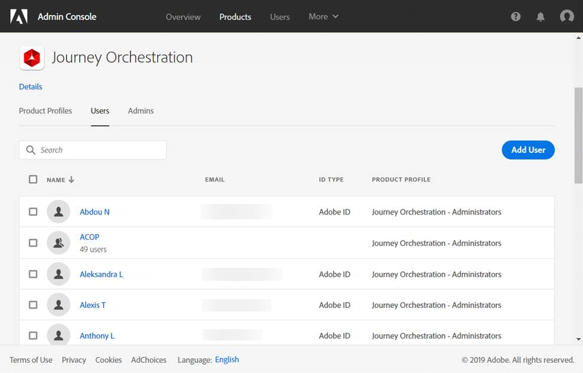

# Gestion des accès{#concept_rfj_wpt_52b}

## Gestion des accès {#about-access-management}

Les profils de produit sont attribués à un ensemble d’utilisateurs qui partagent les mêmes droits au sein de votre entreprise.

Admin console permet d’attribuer aux utilisateurs l’un des profils de produit d’usine suivants :

* **[!UICONTROL Utilisateur à accès limité]** : utilisateur disposant d’un accès en lecture seule aux parcours et aux rapports. Ce profil de produit comprend les droits suivants :
   * Lire les parcours
   * Lire les rapports

* **[!UICONTROL Administrateur]** : utilisateur ayant accès aux menus d’administration avec la possibilité de gérer les parcours, les événements et les rapports. Ce profil de produit comprend les droits suivants :
   * Gérer et exécuter les parcours
   * Gérer les événements, les sources de données et les actions
   * Gérer les rapports
   >[!NOTE]
   >
   >Les **[!UICONTROL administrateurs]** sont le seul profil de produit qui permet la création, l’édition et la publication de messages transactionnels (ou de modèles de message) dans Adobe Campaign Standard. Ce profil de produit est nécessaire si vous utilisez Adobe Campaign Standard pour envoyer des messages dans vos parcours.

* **[!UICONTROL Utilisateur standard]** : utilisateur disposant d’un accès de base, tel que la gestion des parcours. Ce profil de produit comprend les droits suivants :
   * Gérer et exécuter les parcours
   * Gérer les rapports

Vous trouverez [ici](../assets/do-not-localize/acs_rights_journeys.pdf) des informations relatives à la compatibilité entre les droits et les différentes fonctionnalités de Journey Orchestration.

## Attribution d’un profil de produit {#assigning-product-profile}

Les profils de produit sont gérés dans Admin console. Pour plus d’informations à ce sujet, consultez la [documentation relative à Admin console](https://helpx.adobe.com/fr/enterprise/managing/user-guide.html).

Pour attribuer un profil de produit à un utilisateur et lui permettre d’accéder à Journey Orchestration :

1. Sélectionnez **[!UICONTROL Journey Orchestration]** dans Admin console.

   

1. Sélectionnez le profil de produit auquel votre nouvel utilisateur sera associé.

   

1. Cliquez sur **[!UICONTROL Ajouter un utilisateur]**.

   Vous pouvez également ajouter votre nouvel utilisateur à un groupe d’utilisateurs pour parfaire l’ensemble d’autorisations partagé. Pour plus d’informations à ce propos, consultez [cette page](https://helpx.adobe.com/fr/enterprise/using/user-groups.html).

   

1. Saisissez l’adresse email du nouvel utilisateur, puis cliquez sur **[!UICONTROL Enregistrer]**.

   

L’utilisateur doit alors recevoir un email pour le rediriger vers votre instance de Journey Orchestration.