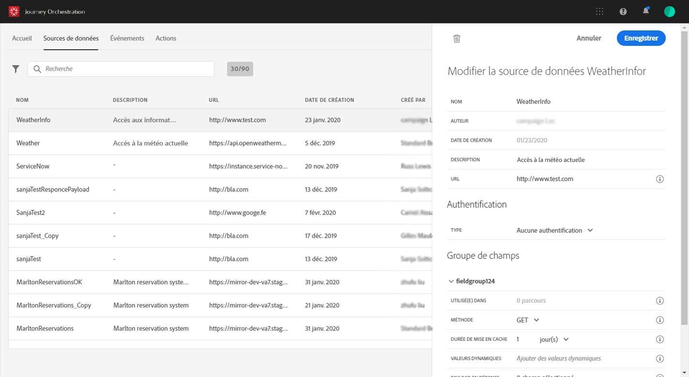
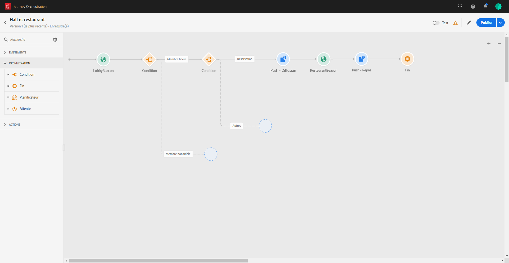
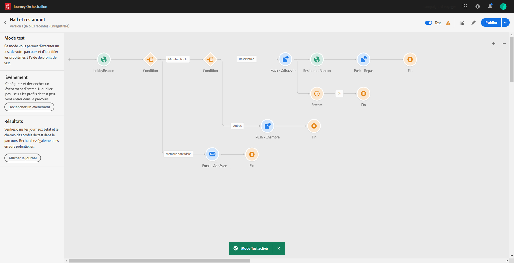
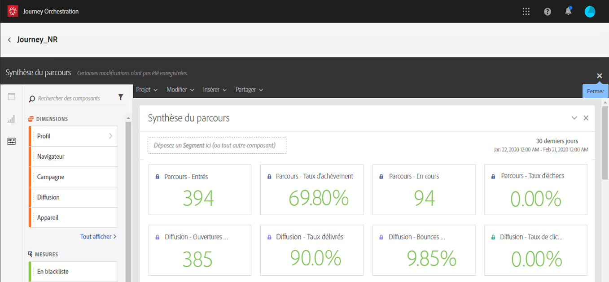

# Prise en main{#concept_y4b_4qt_52b}

Dans [!DNL Journey Orchestration], il existe deux types d’utilisateurs, chacun d’eux effectuant des tâches spécifiques : l’**utilisateur technique** et l’**utilisateur chargé de la conception de parcours**. Les profils de produit et les droits servent à gérer les accès des utilisateurs. Reportez-vous à la section  pour configurer les accès des utilisateurs.

Les principales étapes pour configurer et utiliser [!DNL Journey Orchestration] sont les suivantes :

1. **Configurer un événement**

   Vous devez définir les informations attendues et comment les traiter. Cette configuration est obligatoire. Cette étape est effectuée par un **utilisateur technique**.

   Voir à ce sujet la section .

   

1. **Configurer la source de données**

   Vous devez définir une connexion à un système pour récupérer des informations supplémentaires qui seront utilisées pour vos parcours, par exemple dans vos conditions. Une source de données d’Adobe Experience Platform intégrée est également configurée au moment de la mise en service. Cette étape n’est pas obligatoire si vous n’exploitez que les données des événements de votre parcours. Elle est effectuée par un **utilisateur technique**.

   Voir à ce sujet la section .

   

1. **Configurer une action**

   Si vous utilisez un système tiers pour envoyer vos messages, vous devez configurer sa connexion à [!DNL Journey Orchestration]. Voir .

   Si vous utilisez Adobe Campaign Standard pour envoyer des messages, vous devez configurer l’action intégrée. Voir .

   Ces étapes sont effectuées par un **utilisateur technique**.

   

1. **Concevoir le parcours**

   Combinez les différentes activités d’événement, d’orchestration et d’action afin de créer des scénarios cross-canal à plusieurs étapes. Cette étape est effectuée par un **utilisateur chargé de la conception de parcours**.

   Pour plus d’informations à ce sujet, voir .

   

1. **Tester et publier le parcours**

   Vous devez valider et activer le parcours. Cette étape est effectuée par un **utilisateur chargé de la conception de parcours**.

   Pour plus d’informations à ce sujet, voir  et .

   

1. **Suivre le parcours**

   Utilisez les outils de reporting dédiés pour mesurer l’efficacité du parcours. Cette étape est effectuée par un **utilisateur chargé de la conception de parcours**.

   Pour plus d’informations à ce sujet, voir .

   

