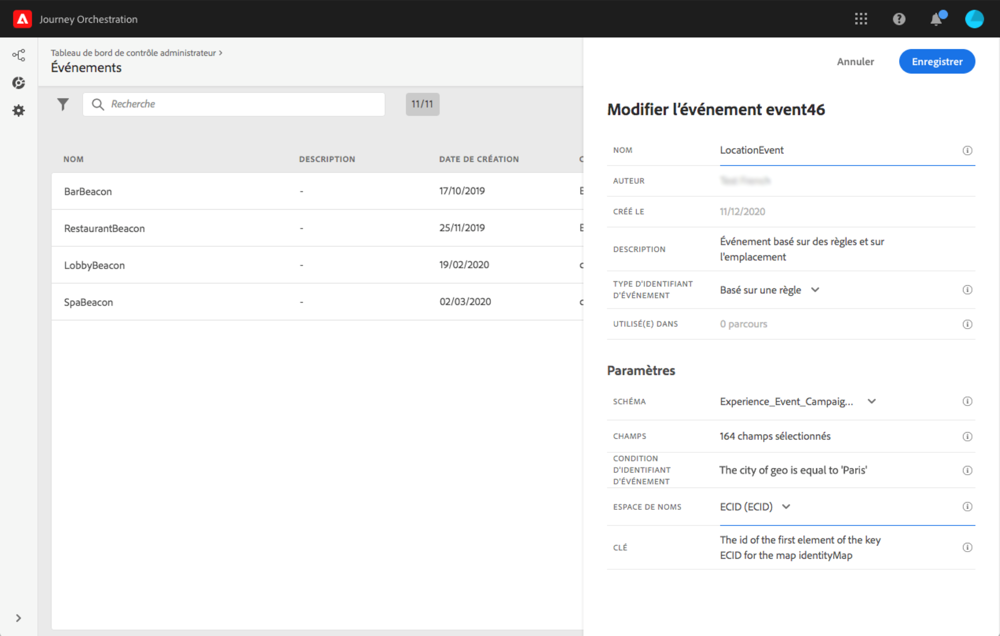
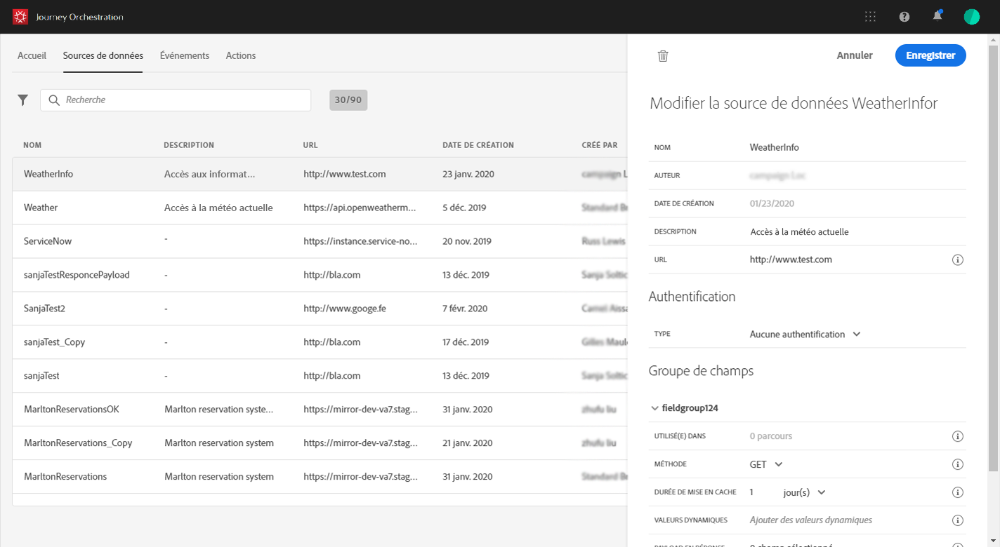
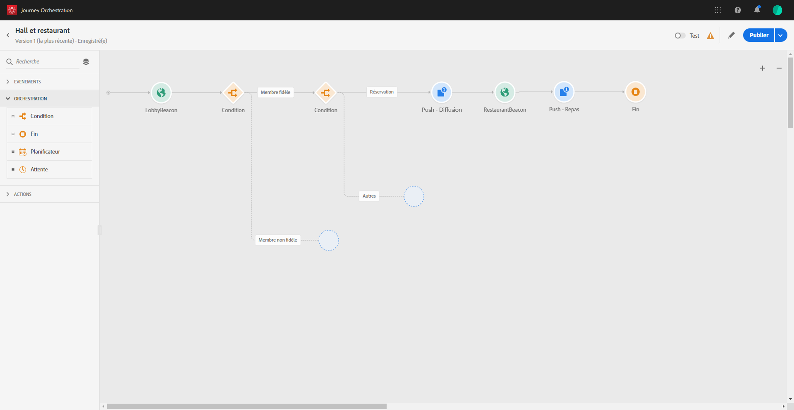
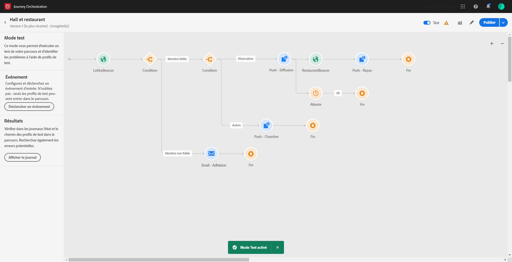
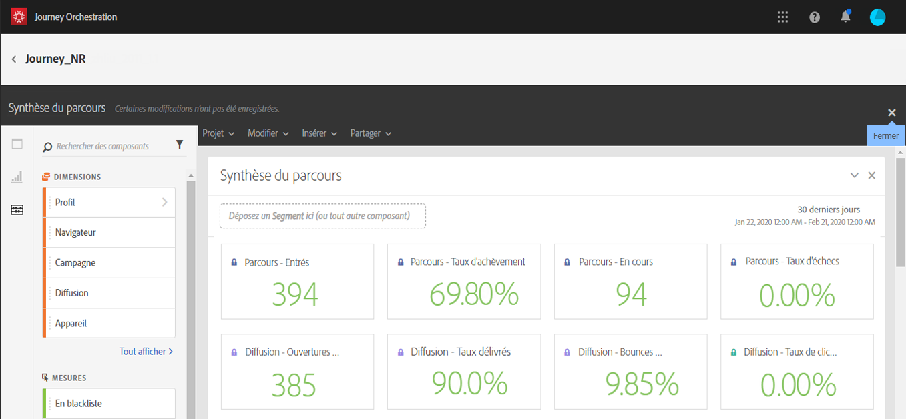

# Commencer{#concept_y4b_4qt_52b}

>[!CAUTION]
>
>**Vous recherchez Adobe Journey Optimizer** ? Cliquez [ici](https://experienceleague.adobe.com/fr/docs/journey-optimizer/using/ajo-home){target="_blank"} pour consulter la documentation de Journey Optimizer.
>
>
>_Cette documentation se rapporte aux anciens contenus de Journey Orchestration qui ont été remplacés par Journey Optimizer. Pour toute question concernant votre accès à Journey Orchestration ou Journey Optimizer, contactez votre équipe en charge des comptes._

Dans [!DNL Journey Orchestration], il existe deux types d’utilisateurs, chacun d’eux effectuant des tâches spécifiques : l’**utilisateur technique** et l’**utilisateur chargé de la conception de parcours**. Les profils de produit et les droits servent à gérer les accès des utilisateurs. Consultez [cette page](../about/access-management.md) pour découvrir comment configurer les accès des utilisateurs.

Les principales étapes pour configurer et utiliser [!DNL Journey Orchestration] sont les suivantes :

1. **Configurer un événement**

   Vous devez définir les informations attendues et comment les traiter. Cette configuration est obligatoire. Cette étape est effectuée par un **utilisateur technique**.

   Pour plus d’informations, consultez [cette page](../event/about-events.md).

   

1. **Configurer la source de données**

   Vous devez définir une connexion à un système pour récupérer des informations supplémentaires qui seront utilisées pour vos parcours, par exemple dans vos conditions. Une source de données Adobe Experience Platform intégrée est également définie au moment de l&#39;approvisionnement. Cette étape n&#39;est pas obligatoire si vous n&#39;exploitez que les données des événements de votre parcours. Cette étape est effectuée par un **utilisateur technique**.

   Pour plus d’informations, consultez [cette page](../datasource/about-data-sources.md).

   

1. **Configurer une action**

   Si vous utilisez un système tiers pour envoyer vos messages, vous devez configurer sa connexion à [!DNL Journey Orchestration]. Consultez [cette page](../action/about-custom-action-configuration.md).

   Si vous utilisez Adobe Campaign Standard pour envoyer des messages, vous devez configurer l’action intégrée. Consultez [cette page](../action/working-with-adobe-campaign.md).

   Ces étapes sont effectuées par un **utilisateur technique**.

   

1. **Concevoir le parcours**

   Combinez les différentes activités d&#39;événement, d&#39;orchestration et d&#39;action afin de créer des scénarios cross-canal à plusieurs étapes. Cette étape est effectuée par un **utilisateur chargé de la conception de parcours**.

   Pour plus d’informations à ce sujet, consultez [cette page](../building-journeys/journey.md).

   

1. **Tester et publier le parcours**

   Vous devez valider et activer le parcours. Cette étape est effectuée par un **utilisateur chargé de la conception de parcours**.

   Pour en savoir plus, consultez les pages [Test du parcours](../building-journeys/testing-the-journey.md) et [Publication du parcours](../building-journeys/publishing-the-journey.md).

   

1. **Su le parcours**

   Utilisez les outils de reporting dédiés pour mesurer l’efficacité du parcours. Cette étape est effectuée par un **utilisateur chargé de la conception de parcours**.

   Pour plus d’informations à ce sujet, consultez [cette page](../reporting/about-journey-reports.md).

   
