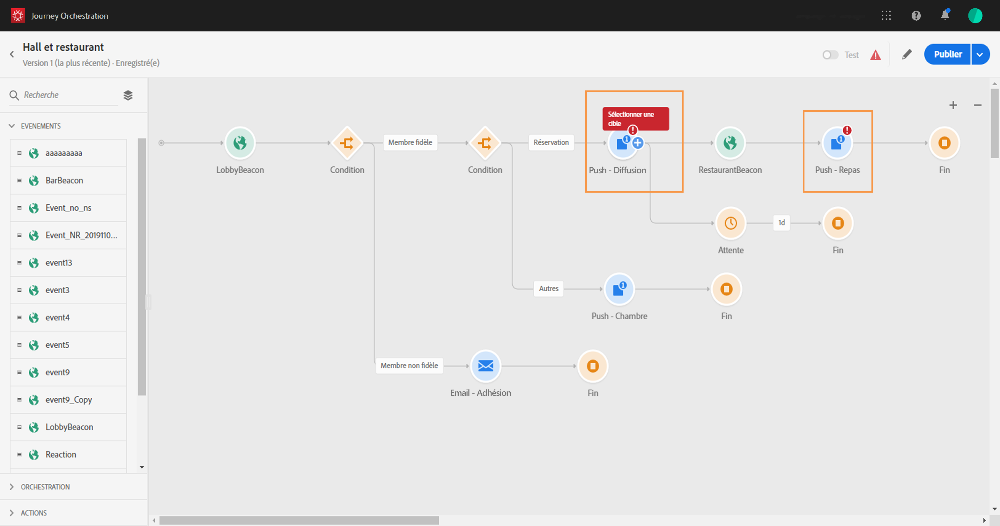
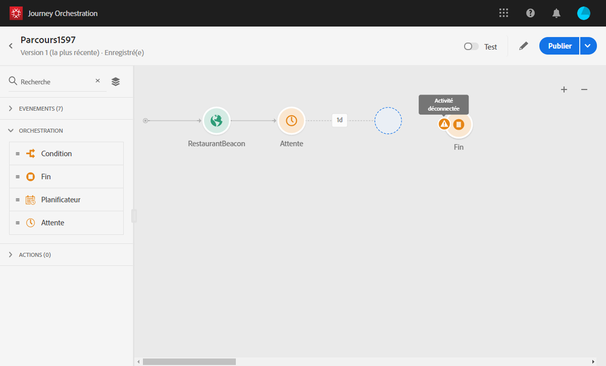
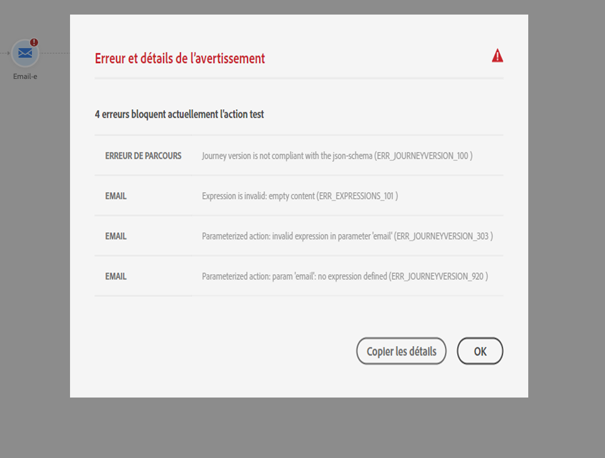

# Résolution des problèmes{#concept_nlv_bcv_2fb}

Cette section décrit comment résoudre les problèmes liés aux parcours avant de les tester ou de les publier. Il est possible d’effectuer les vérifications répertoriées ci-dessous lorsque le parcours est en mode test ou actif. Il est recommandé de les réaliser en mode test, puis d’effectuer la publication. Voir [cette page](../building-journeys/testing-the-journey.md).

## Vérification des erreurs avant le test{#section_h3q_kqk_fhb}

Avant de tester et de publier votre parcours, vérifiez que toutes les activités sont correctement configurées. Vous ne pouvez pas effectuer de tests ou de publications si des erreurs sont détectées par le système.

Les erreurs sont représentées par un symbole d’avertissement, affiché sur l’activité elle-même, dans la zone de travail. Placez le curseur sur le point d’exclamation pour afficher le message d’erreur. Si vous cliquez sur l’activité, vous devez voir la ligne contenant l’erreur associée à un avertissement. Par exemple, si un champ obligatoire est vide, une erreur s’affiche.



Par exemple, dans la zone de travail, lorsque deux activités sont déconnectées, un avertissement s’affiche.



En regard du bouton bascule **[!UICONTROL Test]** et du bouton **[!UICONTROL Publier]**, un signe d’avertissement peut s’afficher. Il indique les erreurs détectées par le système et empêche l’activation du mode test ou la publication du parcours. La plupart du temps, les erreurs détectées par le système sont liées à des dysfonctionnements visibles relatifs aux activités. Cependant, elles sont parfois associées à d’autres problèmes. Dans ce cas, vous pouvez les afficher en essayant d’identifier le problème à l’aide de la description de l’erreur. Si vous ne parvenez pas à l’identifier, vous pouvez copier les détails et les envoyer à l’administrateur ou à l’assistance technique. Notez que les erreurs qui bloquent le test et celles qui bloquent la publication sont similaires.

Le système détecte deux types de problèmes : les erreurs et les avertissements. Les erreurs bloquent la publication et l’activation des tests. Les avertissements indiquent des problèmes potentiels qui ne bloquent pas l’activation ou la publication des tests. Vous verrez une description du problème et un identifiant de journal des problèmes du type ERR_XXX_XXX. Ce format facilite l’identification du problème par l’assistance technique.

Le signe en regard du bouton bascule **[!UICONTROL Test]** et du bouton **[!UICONTROL Publier]** peut apparaître dans deux couleurs différentes. Il est rouge en cas d’erreur, et orange pour un avertissement.



Les erreurs et les avertissements globaux du parcours apparaissent en tête de liste. Ceux liés à des activités spécifiques sont répertoriés ensuite, par ordre d’activité ou d’apparition dans le parcours, de gauche à droite. Le bouton **[!UICONTROL Copier les détails]** copie les informations techniques relatives au parcours qui seront utiles à l’équipe d’assistance technique pour résoudre les problèmes.

Lorsqu’une erreur se produit dans une action ou une condition, le parcours d’un individu s’arrête. La seule façon de le faire continuer est de cocher la case **[!UICONTROL Ajouter un autre chemin en cas de dépassement de délai ou d&#39;erreur]**. Reportez-vous à [cette section](../building-journeys/using-the-journey-designer.md#paths).

## Vérification de l’envoi correct des événements{#section_rqz_11t_dgb}

Le point de départ d’un parcours est toujours un événement. Il est possible d’effectuer des tests à l’aide d’outils tels que Postman.

Vous pouvez ainsi vérifier si l’appel d’API émis via ces outils est correctement envoyé ou non. Si vous obtenez une erreur en retour, cela signifie que votre appel a rencontré un problème. Vérifiez à nouveau la payload, l’en-tête (et en particulier l’identifiant d’organisation) et l’URL de destination. Vous pouvez demander à votre administrateur l’URL appropriée pour l’accès.

Les événements ne sont pas directement transmis de la source à [!DNL Journey Orchestration]. En effet, [!DNL Journey Orchestration] s’appuie sur les API d’ingestion en flux continu d’Adobe Experience Platform. As a result, in case of event related issues, you can refer to [this page](https://docs.adobe.com/content/help/fr-FR/experience-platform/ingestion/streaming/troubleshooting.html) for Streaming ingestion APIs troubleshooting.

## Vérification de l’entrée des visiteurs dans le parcours{#section_x4v_zzs_dgb}

Les rapports [!DNL Journey Orchestration] donnent des mesures en temps réel des entrées des visiteurs dans un parcours.

Si l’événement a été envoyé avec succès, mais que vous ne voyez pas d’entrée dans le parcours, cela signifie qu’une erreur s’est produite entre l’envoi de l’événement et la réception de l’événement dans le parcours.

En tant qu’administrateur, vous devez vérifier les points suivants :

* Êtes-vous certain que le parcours où vous attendez l’événement entrant est en mode test ou actif ?
* Avez-vous enregistré l’événement avant de copier la payload depuis l’aperçu de la payload ?
* La payload d’événement contient-elle un identifiant d’événement ?
* Avez-vous atteint la bonne URL ?
* Avez-vous appliqué la structure de payload des API d’ingestion en flux continu en utilisant l’aperçu de la structure de payload dans le volet de configuration des événements ? Voir [cette page](../event/previewing-the-payload.md).
* Avez-vous utilisé les paires clé/valeur appropriées dans l’en-tête de l’événement ?

   ```
   X-gw-ims-org-id - your ORGID
   Content-type - application/json
   ```

## Vérification de la manière dont les visiteurs naviguent dans le parcours{#section_l5y_yzs_dgb}

Les rapports [!DNL Journey Orchestration] mesurent la progression des individus dans un parcours. Il est très facile d’identifier où et pourquoi une personne s’est arrêtée.

Les éléments à vérifier sont les suivants :

* La situation est-elle due à une condition excluant la personne concernée ? Par exemple, la condition est « genre = masculin » et la personne est une femme. Si la condition n’est pas trop complexe, un utilisateur chargé de la conception de parcours peut effectuer cette vérification.
* La situation est-elle due à une source de données qui ne répond pas ? Lorsque le parcours est en test, ces informations apparaissent dans les journaux du mode test. Lorsque le parcours est actif, un administrateur peut tester les appels directs à la source de données et vérifier la réponse reçue. Il peut également dupliquer le parcours et le tester.

## Vérification de l’envoi des messages{#section_qb1_yzs_dgb}

Si les individus suivent le bon chemin dans le parcours sans recevoir de messages, vous pouvez vérifier les points suivants :

* La messagerie transactionnelle a correctement pris en compte la demande d’envoi du message. Un utilisateur chargé de la conception de parcours peut accéder au message transactionnel censé être envoyé et vérifier si l’heure de la dernière exécution correspond à l’heure d’exécution de votre parcours. Il peut également vérifier les derniers appels/événements d’API reçus par la messagerie transactionnelle.
* La messagerie transactionnelle a bien envoyé le message. Dans les journaux d’envoi des messages transactionnels, vous pouvez voir le statut de chaque exécution, en vert ou en rouge, et la nature du problème. Un utilisateur chargé de la conception de parcours peut accéder à cet écran et envoyer les journaux à un administrateur pour plus d’informations.

Dans le cas d’un message envoyé par le biais d’une action personnalisée, le seul élément vérifiable pendant le test du parcours est l’apparition ou non d’une erreur suite à l’appel du système à l’aide d’une action personnalisée. Si l’appel au système externe associé à l’action personnalisée n’entraîne pas d’erreur, mais ne déclenche pas l’envoi d’un message, certaines vérifications doivent être effectuées du côté du système externe.

