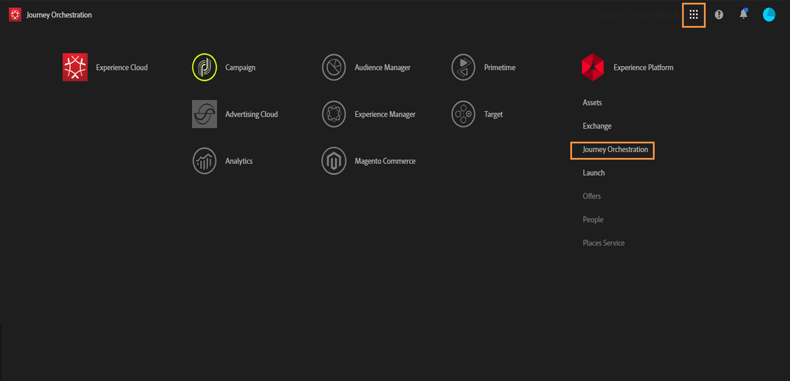
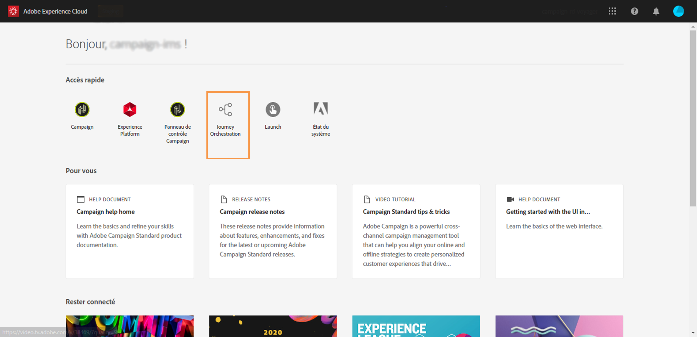
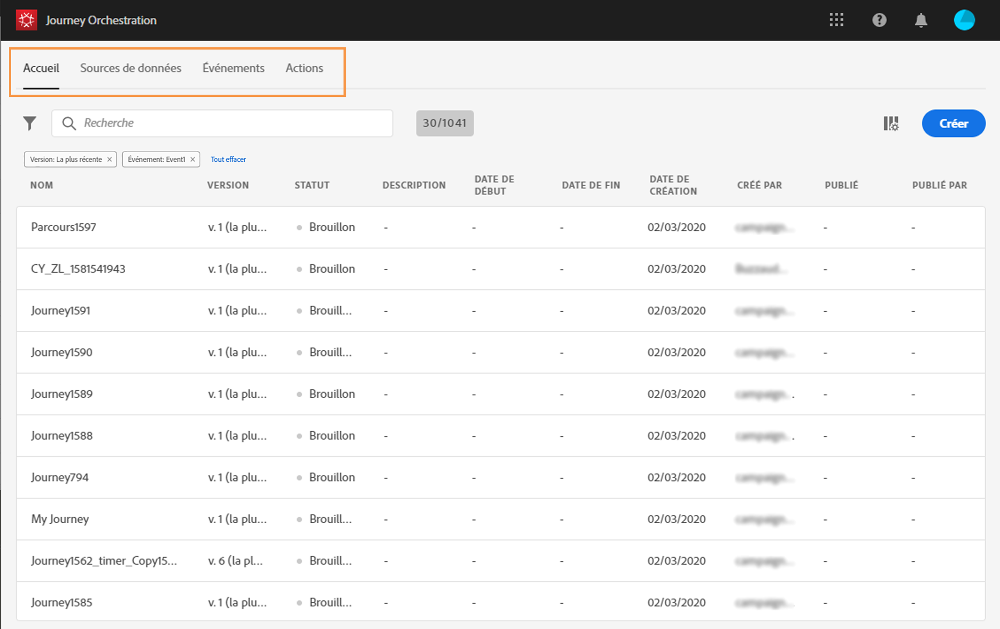
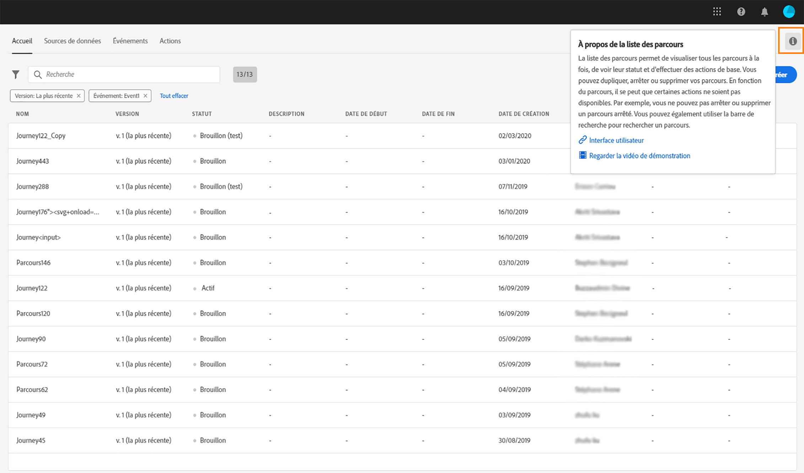
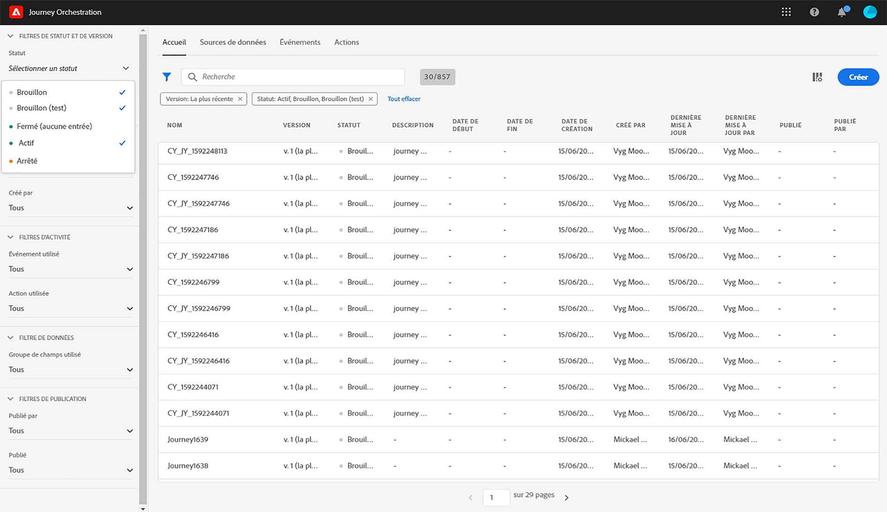
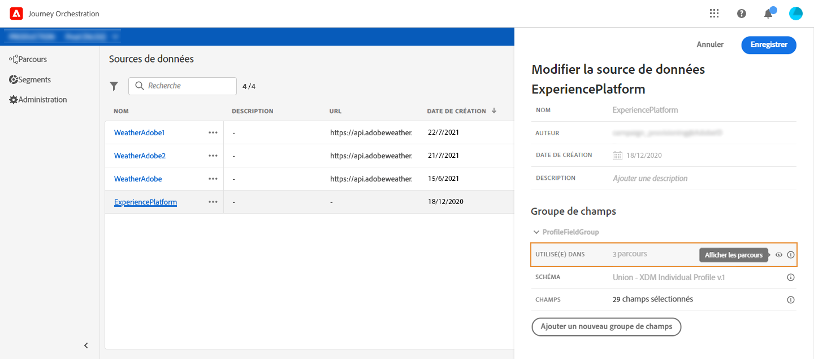
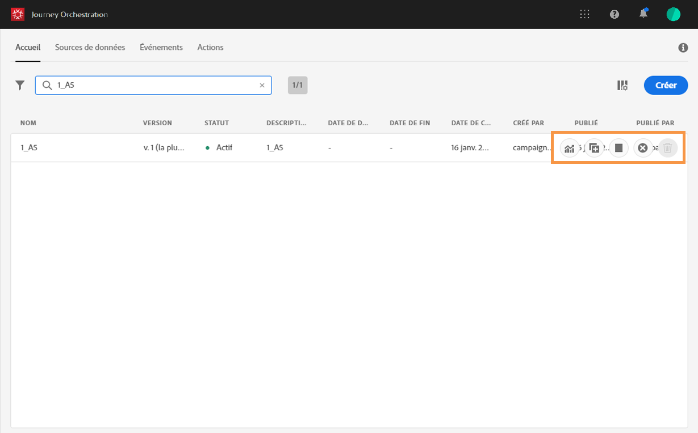
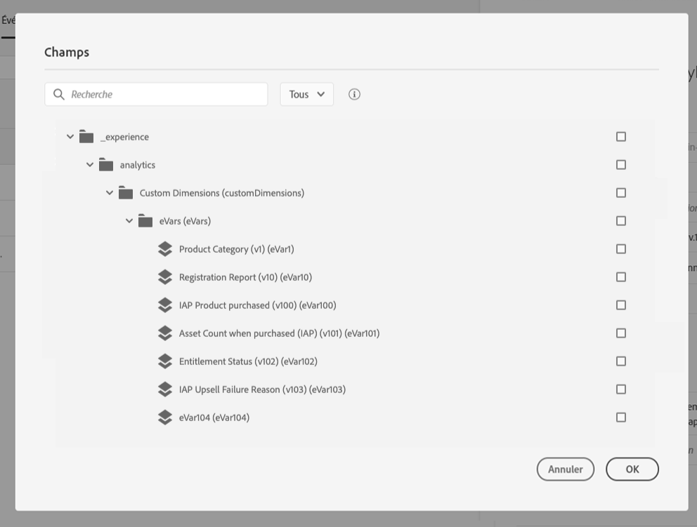

# Interface utilisateur{#concept_rcq_lqt_52b}

>[!CONTEXTUALHELP]
>id=&quot;jo_home&quot;
>title=&quot;À propos de la liste des parcours&quot;
>abstract=&quot;La liste des parcours vous permet de visualiser tous vos parcours en même temps, de consulter leur statut et d’effectuer des actions de base. Vous pouvez dupliquer, arrêter ou supprimer vos parcours. En fonction du parcours, il se peut que certaines actions ne soient pas disponibles. Par exemple, vous ne pouvez pas arrêter ou supprimer un voyage terminé. Vous pouvez également utiliser la barre de recherche pour rechercher un parcours.&quot;
>additional-url=&quot;https://images-tv.adobe.com/mpcv3/38af62cb-9390-4bc0-a576-d336849adb97_1574809570.1920x1080at3000_h264.mp4&quot; text=&quot;Regarder la vidéo de démonstration&quot;

>[!NOTE]
>
>Pour tirer le meilleur parti de Journey Orchestration, il est recommandé d’utiliser Chrome en tant que navigateur Internet.
>
>Cette documentation est fréquemment mise à jour pour prendre en compte les modifications récentes du produit. Cependant, certaines captures d’écran peuvent être légèrement différentes de l’interface du produit.

## Découverte de l’interface{#section_jsq_zr1_ffb}

To access the Journey Orchestration&#39;s interface, click the **[!UICONTROL App Selector]** icon, in the top right. Sous « Experience Platform », cliquez sur **[!UICONTROL Journey Orchestration]**, dans la partie droite.

You can also access Journey Orchestration from the Experience Cloud home page, in the **[!UICONTROL Quick access]** section.

Les menus supérieurs vous permettent de naviguer parmi les différentes fonctionnalités de Journey Orchestration : **[!UICONTROL Home]**(les voyages),**[!UICONTROL Data Sources]**, **[!UICONTROL Events]**, **[!UICONTROL Actions]**.

Cliquez sur l’  icône dans le coin supérieur droit de l’écran pour afficher l’aide contextuelle. Il est disponible dans les différents écrans de la liste d’orchestration de Journey (voyages, événements, actions et sources de données). Vous pouvez ainsi afficher une description rapide de la fonctionnalité actuelle et accéder aux articles et vidéos connexes.

## Recherche et filtrage{#section_lgm_hpz_pgb}

In the **[!UICONTROL Home]**,**[!UICONTROL Data Sources]**, **[!UICONTROL Events]** and **[!UICONTROL Actions]** lists, a search bar allows you to search for an item.

The **[!UICONTROL Filters]** can be accessed by clicking on the filter icon on the top left of the list. Le menu Filtres permet de filtrer les éléments affichés en fonction de différents critères. Il est possible d’afficher uniquement les éléments d’un certain type ou dans un statut donné, ceux que vous avez créés, ou ceux que vous avez modifiés au cours des 30 derniers jours.

In the **[!UICONTROL Data Sources]**, **[!UICONTROL Events]** and **[!UICONTROL Actions]** lists, use the **Creation filters** to filter on the creation date and user. Vous pouvez, par exemple, choisir de n’afficher que les événements créés au cours des 30 derniers jours.

In the journey list (under **[!UICONTROL Home]**), in addition to the **[!UICONTROL Creation filters]**, you can also filter the displayed journeys according to their status and version (**[!UICONTROL Status and version filters]**). Vous pouvez également choisir d&#39;afficher uniquement les voyages qui utilisent un événement, un groupe de champs ou une action spécifique (**[!UICONTROL Activity filters]** et **[!UICONTROL Data filters]**). **[!UICONTROL Publication filters]** Vous pouvez sélectionner une date de publication ou un utilisateur. Il est possible, par exemple, de n’afficher que les dernières versions des parcours actifs publiées hier. Voir .

>[!NOTE]
>
>Notez que les colonnes affichées peuvent être personnalisées à l’aide du bouton de configuration en haut à droite des listes. La personnalisation est enregistrée pour chaque utilisateur.

Les **[!UICONTROL Last update]** colonnes et **[!UICONTROL Last update by]** les colonnes vous permettent d&#39;afficher quand a eu lieu la dernière mise à jour de vos voyages et quel utilisateur l&#39;a fait.

In the event, data source and action configuration panes, the **[!UICONTROL Used in]** field displays the number of journeys that use that particular event, field group or action. You can click the **[!UICONTROL View journeys]** button to display the list of corresponding journeys.

Il est possible d’effectuer des actions de base sur chaque élément des différentes listes. Vous pouvez par exemple dupliquer ou supprimer un élément.

## Affichage des noms de champs XDM{#friendly-names-display}

Les noms de champs XDM sont définis dans les schémas sous les noms de champs et les noms d’affichage lors de la définition de la charge d’événement, de la charge [de groupe de](../datasource/field-groups.md) champs et de la sélection de champs dans l’éditeur [d’](../expression/expressionadvanced.md)expression.
Lors de la sélection d’un champ, son nom technique s’affiche ainsi qu’un nom plus convivial.

Vous pouvez fournir des descripteurs tels que &quot;xdm:alternativeDisplayInfo&quot; lors de la configuration de schémas pour définir des noms conviviaux qui remplaceront les noms d’affichage. Il vous permet également de modifier les valeurs &quot;titre&quot; et &quot;description&quot; des champs du schéma.

Si un nom convivial est disponible, le champ s’affiche sous la forme `<friendly-name>(<name>)`. Si aucun nom convivial n’est disponible, le nom d’affichage s’affiche, par exemple `<display-name>(<name>)`. Si aucun d’eux n’est défini, seul le nom technique du champ s’affiche `<name>`.

Vous pouvez configurer des descripteurs de nom conviviaux via un appel d’API. Pour plus d&#39;informations, consultez le guide [du développeur](https://www.adobe.io/apis/experienceplatform/home/xdm/xdmservices.html#!api-specification/markdown/narrative/technical_overview/schema_registry/schema_registry_developer_guide.md)Schema Registry.

>[!NOTE]
>
>Les noms conviviaux ne sont pas récupérés lorsque vous sélectionnez des champs dans une union de schémas.

## Utilisation des différents raccourcis{#section_ksq_zr1_ffb}

L’interface de Journey Orchestration propose différents raccourcis.

_Dans les listes de parcours, d’actions, de sources de données ou d’événements :_

* Appuyez sur **c** pour créer un parcours, une action, une source de données ou un événement.

_Lors de la configuration d’une activité dans un parcours :_

Le canevas est automatiquement enregistré. Vous pouvez voir le statut d’enregistrement, en haut à gauche du canevas.

* Appuyez sur **Échap** pour fermer le volet de configuration et ignorer les modifications apportées. Il s’agit de l’équivalent du bouton **[!UICONTROL Cancel]**.
* Press **[!UICONTROL Enter]** or click outside the pane to close the configuration pane. Les modifications sont enregistrées. Il s’agit de l’équivalent du bouton **[!UICONTROL Ok]**.
* If you press **[!UICONTROL Delete]** or **backspace**, you can then press **[!UICONTROL Enter]** to confirm the deletion.

_Dans les fenêtres contextuelles :_

* Appuyez sur **Échap** pour fermer une fenêtre (équivalent du bouton **Annuler**).
* Press **[!UICONTROL Enter]** to save or confirm (equivalent of the **[!UICONTROL Ok]** or **[!UICONTROL Save]** button).

_Dans le volet de configuration d’un événement, d’une source de données ou d’une action :_

* Appuyez sur **Échap** pour fermer le volet de configuration sans effectuer d’enregistrement.
* Press **[!UICONTROL Enter]** to save modifications and close the configuration pane.
* Appuyez sur la touche **tabulation** pour passer d’un champ à un autre et les configurer.

_Dans l’éditeur d’expression simple :_

* Double-cliquez sur un champ, à gauche, pour ajouter une requête (ce qui équivaut à effectuer un glisser-déposer).

_Lors du parcours des champs XDM :_

* Si vous cochez un « nœud », tous les champs qu’il contient sont sélectionnés.

_Dans toutes les zones de texte :_

* Utilisez la combinaison de touches **Ctrl/Commande + A** pour sélectionner le texte. Dans l’aperçu de la payload, cette combinaison de touches sélectionne cette payload.

_Dans un écran contenant une barre de recherche :_

* Utilisez la combinaison de touches **Ctrl/Commande + F** pour sélectionner la barre de recherche.

_Dans le canevas d’un parcours :_

* Utilisez la combinaison de touches **Ctrl/Commande + A** pour sélectionner toutes les activités.
* When one or several activities are selected, press **[!UICONTROL Delete]** or **backspace** to delete them. Then you can press **[!UICONTROL Enter]** to confirm in the confirmation pop-up.
* Double-cliquez sur une activité dans la palette de gauche pour l’ajouter dans la première position disponible (du haut vers le bas).
