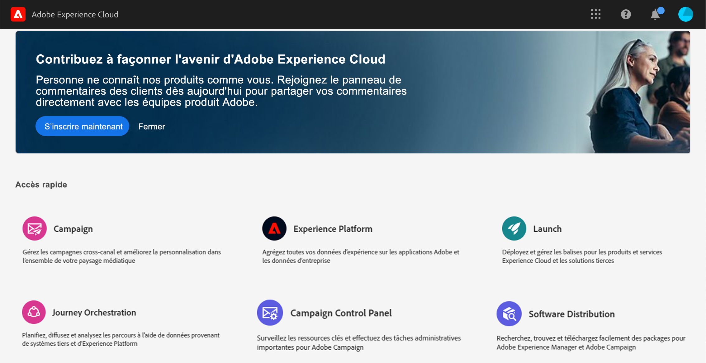

# Interface utilisateur{#concept_rcq_lqt_52b}

>[!NOTE]
>
>Pour tirer le meilleur parti de [!DNL Journey Orchestration], il est recommandé d’utiliser Chrome en tant que navigateur Internet. L’interface s’affiche dans la langue définie dans IMS. Si votre langue IMS n’est pas prise en charge par [!DNL Journey Orchestration], l’interface s’affiche en anglais.
>
>Cette documentation est fréquemment mise à jour pour prendre en compte les modifications récentes du produit. Cependant, certaines captures d’écran peuvent être légèrement différentes de l’interface du produit.

## Accéder aux [!DNL Journey Orchestration]{#accessing_journey_orchestration}

Pour accéder à l’interface de [!DNL Journey Orchestration], cliquez sur l’icône du **[!UICONTROL sélecteur d’applications]**, en haut à droite, puis cliquez sur **[!UICONTROL Journey Orchestration]**.

Vous pouvez également accéder à [!DNL Journey Orchestration] à partir de la page d’accueil d’Experience Cloud, dans la section **[!UICONTROL Accès rapide]**.

## Découverte de l’interface{#section_jsq_zr1_ffb}

>[!CONTEXTUALHELP]
>id="jo_home"
>title="À propos de la liste des parcours"
>abstract="La liste des parcours vous permet de visualiser tous vos parcours en même temps, de consulter leur statut et d’effectuer des actions de base. Vous pouvez dupliquer, arrêter ou supprimer vos parcours. En fonction du parcours, il se peut que certaines actions ne soient pas disponibles. Par exemple, vous ne pouvez pas supprimer ni redémarrer un parcours fermé. Vous pouvez le dupliquer ou en créer une nouvelle version. Vous pouvez également utiliser la barre de recherche pour rechercher un parcours."
>additional-url="https://images-tv.adobe.com/mpcv3/38af62cb-9390-4bc0-a576-d336849adb97_1574809570.1920x1080at3000_h264.mp4" text="Regarder une vidéo de démonstration"

Les menus supérieurs vous permettent de naviguer parmi les différentes fonctionnalités de [!DNL Journey Orchestration] : **[!UICONTROL Accueil]** (les parcours), **[!UICONTROL Sources de données]**, **[!UICONTROL Événements]** et **[!UICONTROL Actions]**.

Cliquez sur l’icône  dans le coin supérieur droit de l’écran pour afficher l’aide contextuelle. Elle est disponible dans les différents écrans des listes de [!DNL Journey Orchestration] (parcours, événements, actions et sources de données). Vous pouvez ainsi afficher une description rapide de la fonctionnalité actuelle et accéder aux articles et vidéos connexes.

## Recherche et filtrage{#section_lgm_hpz_pgb}

Une barre de recherche vous permet de rechercher un élément dans les listes **[!UICONTROL Accueil]**, **[!UICONTROL Sources de données]**, **[!UICONTROL Événements]** et **[!UICONTROL Actions]**.

Pour accéder aux **[!UICONTROL filtres]**, cliquez sur l’icône en forme de filtre en haut à gauche de la liste. Le menu Filtres permet de filtrer les éléments affichés en fonction de différents critères. Il est possible d’afficher uniquement les éléments d’un certain type ou dans un statut donné, ceux que vous avez créés, ou ceux que vous avez modifiés au cours des 30 derniers jours.

Pour filtrer des éléments en fonction de la date de création et de l’utilisateur, utilisez les **[!UICONTROL filtres de création]** contenus dans les listes **[!UICONTROL Sources de données]**, **[!UICONTROL Événements]** et **[!UICONTROL Actions]**. Vous pouvez, par exemple, choisir de n’afficher que les événements créés au cours des 30 derniers jours.

Dans la liste des parcours (page **[!UICONTROL Accueil]**), outre les **[!UICONTROL filtres de création]**, vous pouvez également filtrer les parcours affichés en fonction de leur statut et de leur version (**[!UICONTROL filtres de statut et de version]**). Vous pouvez également choisir d’afficher uniquement les parcours qui utilisent un événement, un groupe de champs ou une action spécifique (**[!UICONTROL Filtres d’activité]** et **[!UICONTROL Filtres de données]**). Les **[!UICONTROL Filtres de publication]** vous permettent de sélectionner une date de publication ou un utilisateur. Il est possible, par exemple, de n’afficher que les dernières versions des parcours actifs publiées hier. Voir [cette page](../building-journeys/using-the-journey-designer.md).

>[!NOTE]
>
>Notez que les colonnes affichées peuvent être personnalisées à l’aide du bouton de configuration en haut à droite des listes. La personnalisation est enregistrée pour chaque utilisateur.

Les colonnes **[!UICONTROL Dernière mise à jour]** et **[!UICONTROL Dernière mise à jour par]** vous permettent d’afficher quand la dernière mise à jour de vos parcours a eu lieu et quel utilisateur l’a effectuée.

Dans les volets de configuration des sources de données, des événements et des actions, le champ **[!UICONTROL Utilisé(e) dans]** affiche le nombre de parcours qui utilisent cet événement, ce groupe de champs ou cette action spécifique. Vous pouvez cliquer sur le bouton **[!UICONTROL Afficher les parcours]** pour faire apparaître la liste des parcours correspondants.

Il est possible d’effectuer des actions de base sur chaque élément des différentes listes. Vous pouvez par exemple dupliquer ou supprimer un élément.

## Navigation dans les champs Adobe Experience Platform {#friendly-names-display}

Lors de la définition du [payload d’événement](../event/defining-the-payload-fields.md), du [payload du groupe de champs](../datasource/field-groups.md), et de la sélection de champs dans l’[éditeur d’expression](../expression/expressionadvanced.md), le nom d’affichage s’affiche en plus du nom du champ. Ces informations sont récupérées à partir de la définition du schéma dans le modèle de données d’expérience.

Si des descripteurs tels que « xdm:alternateDisplayInfo » sont fournis lors de la configuration des schémas, les noms conviviaux remplacent les noms d’affichage. Ceci est particulièrement utile lors de l’utilisation des « eVars » et des champs génériques. Vous pouvez configurer des descripteurs de noms conviviaux par le biais d’un appel API. Pour plus d’informations, consultez le [guide sur le registre de schéma destiné aux développeurs](https://docs.adobe.com/content/help/fr-FR/experience-platform/xdm/api/getting-started.html).

Si un nom convivial est disponible, le champ s’affiche sous la forme `<friendly-name>(<name>)`. Si aucun nom convivial n’est disponible, le nom d’affichage s’affiche, par exemple `<display-name>(<name>)`. Si aucun d’eux n’est défini, seul le nom technique du champ s’affiche `<name>`.

>[!NOTE]
>
>Les noms conviviaux ne sont pas récupérés lorsque vous sélectionnez des champs dans une union de schémas.

## Utilisation des différents raccourcis{#section_ksq_zr1_ffb}

L’interface de [!DNL Journey Orchestration] propose différents raccourcis.

_Dans les listes de parcours, d’actions, de sources de données ou d’événements :_

* Appuyez sur **c** pour créer un parcours, une action, une source de données ou un événement.

_Lors de la configuration d’une activité dans un parcours :_

La zone de travail est automatiquement enregistrée. Vous pouvez voir le statut d’enregistrement, en haut à gauche de la zone de travail.

* Appuyez sur **Échap** pour fermer le volet de configuration et ignorer les modifications apportées. Il s’agit de l’équivalent du bouton **[!UICONTROL Annuler]**.
* Appuyez sur **Entrée** ou cliquez en dehors du volet pour fermer le volet de configuration. Les modifications sont enregistrées. Il s’agit de l’équivalent du bouton **[!UICONTROL OK]**.
* Si vous appuyez sur **Supprimer** ou **Retour arrière**, vous pouvez ensuite appuyer sur **Entrée** pour confirmer la suppression.

_Dans les fenêtres contextuelles :_

* Appuyez sur **Échap** pour fermer une fenêtre (équivalent du bouton **[!UICONTROL Annuler]**).
* Appuyez sur **Entrée** pour enregistrer ou confirmer (équivalent du bouton **[!UICONTROL OK]** ou **[!UICONTROL Enregistrer]**).

_Dans le volet de configuration d’un événement, d’une source de données ou d’une action :_

* Appuyez sur **Échap** pour fermer le volet de configuration sans effectuer d’enregistrement.
* Appuyez sur **Entrée** pour enregistrer les modifications et fermer le volet de configuration.
* Appuyez sur la touche **tabulation** pour passer d’un champ à un autre et les configurer.

_Dans l’éditeur d’expression simple :_

* Double-cliquez sur un champ, à gauche, pour ajouter une requête (ce qui équivaut à effectuer un glisser-déposer).

_Lors du parcours des champs XDM :_

* Si vous cochez un « nœud », tous les champs qu’il contient sont sélectionnés.

_Dans toutes les zones de texte :_

* Utilisez la combinaison de touches **Ctrl/Commande + A** pour sélectionner le texte. Dans l’aperçu de la payload, cette combinaison de touches sélectionne cette payload.

_Dans un écran contenant une barre de recherche :_

* Utilisez la combinaison de touches **Ctrl/Commande + F** pour sélectionner la barre de recherche.

_Dans la zone de travail d’un parcours :_

* Utilisez la combinaison de touches **Ctrl/Commande + A** pour sélectionner toutes les activités.
* Lorsqu’une ou plusieurs activités sont sélectionnées, appuyez sur **Supprimer** ou **Retour arrière** pour les supprimer. Vous pouvez ensuite appuyer sur **Entrée** pour confirmer la suppression dans la fenêtre contextuelle de confirmation.
* Double-cliquez sur une activité dans la palette de gauche pour l’ajouter dans la première position disponible (du haut vers le bas).

_En voyage :_

* Appuyez sur **T** pour activer/désactiver le mode de test.
* Dans un parcours par événement en mode test, appuyez sur **E** pour déclencher un événement.
* Dans un parcours par segment, lorsque l’option profil **unique à la fois** est sélectionnée en mode test, appuyez sur **P** pour déclencher un événement.
* En mode test, appuyez sur **L** pour afficher les journaux.

