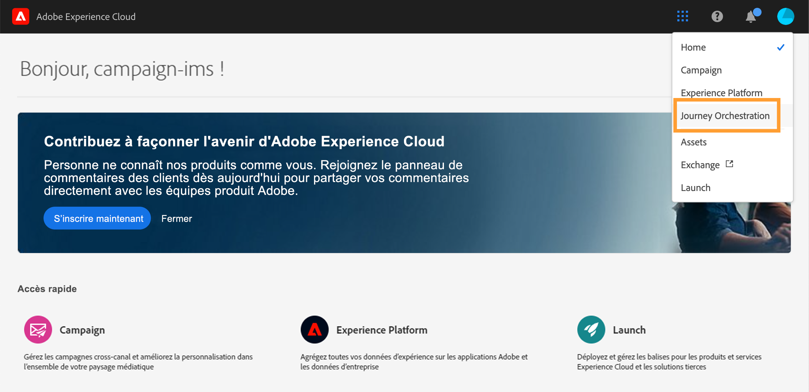

# Interface utilisateur{#concept_rcq_lqt_52b}

>[!NOTE]
>
>Pour tirer le meilleur parti de [!DNL Journey Orchestration], il est recommandé d’utiliser le navigateur Internet Chrome. L’interface s’affiche dans la langue définie dans IMS. Si votre langue IMS n’est pas prise en charge par [!DNL Journey Orchestration], l’interface s’affiche en anglais.
>
>Cette documentation est fréquemment mise à jour pour prendre en compte les modifications récentes du produit. Cependant, certaines captures d’écran peuvent être légèrement différentes de l’interface du produit.

## Accéder à [!DNL Journey Orchestration]{#accessing_journey_orchestration}

Pour accéder à l’interface de [!DNL Journey Orchestration], cliquez sur l’icône du **[!UICONTROL sélecteur d’applications]**, en haut à droite, puis cliquez sur **[!UICONTROL Journey Orchestration]**.

Vous pouvez également accéder à [!DNL Journey Orchestration] à partir de la page d’accueil d’Experience Cloud, dans la section **[!UICONTROL Accès rapide]**.

## Découvrir l’interface{#section_jsq_zr1_ffb}

>[!CONTEXTUALHELP]
>id="jo_home"
>title="À propos de la liste des parcours"
>abstract="La liste des parcours vous permet de visualiser tous vos parcours en même temps, de consulter leur statut et d&#39;effectuer des actions de base."
>additional-url="https://images-tv.adobe.com/mpcv3/38af62cb-9390-4bc0-a576-d336849adb97_1574809570.1920x1080at3000_h264.mp4" text="Regarder une vidéo de démonstration"

Les menus supérieurs vous permettent de naviguer parmi les différentes fonctionnalités de [!DNL Journey Orchestration] : **[!UICONTROL Accueil]** (les parcours), **[!UICONTROL Sources de données]**, **[!UICONTROL Événements]** et **[!UICONTROL Actions]**.

Cliquez sur l’icône  dans le coin supérieur droit de l’écran pour afficher l’aide contextuelle. Elle est disponible dans les différents écrans des listes de [!DNL Journey Orchestration] (parcours, événements, actions et sources de données). Vous pouvez ainsi afficher une description rapide de la fonctionnalité actuelle et accéder aux articles et vidéos connexes.

## Recherche et filtrage{#section_lgm_hpz_pgb}

Une barre de recherche vous permet de rechercher un élément dans les listes **[!UICONTROL Accueil]**, **[!UICONTROL Sources de données]**, **[!UICONTROL Événements]** et **[!UICONTROL Actions]**.

Pour accéder aux **[!UICONTROL filtres]**, cliquez sur l’icône en forme de filtre en haut à gauche de la liste. Le menu Filtres permet de filtrer les éléments affichés en fonction de différents critères. Il est possible d’afficher uniquement les éléments d’un certain type ou dans un statut donné, ceux que vous avez créés, ou ceux que vous avez modifiés au cours des 30 derniers jours.

Pour filtrer des éléments en fonction de la date de création et de l’utilisateur, utilisez les **[!UICONTROL filtres de création]** contenus dans les listes **[!UICONTROL Sources de données]**, **[!UICONTROL Événements]** et **[!UICONTROL Actions]**. Vous pouvez, par exemple, choisir de n’afficher que les événements créés au cours des 30 derniers jours.

Dans la liste des parcours (page **[!UICONTROL Accueil]**), outre les **[!UICONTROL filtres de création]**, vous pouvez également filtrer les parcours affichés en fonction de leur statut, de leur type et de leur version (**[!UICONTROL filtres de statut et de version]**). Le type peut être : **[!UICONTROL Événement unitaire]** ou **[!UICONTROL Qualification du segment]**. Vous pouvez aussi choisir d’afficher uniquement les parcours qui utilisent un événement, un groupe de champs ou une action spécifique (**[!UICONTROL Filtres d’activité]** et **[!UICONTROL Filtres de données]**). Les **[!UICONTROL Filtres de publication]** vous permettent de sélectionner une date de publication ou un utilisateur. Il est possible, par exemple, de n’afficher que les dernières versions des parcours actifs publiées hier. Voir [cette page](../building-journeys/using-the-journey-designer.md).

>[!NOTE]
>
>Notez que les colonnes affichées peuvent être personnalisées à l&#39;aide du bouton de configuration en haut à droite des listes. La personnalisation est enregistrée pour chaque utilisateur.

Les colonnes **[!UICONTROL Dernière mise à jour]** et **[!UICONTROL Dernière mise à jour par]** vous permettent d’afficher quand la dernière mise à jour de vos parcours a eu lieu et quel utilisateur l’a effectuée.

Dans les volets de configuration des sources de données, des événements et des actions, le champ **[!UICONTROL Utilisé(e) dans]** affiche le nombre de parcours qui utilisent cet événement, ce groupe de champs ou cette action spécifique. Vous pouvez cliquer sur le bouton **[!UICONTROL Afficher les parcours]** pour faire apparaître la liste des parcours correspondants.

Il est possible d&#39;effectuer des actions de base sur chaque élément des différentes listes. Vous pouvez par exemple dupliquer ou supprimer un élément.

## Navigation dans les champs Adobe Experience Platform {#friendly-names-display}

Lors de la définition de la [payload d&#39;événement](../event/defining-the-payload-fields.md), de la [payload du groupe de champs](../datasource/field-groups.md) et de la sélection de champs dans l&#39;[éditeur d&#39;expression](../expression/expressionadvanced.md), le nom d&#39;affichage s&#39;affiche en plus du nom du champ. Ces informations sont récupérées à partir de la définition du schéma dans le modèle de données d&#39;expérience.

Si des descripteurs tels que « xdm:alternateDisplayInfo » sont fournis lors de la configuration des schémas, les noms conviviaux remplacent les noms d&#39;affichage. Ceci est particulièrement utile lors de l’utilisation des « eVars » et des champs génériques. Vous pouvez configurer des descripteurs de noms conviviaux par le biais d’un appel API. Pour plus d&#39;informations, consultez le [guide sur le registre de schéma destiné aux développeurs](https://experienceleague.adobe.com/docs/experience-platform/xdm/api/getting-started.html?lang=fr).

Si un nom convivial est disponible, le champ s&#39;affiche sous la forme `<friendly-name>(<name>)`. Si aucun nom convivial n&#39;est disponible, le nom d&#39;affichage s&#39;affiche, par exemple `<display-name>(<name>)`. Si aucun d&#39;eux n&#39;est défini, seul le nom technique du champ s&#39;affiche `<name>`.

>[!NOTE]
>
>Les noms conviviaux ne sont pas récupérés lorsque vous sélectionnez des champs dans une union de schémas.

## Accessibilité{#accessibility}

Les fonctionnalités d’accessibilité dans Adobe Journey Optimizer sont fournies par Adobe Experience Platform :

* Accessibilité à l’aide du clavier
* Contraste des couleurs
* Validation des champs obligatoires

[En savoir plus](https://experienceleague.adobe.com/docs/experience-platform/accessibility/features.html?lang=fr){target="_blank"} dans la documentation Adobe Experience Platform.

Vous pouvez utiliser les raccourcis clavier suivants dans Adobe Journey Optimizer :

| Action | Raccourci |
| --- | --- |
| Déplacement entre les éléments, sections et groupes de menus de l’interface utilisateur | Tabulation |
| Retour en arrière entre les éléments, sections et groupes de menus de l’interface utilisateur | Maj+Tabulation |
| Déplacement dans des sections pour définir la cible d’action sur des éléments individuels | Flèche |
| Sélection ou suppression d’un élément ciblé | Entrée ou Barre d’espace |
| Annulation d’une sélection, réduction d’un panneau ou fermeture d’une boîte de dialogue | Échap |

[En savoir plus](https://experienceleague.adobe.com/docs/experience-platform/accessibility/custom.html?lang=fr){target="_blank"} dans la documentation Adobe Experience Platform.

Vous pouvez utiliser ces raccourcis dans des parties spécifiques de Journey Optimizer :

<table>
  <thead>
    <tr>
      <th>Élément d’interface</th>
      <th>Action</th>
      <th>Raccourci</th>
    </tr>
  </thead>
  <tr>
    <td>Liste de parcours, d’actions, de sources de données ou d’événements</td>
    <td>Création d’un parcours, d’une action, d’une source de données ou d’un événement</td>
    <td>C</td>
  </tr>
  <tr>
    <td rowspan="3">Zone de travail de parcours à l'état de brouillon</td>
    <td>Ajoutez une activité à partir de la palette gauche à la première position disponible, du haut vers le bas.</td>
    <td>Effectuez un double clic sur l’activité.</td>
  </tr>
  <tr>
    <td>Sélection de toutes les activités</td>
    <td>Ctrl + A (Windows) Commande + A (Mac)</td>
  </tr>
  <tr>
    <td>Suppression des activités sélectionnées</td>
    <td>Suppr ou Retour arrière, puis Entrée pour confirmer la suppression</td>
  </tr>
  <tr>
  <td rowspan="3">

Volet de configuration de ces éléments :

<ul>
  <li>Activité dans un parcours</li>
  <li>Événement</li>
  <li>Source de données</li>
  <li>Action</li>
</ul>

</td>
    <td>Accès au champ suivant à configurer</td>
    <td>Tabulation</td>
  </tr>
  <tr>
    <td>Enregistrement des modifications et fermeture du volet de configuration</td>
    <td>Enter</td>
  </tr>
  <tr>
    <td>Rejet des modifications et fermeture du volet de configuration</td>
    <td>Échap</td>
  </tr>
  <tr>
    <td rowspan="4">Parcours en mode test</td>
    <td>Activation ou désactivation du mode test</td>
    <td>T</td>
  </tr>
  <tr>
    <td>Déclenchement d’un événement dans un parcours basé sur un événement</td>
    <td>E</td>
  </tr>
  <tr>
    <td>

Déclenchez un événement dans un parcours basé sur des segments pour lequel l’option **[!UICONTROL Un profil unique à la fois]** est activée.

</td>
    <td>P</td>
  </tr>
  <tr>
    <td>Affichage des journaux de test</td>
    <td>L</td>
  </tr>
<!-- //Ajouter ce raccourci quand il marchera (actuellement, le raccourci Ctrl/Cmd+F du navigateur a priorité sur celui de AJO).//
  <tr>
    <td>Page with a search bar</td>
    <td>Select the search bar</td>
    <td>Ctrl/Command + F</td>
  </tr>
-->
  <tr>
    <td>Champ de texte</td>
    <td>Sélection de tout le texte dans le champ sélectionné</td>
    <td>Ctrl + A (Windows) Commande + A (Mac)</td>
  </tr>
  <tr>
    <td rowspan="2">Fenêtre pop-up</td>
    <td>Enregistrement des modifications ou confirmation de l’action</td>
    <td>Enter</td>
  </tr>
  <tr>
    <td>Fermeture de la fenêtre</td>
    <td>Échap</td>
  </tr>
  <tr>
    <td>Éditeur d’expression simple</td>
    <td>Sélection et ajout d’un champ</td>
    <td>Double-clic sur un champ</td>
  </tr>
  <tr>
    <td>Navigation à travers les champs XDM</td>
    <td>Sélection de tous les champs d’un nœud</td>
    <td>Sélection du nœud parent</td>
  </tr>
  <tr>
    <td>Aperçu de la payload</td>
    <td>Sélection de la payload</td>
    <td>Ctrl + A (Windows) Commande + A (Mac)</td>
  </tr>
</table>
