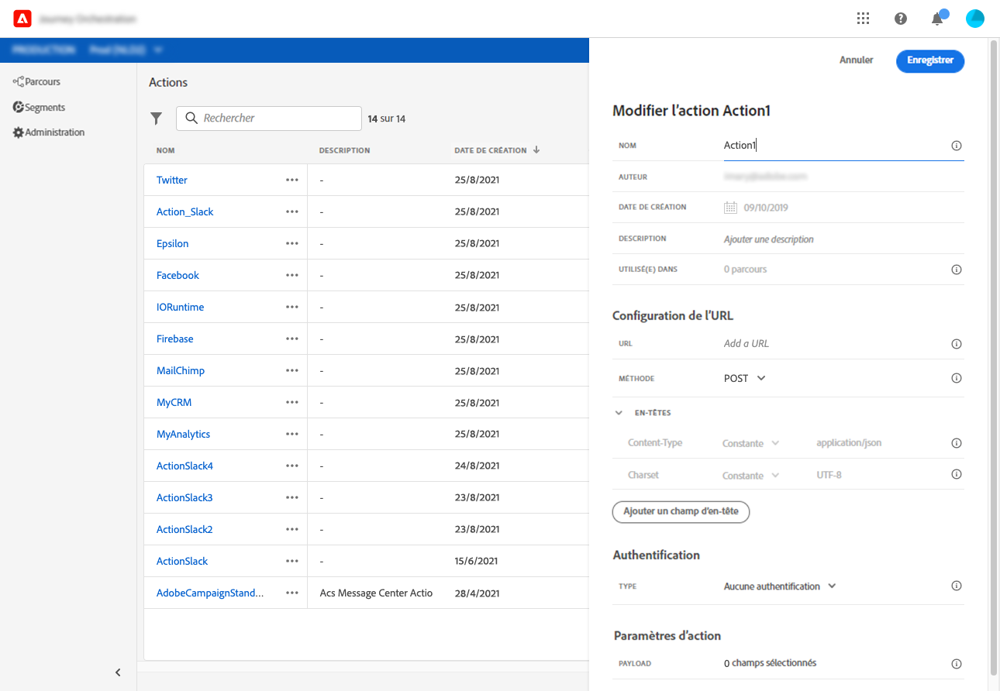

# À propos de la configuration des actions personnalisées {#concept_sxy_bzs_dgb}

Si vous utilisez un système tiers pour envoyer des messages ou si vous souhaitez que [!DNL Journey Orchestration] envoie des appels d’API à un système tiers, vous devez configurer la connexion de ce système à [!DNL Journey Orchestration]. L’action personnalisée définie par les utilisateurs techniques sera alors disponible dans la palette gauche du parcours, dans la catégorie **[!UICONTROL Action]** (voir [cette page](../building-journeys/about-action-activities.md). À titre d’exemple, Epsilon, Facebook, Adobe.io, Firebase, etc. sont des systèmes auxquels vous pouvez vous connecter à l’aide d’actions personnalisées.
Les limites sont répertoriées dans [cette page](../about/limitations.md).

Les principales étapes nécessaires pour configurer une action personnalisée sont les suivantes :

1. Dans la liste **[!UICONTROL Actions]**, cliquez sur **[!UICONTROL Ajouter]** pour créer une action. Le volet de configuration des actions s’ouvre dans la droite de l’écran.

   

1. Saisissez le nom de l’action.

   >[!NOTE]
   >
   >N’utilisez ni espaces ni caractères spéciaux. Utilisez 30 caractères au maximum.

1. Ajoutez une description à l’action. Cette étape est facultative.
1. Le nombre de parcours qui font appel à cette action apparaît dans le champ **[!UICONTROL Utilisé(e) dans]**. Vous pouvez cliquer sur le bouton **[!UICONTROL Afficher les parcours]** pour faire apparaître la liste des parcours utilisant cette action.
1. Définissez les différents paramètres de **[!UICONTROL Configuration d’URL]**. Voir [cette page](../action/url-configuration.md).
1. Configurez la section **[!UICONTROL Authentification]**. Cette configuration est la même que pour les sources de données.  Reportez-vous à [cette section](../datasource/external-data-sources.md#section_wjp_nl5_nhb).
1. Définissez les **[!UICONTROL Paramètres de message]**. Voir [cette page](../action/defining-the-message-parameters.md).
1. Cliquez sur **[!UICONTROL Enregistrer]**.

   L’action personnalisée est maintenant configurée et prête à être utilisée dans vos parcours. Voir [cette page](../building-journeys/about-action-activities.md).

   >[!NOTE]
   >
   >Lorsqu’une action personnalisée est utilisée dans un parcours, la plupart des paramètres sont en lecture seule. Vous ne pouvez modifier que les champs **[!UICONTROL Nom]**, **[!UICONTROL Description]**, **[!UICONTROL URL]** et la section **[!UICONTROL Authentification.]**
