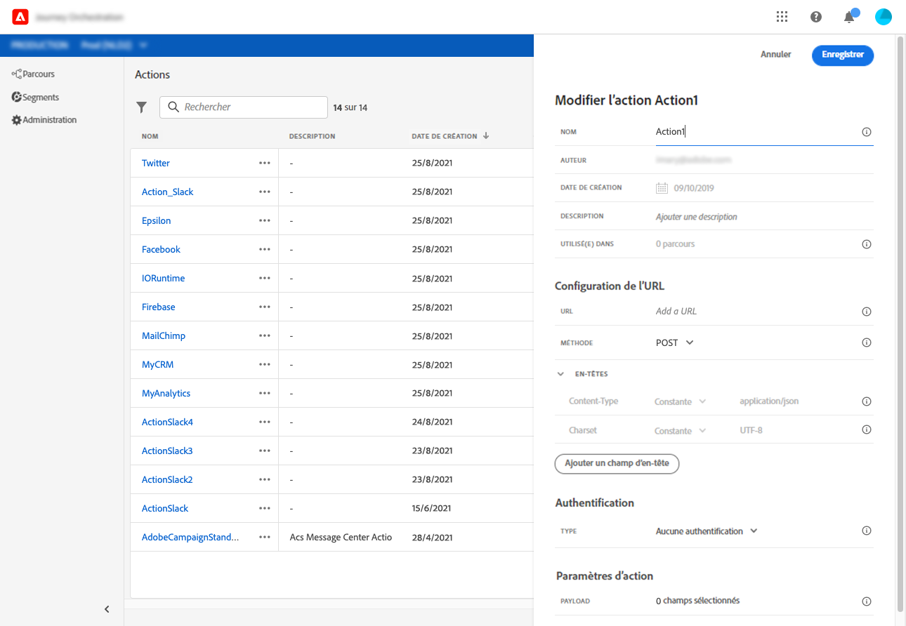

# À propos de la configuration des actions personnalisées {#concept_sxy_bzs_dgb}

>[!CAUTION]
>
>**Vous recherchez Adobe Journey Optimizer** ? Cliquez [ici](https://experienceleague.adobe.com/fr/docs/journey-optimizer/using/ajo-home){target="_blank"} pour consulter la documentation de Journey Optimizer.
>
>
>_Cette documentation se rapporte aux anciens contenus de Journey Orchestration qui ont été remplacés par Journey Optimizer. Pour toute question concernant votre accès à Journey Orchestration ou Journey Optimizer, contactez votre équipe en charge des comptes._

Si vous utilisez un système tiers pour envoyer des messages ou si vous souhaitez que [!DNL Journey Orchestration] envoie des appels d’API à un système tiers, vous devez configurer la connexion de ce système à [!DNL Journey Orchestration]. L&#39;action personnalisée définie par les utilisateurs techniques sera alors disponible dans la palette gauche du parcours, dans la catégorie **[!UICONTROL Action]** (voir [cette page](../building-journeys/about-action-activities.md). À titre d&#39;exemple, Epsilon, Facebook, Adobe.io, Firebase, etc. sont des systèmes auxquels vous pouvez vous connecter à l&#39;aide d&#39;actions personnalisées.

Les limites sont répertoriées dans [cette page](../about/limitations.md).

Dans les paramètres d’action personnalisée, vous pouvez transmettre une collection simple, ainsi qu’une collection d’objets. En ce qui concerne les limitations, reportez-vous à [cette page](../usecase/collections.md#limitations). Notez également qu’un format spécifique est attendu pour les paramètres (par exemple : chaîne, décimal, etc.). Vous devez veiller au respect de cette exigence. Reportez-vous à ce [cas d’utilisation](../usecase/collections.md).

Les principales étapes nécessaires pour configurer une action personnalisée sont les suivantes :

1. Dans la liste **[!UICONTROL Actions]**, cliquez sur **[!UICONTROL Ajouter]** pour créer une action. Le volet de configuration des actions s&#39;ouvre dans la droite de l&#39;écran.

   

1. Saisissez le nom de l&#39;action.

   >[!NOTE]
   >
   >N&#39;utilisez ni espaces ni caractères spéciaux. Utilisez 30 caractères au maximum.

1. Ajoutez une description à l&#39;action. Cette étape est facultative.
1. Le nombre de parcours qui font appel à cette action s’affiche dans le champ **[!UICONTROL Utilisé dans]**. Vous pouvez cliquer sur le bouton **[!UICONTROL Afficher les parcours]** pour afficher la liste des parcours utilisant cette action.
1. Définissez les différents paramètres de **[!UICONTROL Configuration d&#39;URL]**. Consultez [cette page](../action/url-configuration.md).
1. Configurez la section **[!UICONTROL Authentification]**. Cette configuration est la même que pour les sources de données.  Consultez [cette section](../datasource/external-data-sources.md#section_wjp_nl5_nhb).
1. Définissez les **[!UICONTROL paramètres d&#39;action]**. Consultez [cette page](../action/defining-the-message-parameters.md).
1. Cliquez sur **[!UICONTROL Enregistrer]**.

   L&#39;action personnalisée est maintenant configurée et prête à être utilisée dans vos parcours. Consultez [cette page](../building-journeys/about-action-activities.md).

   >[!NOTE]
   >
   >Lorsqu&#39;une action personnalisée est utilisée dans un parcours, la plupart des paramètres sont en lecture seule. Vous pouvez uniquement modifier les champs **[!UICONTROL Nom]**, **[!UICONTROL Description]**, **[!UICONTROL URL]** et la section **[!UICONTROL Authentification]**.
