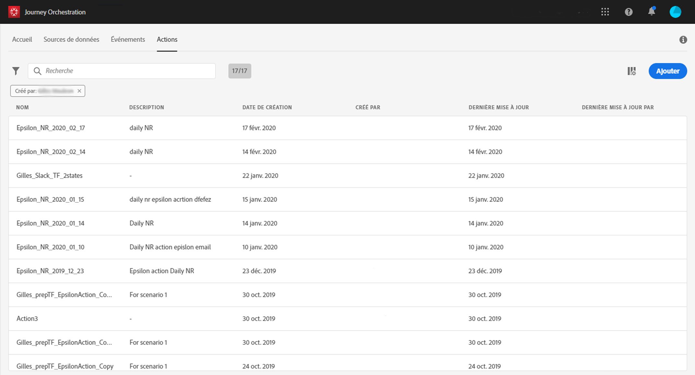

# A propos des actions {#about_actions}

>[!CONTEXTUALHELP]
>id=&quot;jo_actions&quot;
>title=&quot;A propos des actions&quot;
>abstract=&quot;C&#39;est là que vous définissez la connexion au système qui enverra des messages. Les actions définies ici seront alors disponibles dans la palette gauche de votre voyage, dans la catégorie Action.&quot;

La configuration des actions personnalisées est toujours effectuée par un utilisateur **** technique.

C&#39;est là que vous définissez la connexion au système qui enverra des messages. Les actions définies ici seront alors disponibles dans la palette gauche de votre voyage, dans la catégorie **[!UICONTROL Action]**(voir.

Pour afficher la liste des actions ou configurer une nouvelle action, cliquez sur **[!UICONTROL Actions]**dans les menus supérieurs. La liste des actions s’affiche. Voirpour plus d’informations sur l’interface.

Si vous disposez d’Adobe Campaign Standard, vous devez configurer l’action prête à l’emploi. Reportez-vous à .

Si vous utilisez un système tiers pour envoyer des messages, vous devez ajouter et configurer une action personnalisée. Reportez-vous à .
