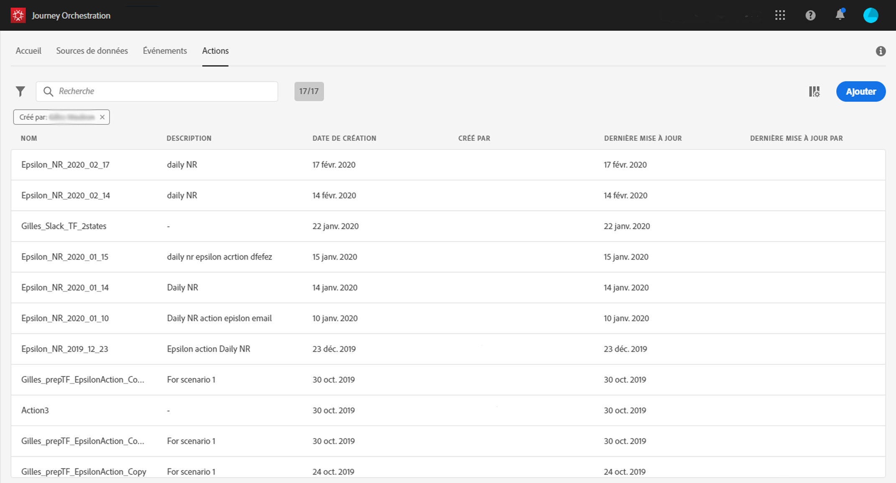

# À propos des actions {#about_actions}

>[!CAUTION]
>
>**Vous recherchez Adobe Journey Optimizer** ? Cliquez [ici](https://experienceleague.adobe.com/fr/docs/journey-optimizer/using/ajo-home){target="_blank"} pour consulter la documentation de Journey Optimizer.
>
>
>_Cette documentation se rapporte aux anciens contenus de Journey Orchestration qui ont été remplacés par Journey Optimizer. Pour toute question concernant votre accès à Journey Orchestration ou Journey Optimizer, contactez votre équipe en charge des comptes._

>[!CONTEXTUALHELP]
>id="jo_actions"
>title="À propos des actions"
>abstract="C&#39;est à ce niveau qu&#39;est définie la connexion au système qui enverra les messages. Les actions définies ici seront alors disponibles dans la palette gauche de votre parcours, dans la catégorie Action. "

Les actions sont des connexions par le biais desquelles vous proposez des expériences en temps réel personnalisées aux clients, telles que des notifications push, des emails, des SMS ou tout autre moyen d&#39;engagement numérique utilisé dans votre entreprise.

Les actions personnalisées vous permettent de configurer la connexion d&#39;un système tiers pour envoyer des messages ou des appels d&#39;API. Une action peut être configurée avec n’importe quel service de n’importe quel fournisseur qui peut être appelé via une API REST avec une payload au format JSON.

Les actions apparaissent dans la palette gauche de votre parcours, dans la catégorie **[!UICONTROL Action]**. Consultez [cette page](../building-journeys/about-action-activities.md).

>[!NOTE]
>
>La configuration des actions personnalisées est toujours effectuée par un **utilisateur technique**.

Dans la liste des **Actions**, vous pouvez appuyer sur la touche c pour créer un parcours, une action, une source de données ou un événement. Pour plus d’informations sur les raccourcis dans [!DNL Journey Orchestration], voir [cette section](../about/user-interface.md#section_ksq_zr1_ffb).

Pour afficher la liste des actions ou configurer une nouvelle action, cliquez sur **[!UICONTROL Actions]** dans les menus supérieurs. La liste des actions s&#39;affiche. Pour plus d&#39;informations sur l&#39;interface, voir [cette page](../about/user-interface.md)

Si vous disposez d’Adobe Campaign Standard, vous devez configurer l’action d’usine pour pouvoir envoyer des e-mails, des notifications Push et des SMS à l’aide des fonctionnalités de message transactionnel de cette plateforme. Voir [cette page](../action/working-with-adobe-campaign.md).

Si vous disposez d’Adobe Campaign v7 ou v8, une intégration est disponible sur demande. Voir [cette page](../action/acc-action.md).

Si vous utilisez un système tiers pour envoyer des messages tels que Epsilon, Facebook, Adobe.io, Firebase, etc., vous devez ajouter et configurer une action personnalisée. Voir [cette page](../action/about-custom-action-configuration.md).

