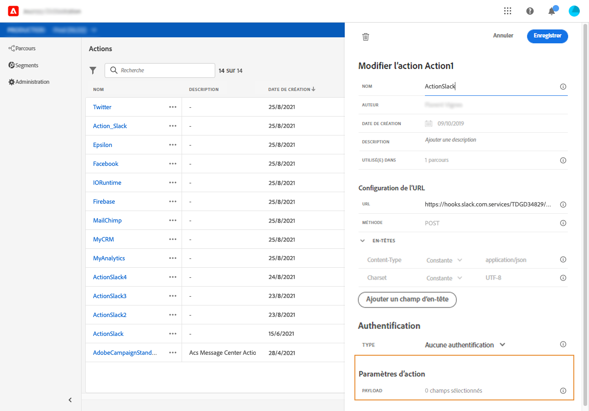
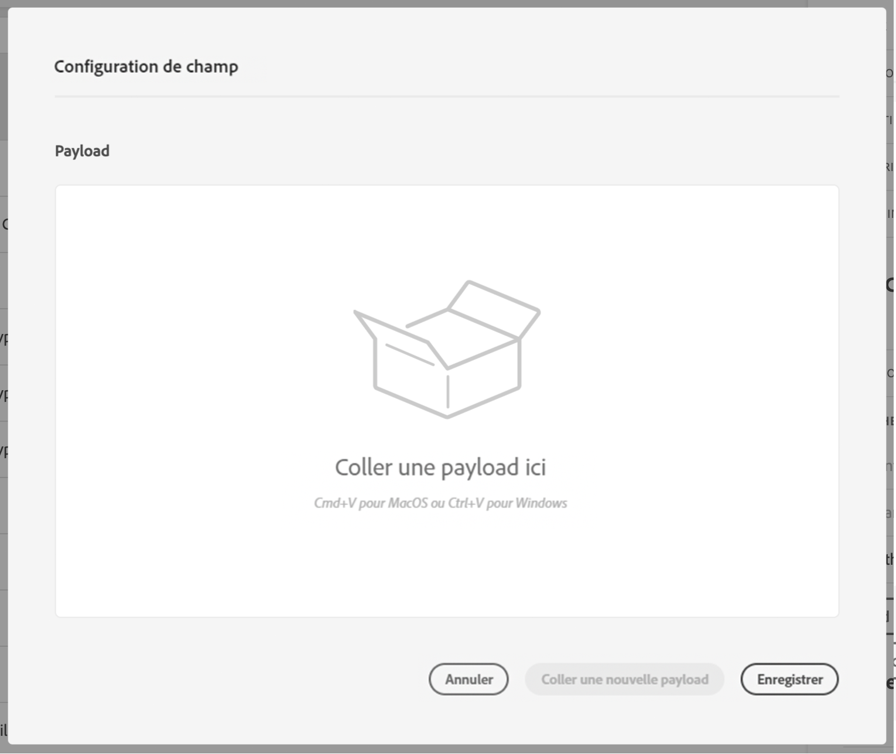
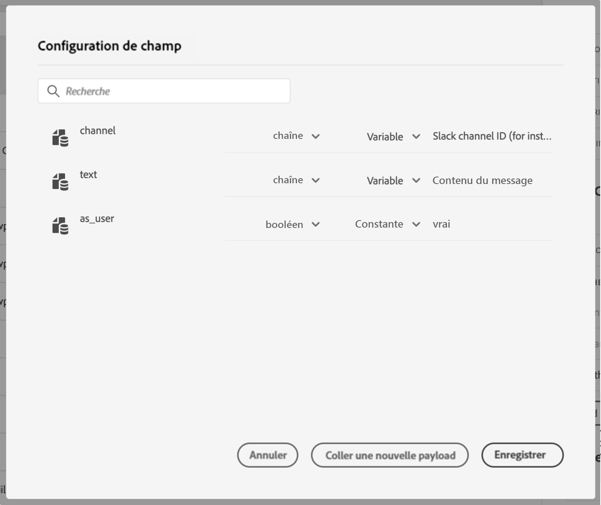

# Définition des paramètres de message {#concept_wy4_bf1_2gb}

Dans la section **[!UICONTROL Paramètres de message]**, collez un exemple de payload JSON à envoyer au service externe.

Vous aurez la possibilité de définir le type de paramètre (par exemple : string, integer, etc.).

Vous pourrez également préciser si le paramètre est une constante ou une variable :

* Le paramètre « Constante » signifie que la valeur du paramètre est définie dans le volet de configuration des actions par une personne ayant un rôle technique. La valeur reste identique dans tous les parcours et le marketeur ne la voit pas lors de l’utilisation de l’action personnalisée dans le parcours. Il peut s’agir, par exemple, d’un identifiant attendu par le système tiers. Dans ce cas, le champ situé à droite du bouton bascule Constante/Variable correspond à la valeur transmise.
* Le paramètre « Variable » signifie que la valeur du paramètre varie. Le marketeur qui utilise cette action personnalisée dans un parcours peut transmettre la valeur de son choix ou bien indiquer où récupérer la valeur de ce paramètre (à partir de l’événement, d‘Adobe Experience Platform, etc.). Dans ce cas, le champ situé à droite du bouton bascule Constante/Variable correspond au libellé que le marketeur voit dans le parcours pour nommer ce paramètre.

