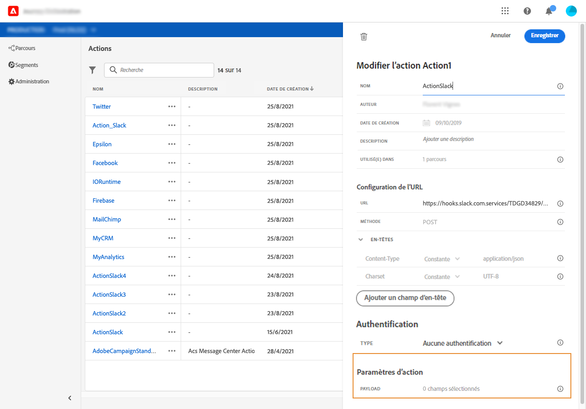
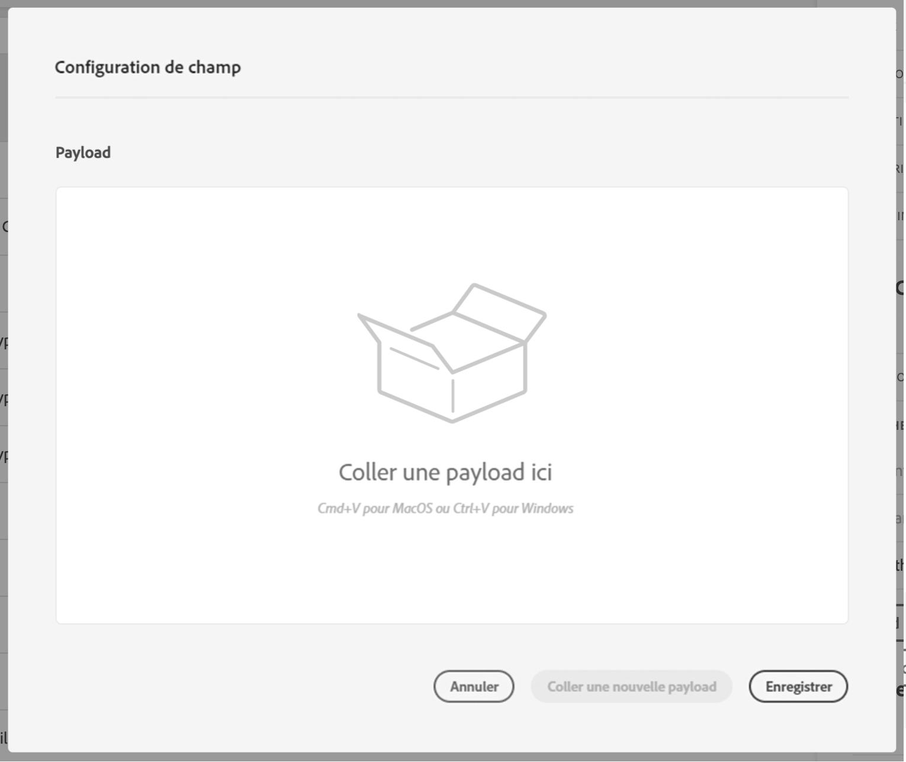
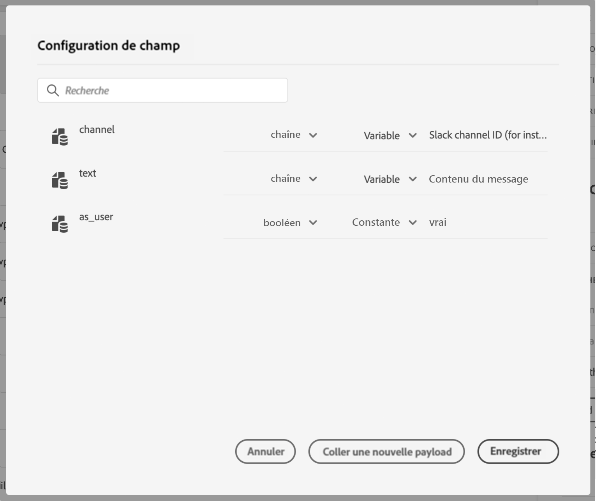

# Définition des paramètres d’action {#concept_wy4_bf1_2gb}

>[!CAUTION]
>
>**Vous recherchez Adobe Journey Optimizer** ? Cliquez [ici](https://experienceleague.adobe.com/fr/docs/journey-optimizer/using/ajo-home){target="_blank"} pour consulter la documentation de Journey Optimizer.
>
>
>_Cette documentation se rapporte aux anciens contenus de Journey Orchestration qui ont été remplacés par Journey Optimizer. Pour toute question concernant votre accès à Journey Orchestration ou Journey Optimizer, contactez votre équipe en charge des comptes._

Dans la section **[!UICONTROL Paramètres d&#39;action]**, collez un exemple de payload JSON à envoyer au service externe.

>[!NOTE]
>
>Les noms de champ de la payload ne peuvent pas contenir de caractère « . » . Ils ne peuvent pas commencer par le caractère &quot;$&quot;.

Vous pourrez définir le type de paramètre (par exemple : chaîne, entier, etc.).

Vous aurez également la possibilité de spécifier si un paramètre est une constante ou une variable :

* Le paramètre « Constante » signifie que la valeur du paramètre est définie dans le volet de configuration des actions par une personne ayant un rôle technique. La valeur reste identique dans tous les parcours et la personne chargée du marketing ne la voit pas lors de l’utilisation de l’action personnalisée dans le parcours. Il peut s&#39;agir, par exemple, d&#39;un identifiant attendu par le système tiers. Dans ce cas, le champ situé à droite du bouton bascule Constante/Variable correspond à la valeur transmise.
* Le paramètre « Variable » signifie que la valeur du paramètre varie. Le spécialiste marketing qui utilise cette action personnalisée dans un parcours peut transmettre la valeur de son choix ou bien indiquer où récupérer la valeur de ce paramètre (à partir de l’événement, d‘Adobe Experience Platform, etc.). Dans ce cas, le champ situé à droite du bouton bascule Constante/Variable correspond au libellé que le spécialiste marketing voit dans le parcours pour nommer ce paramètre.

