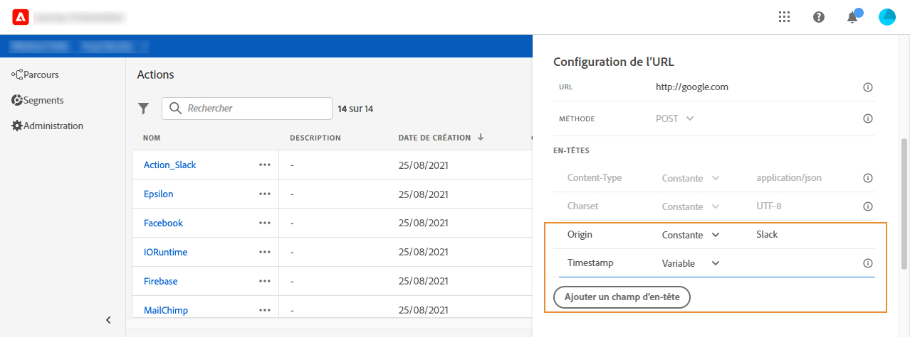

# Configurer des URL {#concept_gbg_1f1_2gb}

Lors de la configuration d&#39;une action personnalisée, vous devez définir les paramètres de **[!UICONTROL configuration d&#39;URL]** suivants :

1. Dans le champ **[!UICONTROL URL]**, spécifiez l&#39;URL du service externe :

   * Si l’URL est statique, saisissez l’URL dans ce champ.

   * Si l’URL comprend un chemin dynamique, saisissez uniquement la partie statique de l’URL, c’est-à-dire le schéma, l’hôte, le port et, éventuellement, une partie statique du chemin.

     Exemple : `https://xxx.yyy.com/somethingstatic/`

     Vous spécifiez le chemin dynamique de l’URL lors de l’ajout de l’action personnalisée à un parcours. [En savoir plus](../building-journeys/using-custom-actions.md).

   >[!NOTE]
   >
   >Pour des raisons de sécurité, nous vous recommandons vivement d’utiliser le schéma HTTPS pour l’URL. L&#39;utilisation des adresses Adobe qui ne sont pas publiques et des adresses IP n&#39;est pas autorisée.
   >
   >Seuls les ports par défaut sont autorisés lors de la définition d’une action personnalisée : 80 pour http et 443 pour https.

1. Sélectionnez la **[!UICONTROL Méthode]** d&#39;appel : il peut s&#39;agir de **[!UICONTROL POST]** ou de **[!UICONTROL PUT]**.
1. Dans la section **[!UICONTROL En-têtes]** , définissez les en-têtes HTTP du message de demande à envoyer au service externe :
   1. Pour ajouter un champ d’en-tête, cliquez sur **[!UICONTROL Ajouter un champ d’en-tête]**.
   1. Saisissez la clé du champ d’en-tête.
   1. Pour définir une valeur dynamique pour la paire clé-valeur, sélectionnez **[!UICONTROL Variable]**. Sinon, sélectionnez **[!UICONTROL Constante]**.

      Par exemple, pour un horodatage, vous pouvez définir une valeur dynamique.

   1. Si vous avez sélectionné **[!UICONTROL Constante]**, saisissez la valeur constante.

      Si vous avez sélectionné **[!UICONTROL Variable]**, vous spécifiez cette variable lors de l’ajout de l’action personnalisée à un parcours. [En savoir plus](../building-journeys/using-custom-actions.md).

      

   1. Pour supprimer un champ d’en-tête, pointez sur le champ d’en-tête et cliquez sur l’icône **[!UICONTROL Supprimer]** .

   Les champs d’en-tête **[!UICONTROL Type de contenu]** et **[!UICONTROL CharSet]** sont définis par défaut. Vous ne pouvez pas modifier ni supprimer ces champs.

   Après avoir ajouté l’action personnalisée à un parcours, vous pouvez toujours y ajouter des champs d’en-tête si le parcours est en état de brouillon. Si vous ne souhaitez pas que le parcours soit affecté par les modifications de configuration, dupliquez l’action personnalisée et ajoutez les champs d’en-tête à la nouvelle action personnalisée.

   >[!NOTE]
   >
   >Les en-têtes sont validés conformément à des règles d&#39;analyse. [En savoir plus](https://tools.ietf.org/html/rfc7230#section-3.2.4).
