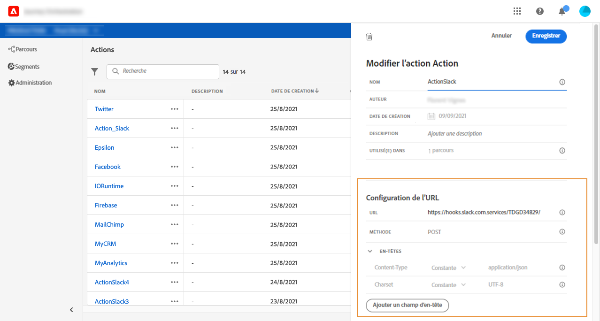

# URL configuration {#concept_gbg_1f1_2gb}

Lors de la configuration d’une action personnalisée, vous devez définir les paramètres de configuration **[!UICONTROL d’]**URL suivants :

1. Ajoutez l’ **[!UICONTROL URL]**du service externe.

   >[!NOTE]
   >
   >Nous vous recommandons vivement d’utiliser HTTPS pour des raisons de sécurité. Nous n’autorisons pas l’utilisation d’adresses Adobe qui ne sont pas publiques et d’adresses IP.

1. Sélectionnez l’appel **[!UICONTROL Méthode]**: il peut s’agir de**[!UICONTROL  POST]** ou **[!UICONTROL PUT]**.
1. Dans la section **[!UICONTROL En-têtes]**, cliquez sur**[!UICONTROL  Ajouter un champ]** d’en-tête pour définir une nouvelle paire clé/valeur. Elles correspondent aux en-têtes HTTP de la requête envoyée au service externe. Pour supprimer des paires clé/valeur, placez le curseur sur le champ **[!UICONTROL En-têtes]**et cliquez sur l’icône**[!UICONTROL  Supprimer]** .

   **[!UICONTROL Content-Type]**et**[!UICONTROL  Charset]** sont définis par défaut et ne peuvent pas être supprimés ni remplacés.

   >[!NOTE]
   >
   >Les en-têtes sont validés conformément aux règles [d’](https://tools.ietf.org/html/rfc7230#section-3.2.4)analyse suivantes.
