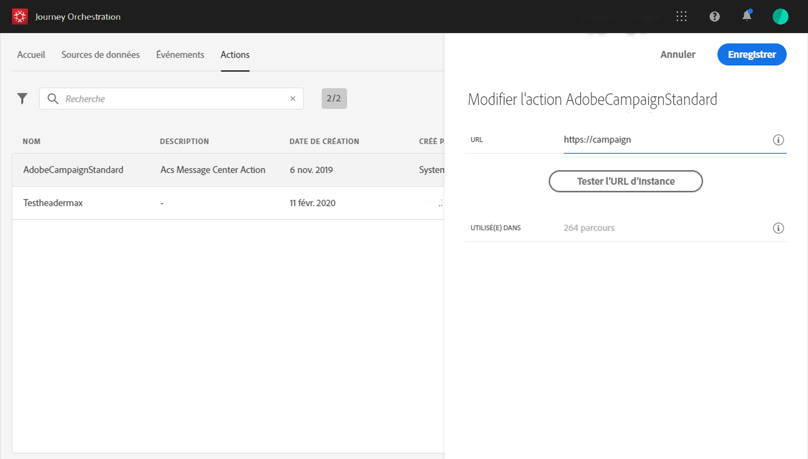
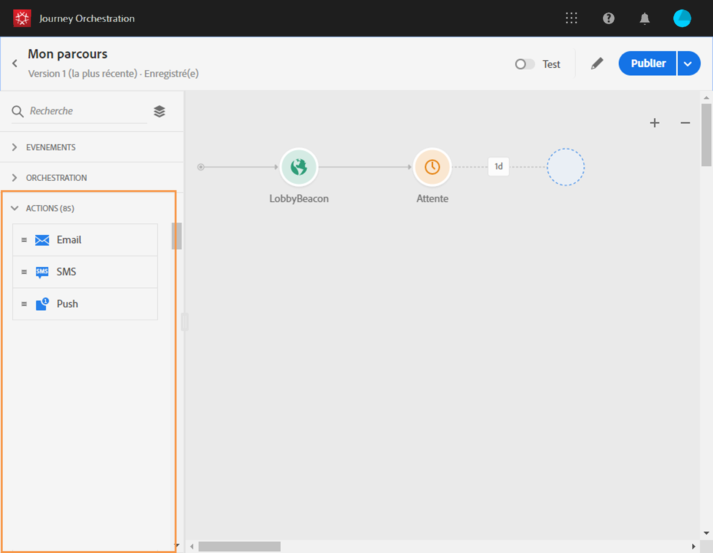

# Utilisation d’Adobe Campaign {#using_adobe_campaign_standard}

Vous pouvez envoyer des emails, des notifications push et des SMS à l’aide des fonctionnalités de messagerie transactionnelle d’Adobe Campaign Standard.

[!DNL Journey Orchestration] est fourni avec une action d’usine qui permet de se connecter à Adobe Campaign Standard.

Le message transactionnel Campaign Standard et son événement associé doivent être publiés pour être utilisés dans Journey Orchestration. Si l’événement est publié mais que le message ne l’est pas, il ne sera pas visible dans l’interface de Journey Orchestration. Si le message est publié mais que son événement associé ne l’est pas, il sera visible dans l’interface de Journey Orchestration, mais il ne sera pas utilisable.

>[!NOTE]
>
>Une règle de plafonnement de 13 appels par seconde est automatiquement définie pour les actions Adobe Campaign Standard dès que l’intégration Adobe Campaign Standard est configurée. Cela correspond à l&#39;échelle officielle des messages transactionnels d&#39;Adobe Campaign Standard.
>
>Pour en savoir plus sur les SLA de messagerie transactionnelle, consultez la [description du produit Adobe Campaign Standard](https://helpx.adobe.com/fr/legal/product-descriptions/campaign-standard.html).

La procédure de configuration est la suivante :

1. Dans la liste **[!UICONTROL Actions]**, cliquez sur l’action **[!UICONTROL AdobeCampaignStandard]** intégrée. Le volet de configuration des actions s’ouvre dans la partie droite de l’écran.

   

1. Copiez l’URL de votre instance Adobe Campaign Standard et collez-la dans le champ **[!UICONTROL URL]**.

1. Cliquez sur **[!UICONTROL Tester l’URL d’instance]** pour tester la validité de l’instance.

   >[!NOTE]
   >
   >Ce test vérifie que les conditions suivantes sont remplies :
   >
   >L’hôte est &quot;.campaign.adobe.com&quot;, &quot;.campaign-sandbox.adobe.com&quot; ou &quot;.campaign-demo.adobe.com&quot;
   >
   >L’URL commence par https.
   >
   >L’organisation associée à cette instance d’Adobe Campaign Standard est identique à l’organisation de Journey Orchestration.

Lors de la conception de votre parcours, trois actions sont disponibles dans la catégorie **[!UICONTROL Action]** : **[!UICONTROL Email]**, **[!UICONTROL Push]** et **[!UICONTROL SMS]** (voir [Utilisation d’actions Adobe Campaign](../building-journeys/using-adobe-campaign-actions.md)). L’**événement Réactions** vous permet également de réagir sur les clics, les ouvertures des messages, etc. (Voir [Événements Réactions](../building-journeys/reaction-events.md)).

Si vous utilisez un système tiers pour l’envoi de messages, vous devez ajouter et configurer une action personnalisée. Voir [À propos de la configuration d’actions personnalisées](../action/about-custom-action-configuration.md).
