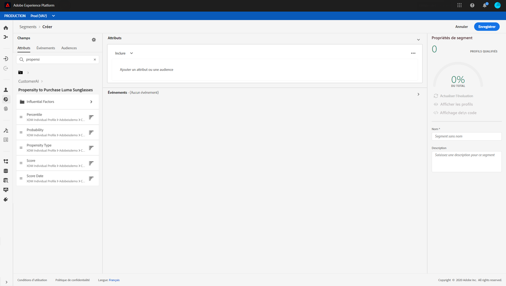

# Utilisation de l’IA dédiée aux clients {#customer-ai}

L’IA dédiée aux clients fait partie des Services intelligents. Elle permet de prévoir ce qu’un client est susceptible de faire. Reportez-vous à la [documentation](https://docs.adobe.com/content/help/fr-FR/experience-platform/intelligent-services/customer-ai/overview.html).

L’IA dédiée aux clients permet aux marques de créer des scores basés sur le machine learning d’attrition ou de conversion qui seront disponibles en tant qu’attributs de profil dans les profils Adobe Experience Platform (profil client en temps réel).

Par conséquent, ils peuvent être utilisés comme tout autre attribut de profil dans les conditions de Journey Orchestration (pour prendre les meilleures décisions), les actions ou la création de segments.

Veuillez noter que l’IA dédiée aux clients est une fonction payante d’Adobe Experience Platform.

