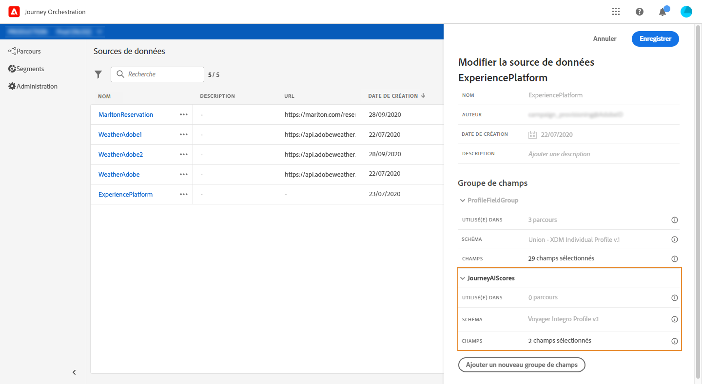
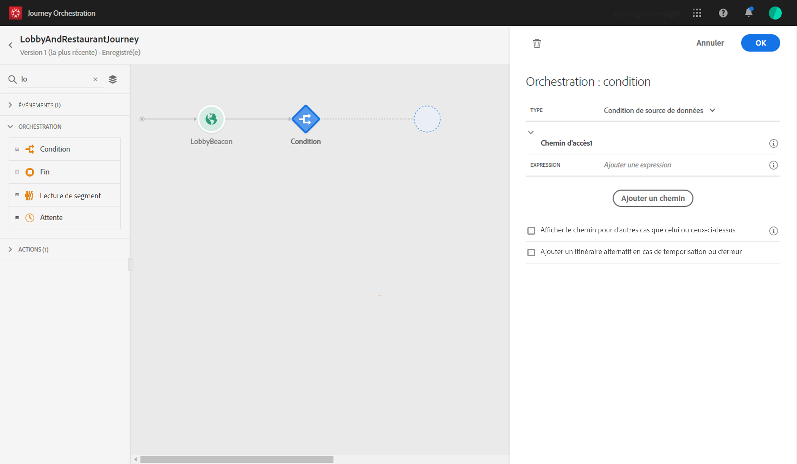
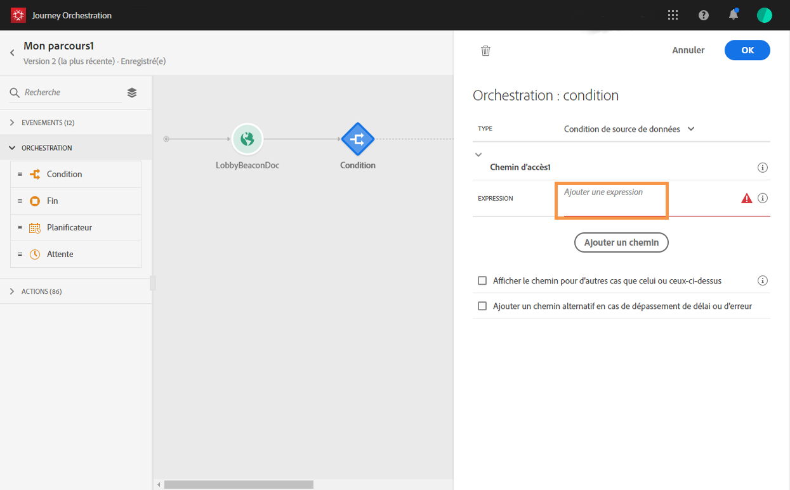
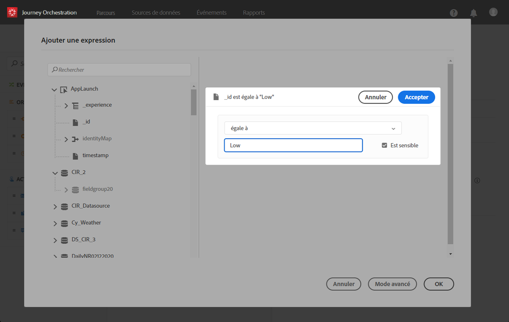
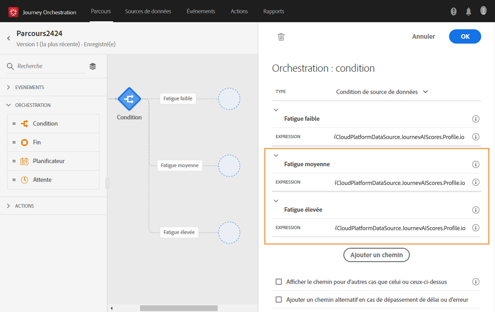
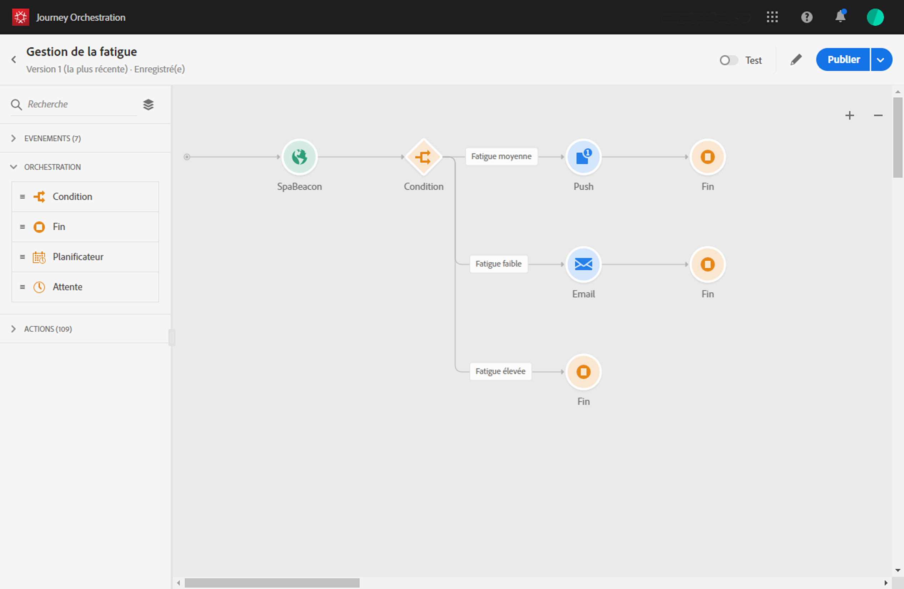

# Utilisation de l’IA dédiée aux parcours {#concept_dsh_1ry_wfb}

Ce cas d’utilisation montre comment tirer parti des scores de fatigue pour éviter de trop solliciter les clients dans les parcours.

>[!CAUTION]
>
>La fonctionnalité prédictive de score de fatigue n’est disponible que pour les clients qui utilisent la fonction Service de données d’Adobe Campaign Standard.

## Configuration de l’événement {#section_ptb_ws1_ffb}

Suivez les étapes décrites dans la section [](../event/about-events.md).

## Configuration de la source de données {#section_o3n_4yy_wfb}

Pour sélectionner les champs de score de fatigue dans la source de données intégrée, procédez comme suit :

1. Dans le menu supérieur, cliquez sur l’onglet **[!UICONTROL Sources de données]** et sélectionnez la source de données Experience Platform intégrée.

   

1. Vérifiez que les champs requis pour votre cas d’utilisation sont sélectionnés.
1. Cliquez sur **[!UICONTROL Ajouter un nouveau groupe de champs]**, sélectionnez le modèle **[!UICONTROL Profils]**, puis ajoutez les champs **[!UICONTROL fatigueLevel]** et **[!UICONTROL fatigueScore]** (au-dessous de _journeyAI > emailScore > fatigue_).

   

1. Cliquez sur **[!UICONTROL Enregistrer]**.

## Création du parcours {#section_uzm_pyy_wfb}

Pour créer, valider et publier le parcours, suivez les étapes décrites dans la section [](../building-journeys/journey.md).

Dans notre cas d’utilisation, nous employons le champ **[!UICONTROL fatigueLevel]**. Vous pouvez également avoir recours au champ **[!UICONTROL fatigueScore]**.

Pour utiliser le niveau de fatigue dans votre parcours, procédez comme suit :

1. Ajoutez un événement et une condition au parcours.

   

1. Sélectionnez le type **[!UICONTROL Condition de source de données]**, puis cliquez dans le champ **[!UICONTROL Expression]**.

   

1. À l’aide de l’éditeur d’expression simple, recherchez le champ **[!UICONTROL fatigueLevel]** (_ExperiencePlatformDataSource > JourneyAIScores > Profile > journeyAI > emailScore > fatigue_), déposez-le sur la droite et créez la condition suivante : « fatigueLevel est égal à Low ». Cliquez sur **[!UICONTROL Ok]**.

   

   L’expression avancée est la suivante :

   ```
   #{ExperiencePlatformDataSource.JourneyAIScores.Profile.journeyAI.emailScore.fatigue.fatigueLevel} == "low"
   ```

1. Dans la condition, créez deux autres chemins pour les niveaux de fatigue moyen et élevé.

   

1. Vous pouvez maintenant ajouter différentes actions pour chaque niveau de fatigue.

   
