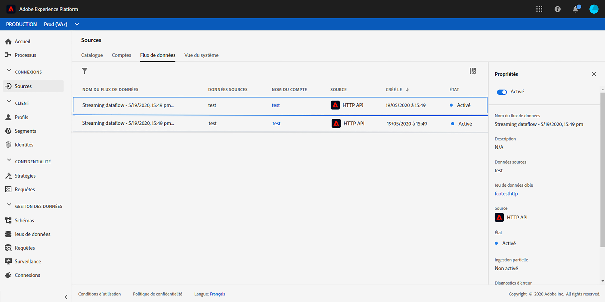

# Événements basés sur des règles{#simplified-events}

Nous avons simplifié la configuration des événements d’expérience. Nous proposons une nouvelle méthode qui ne nécessite pas l’utilisation d’un identifiant d’événement. Lorsque vous configurez votre événement dans Journey Orchestration, vous pouvez désormais définir un événement basé sur des règles.

Ce nouveau type d’événement ne génère pas d’identifiant d’événement. En utilisant l’éditeur d’expression simple, vous définissez désormais simplement une règle qui sera utilisée par le système pour identifier les événements pertinents qui déclencheront vos parcours. Cette règle peut être basée sur n’importe quel champ disponible dans le payload, par exemple l’emplacement du profil ou le nombre d’éléments ajoutés au panier du profil.

Cette nouvelle méthode est majoritairement transparente pour les utilisateurs. La seule modification est un nouveau champ dans l’écran de définition de l’événement.

>[!CAUTION]
>
>Une règle de plafonnement est définie pour les événements basés sur des règles. Il limite à 400 000 le nombre de événements qualifiés qu&#39;un voyage peut traiter à la minute. Pour plus d&#39;informations, veuillez contacter votre point de contact du programme Alpha.

## Utilisation des données Adobe Analytics{#analytics-data}

>[!NOTE]
>
>Cette section s’applique uniquement aux clients qui doivent utiliser des données Adobe Analytics.

Vous pouvez exploiter toutes les données d’événement comportemental Adobe Analytics que vous capturez déjà et diffusez en continu dans Platform afin de déclencher des parcours et d’automatiser les expériences de vos clients.

Pour que cela fonctionne, vous devez activer, dans Adobe Experience Platform, la suite de rapports que vous souhaitez utiliser :

1. Dans Adobe Experience Platform, sélectionnez **[!UICONTROL Sources]**, puis **[!UICONTROL Ajouter des données]** dans la section Adobe Analytics. La liste des suites de rapports Adobe Analytics disponibles s’affiche.

1. Sélectionnez la suite de rapports à activer, cliquez sur **[!UICONTROL Suivant]** et sur **[!UICONTROL Terminer]**.

1. Partagez l’ID de données source avec votre point de contact de programme Alpha.

Cela active le connecteur source Analytics pour cette suite de rapports. Chaque fois que des données entrent, elles sont transformées en événement d’expérience et envoyées dans Adobe Experience Platform.

Pour plus d’informations sur le connecteur source Adobe Analytics, consultez la [documentation](https://docs.adobe.com/help/fr-FR/experience-platform/sources/connectors/adobe-applications/analytics.html) et le [tutoriel](https://docs.adobe.com/content/help/fr-FR/experience-platform/sources/ui-tutorials/create/adobe-applications/analytics.html).

## Configuration d’un événement basé sur des règles{#configuring-rule-based}

1. Dans le menu de gauche, cliquez sur l’icône **[!UICONTROL Administration]**, puis sur **[!UICONTROL Événements]**. La liste des événements s’affiche.

   

1. Cliquez sur le bouton **[!UICONTROL Ajouter]** pour créer un événement. Le volet de configuration d’événement s’ouvre dans la partie droite de l’écran.

   

1. Saisissez le nom de votre événement. Vous pouvez également ajouter une description.

   

1. Dans le nouveau champ **[!UICONTROL Type d’identifiant d’événement]**, sélectionnez **[!UICONTROL Basé sur des règles]**.

   

   >[!NOTE]
   >
   >Le type **[!UICONTROL Généré par le système]** est la méthode existante qui requiert un identifiant d’événement. Reportez-vous à [cette section](../event/about-events.md).

1. Définissez les champs **[!UICONTROL Schéma]** et **[!UICONTROL Payload]**. Reportez-vous à [cette section](../event/defining-the-payload-fields.md).

   

   >[!NOTE]
   >
   >Lorsque vous sélectionnez le type **[!UICONTROL Généré par le système]**, seuls les schémas dont le mixin est de type Identifiant d’événement sont disponibles. Lorsque vous sélectionnez le type **[!UICONTROL Basé sur des règles]**, tous les schémas Événement d’expérience sont disponibles.

1. Cliquez à l’intérieur du champ **[!UICONTROL Condition de l’identifiant d’événement]**. À l’aide de l’éditeur d’expression simple, définissez la condition qui sera utilisée par le système pour identifier les événements qui déclencheront votre parcours.

   

   Dans notre exemple, nous avons écrit une condition basée sur la ville du profil. Cela signifie que chaque fois que le système reçoit un événement qui correspond à cette condition (champ **[!UICONTROL Ville]** et valeur **[!UICONTROL Paris]**), il le transmet à Journey Orchestration.

1. Définissez l’**[!UICONTROL espace de noms]** et la **[!UICONTROL clé]**. Voir [Sélection de l’espace de noms](../event/selecting-the-namespace.md) et [Définition de la clé de l’événement](../event/defining-the-event-key.md).

   

Les autres étapes pour la configuration d’événement et la création de parcours restent inchangées.

L’événement est maintenant configuré et prêt à être déposé dans un parcours comme n’importe quel autre événement. Chaque fois qu’un événement correspondant à la règle est envoyé au système, il est transmis à Journey Orchestration pour déclencher vos parcours.

## Mode test pour les événements basés sur des règles{#test-rule-based}

Le mode test est également disponible pour les parcours qui utilisent un événement basé sur des règles.

Lors du déclenchement d&#39;un événement, l&#39;écran de **configuration de l’événement** permet de définir les paramètres d’événement à transmettre au test. Vous pouvez afficher la condition d’identifiant d’événement en cliquant sur l’icône d’info-bulle située dans le coin supérieur droit. Une info-bulle est également disponible en regard de chaque champ qui fait partie de l’évaluation des règles.

Pour plus d’informations sur l’utilisation du mode test, consultez .

