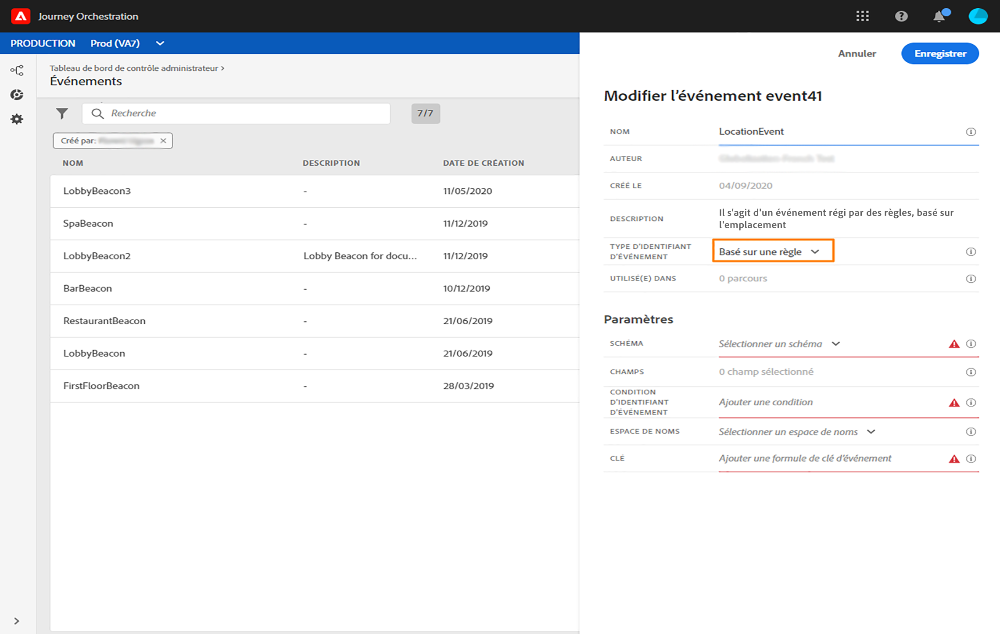
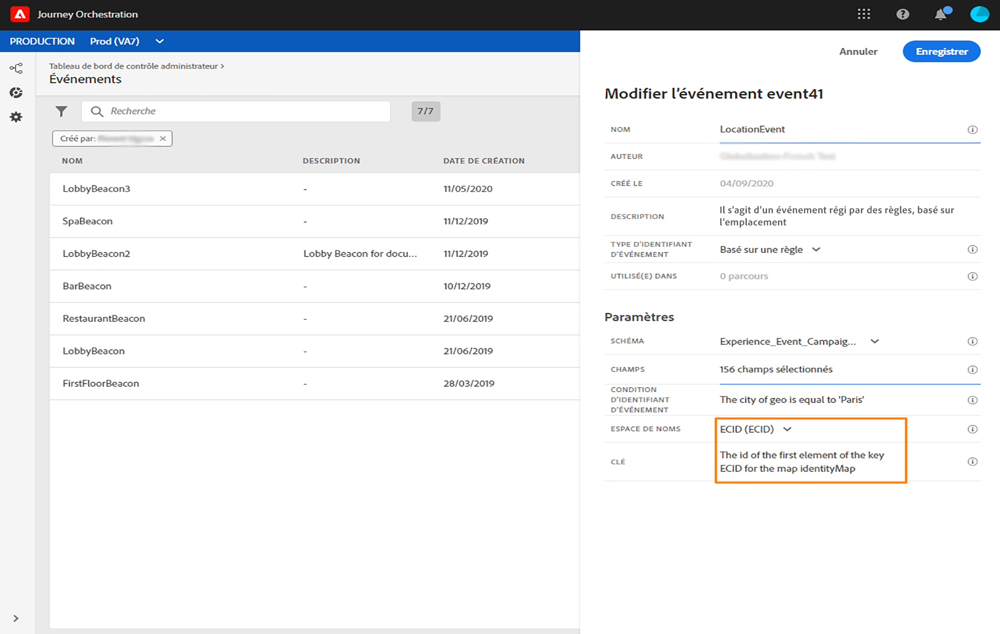

# Événements basés sur des règles{#simplified-events}

Nous avons simplifié la configuration des événements d’expérience. Nous proposons une nouvelle méthode qui ne nécessite pas l’utilisation d’un identifiant d’événement. Lorsque vous configurez votre événement dans Journey Orchestration, vous pouvez désormais définir un événement basé sur des règles.

Ce nouveau type d’événement ne génère pas d’identifiant d’événement. En utilisant l’éditeur d’expression simple, vous définissez désormais simplement une règle qui sera utilisée par le système pour identifier les événements pertinents qui déclencheront vos parcours. Cette règle peut être basée sur n’importe quel champ disponible dans le payload, par exemple l’emplacement du profil ou le nombre d’éléments ajoutés au panier du profil.

Cette nouvelle méthode est majoritairement transparente pour les utilisateurs. La seule modification est un nouveau champ dans l’écran de définition de l’événement.

1. Dans le menu de gauche, cliquez sur l’icône **Administration**, puis sur **Événements**. La liste des événements s’affiche.

   

1. Cliquez sur le bouton **Ajouter** pour créer un événement. Le volet de configuration d’événement s’ouvre dans la partie droite de l’écran.

   

1. Saisissez le nom de votre événement. Vous pouvez également ajouter une description.

   

1. Dans le nouveau champ **Type d’identifiant d’événement**, sélectionnez **Basé sur des règles**.

   

   >[!NOTE]
   >
   >Le type **Généré par le système** est la méthode existante qui requiert un identifiant d’événement. Reportez-vous à [cette section](../event/about-events.md).

1. Définissez les champs **Schéma** et **Payload**. Reportez-vous à [cette section](../event/defining-the-payload-fields.md).

   

   >[!NOTE]
   >
   >Lorsque vous sélectionnez le type **Généré par le système**, seuls les schémas dont le mixin est de type Identifiant d’événement sont disponibles. Lorsque vous sélectionnez le type **Basé sur des règles**, tous les schémas Événement d’expérience sont disponibles.

1. Cliquez à l’intérieur du champ **Condition de l’identifiant d’événement**. À l’aide de l’éditeur d’expression simple, définissez la condition qui sera utilisée par le système pour identifier les événements qui déclencheront votre parcours.

   

   Dans notre exemple, nous avons écrit une condition basée sur la ville du profil. Cela signifie que chaque fois que le système reçoit un événement qui correspond à cette condition (champ **Ville** et valeur **Paris**), il le transmet à Journey Orchestration.

1. Définissez l’**espace de noms** et la **clé**. Voir [Sélection de l’espace de noms](../event/selecting-the-namespace.md) et [Définition de la clé de l’événement](../event/defining-the-event-key.md).

   

Les autres étapes pour la configuration d’événement et la création de parcours restent inchangées.

L’événement est maintenant configuré et prêt à être déposé dans un parcours comme n’importe quel autre événement. Chaque fois qu’un événement correspondant à la règle est envoyé au système, il est transmis à Journey Orchestration pour déclencher vos parcours.

