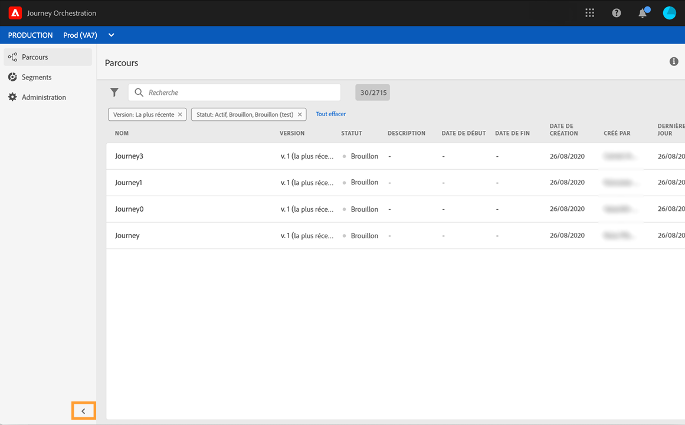
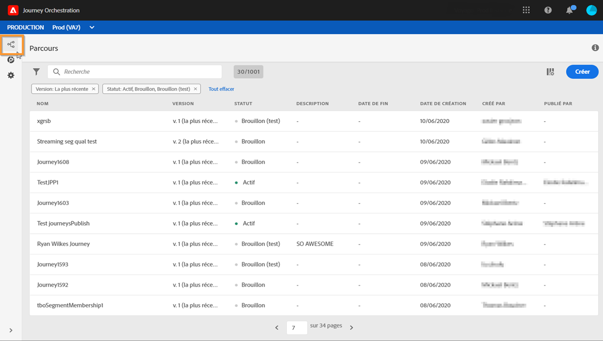
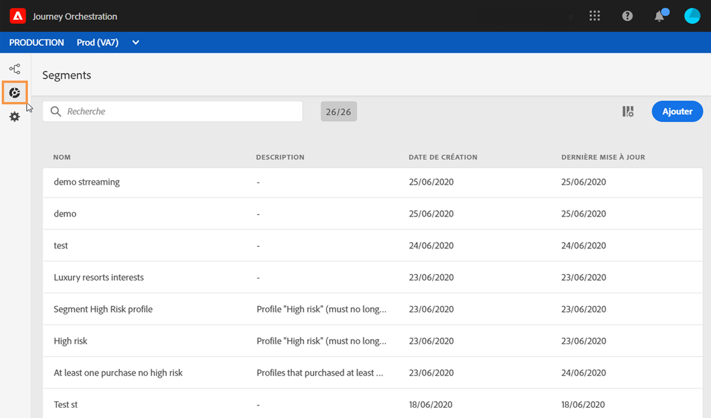
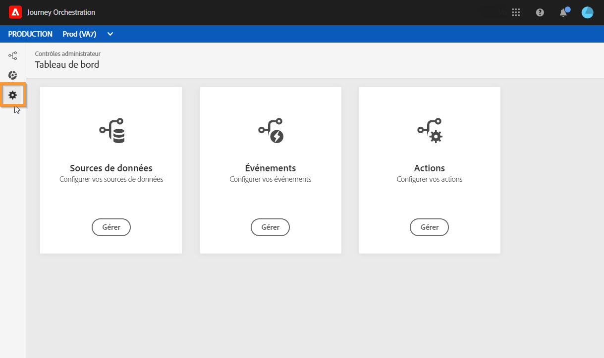

# Découverte de l’interface de la version Alpha {#discovering-alpha-interface}

## À propos de l’interface de la version Alpha {#about-alpha-interface}

La navigation dans les menus [!DNL Journey Orchestration] a été améliorée afin de fournir une interface en cohérence avec Adobe Experience Platform. Les modifications incluent les suivantes :

* Menus déplacés du haut vers le côté gauche de l’interface
* Regroupement des fonctionnalités d’administration en un seul tableau de bord

Les concepts généraux sur l’utilisation et la navigation dans l’interface (recherche et filtrage, navigation dans les champs Adobe Experience Platform, raccourcis) sont présentés dans [cette section](../about/user-interface.md).

## Accès aux fonctionnalités de [!DNL Journey Orchestration]{#accessing-journey-orchestration-functionalities}

La barre de menus située à gauche permet d’accéder aux différentes fonctionnalités. Cliquez sur une icône pour accéder au menu correspondant. Vous pouvez cliquer sur la flèche en bas à gauche pour développer ou réduire la barre de menus.

Lorsque vous accédez à [!DNL Journey Orchestration], le menu **[!UICONTROL Parcours]** s’affiche, ce qui vous permet d’accéder aux parcours existants ou d’en créer de nouveaux. Voir [Utilisation du concepteur de parcours](../building-journeys/using-the-journey-designer.md).

Le menu **[!UICONTROL Segments]** permet d’accéder aux segments Adobe Experience Platform et d’en créer. Voir [À propos des segments Adobe Experience Platform](../segment/about-segments.md).

Le menu **[!UICONTROL Administration]** est disponible pour tous les utilisateurs disposant de droits d’administrateur (voir [Gestion des accès](../about/access-management.md)). Il fournit un tableau de bord qui vous permet de configurer des [sources de données](../datasource/about-data-sources.md), des [événements](../event/about-events.md) et des [actions](../action/action.md).

