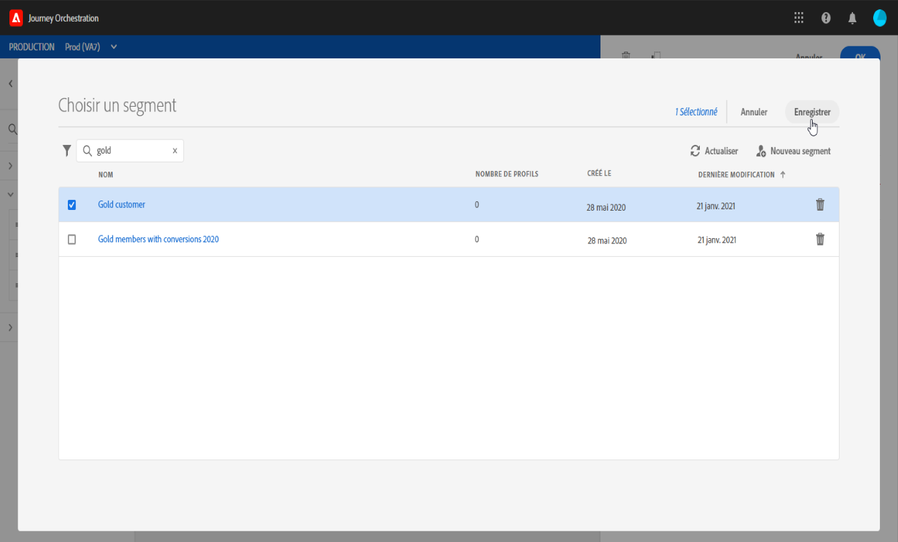
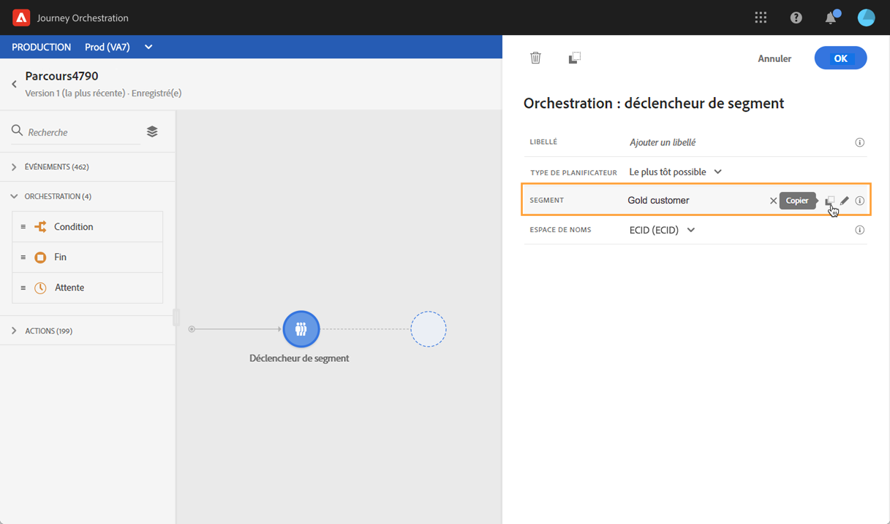
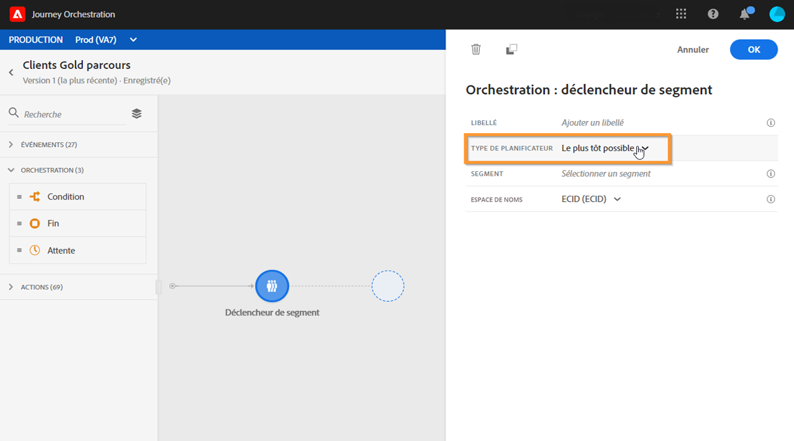
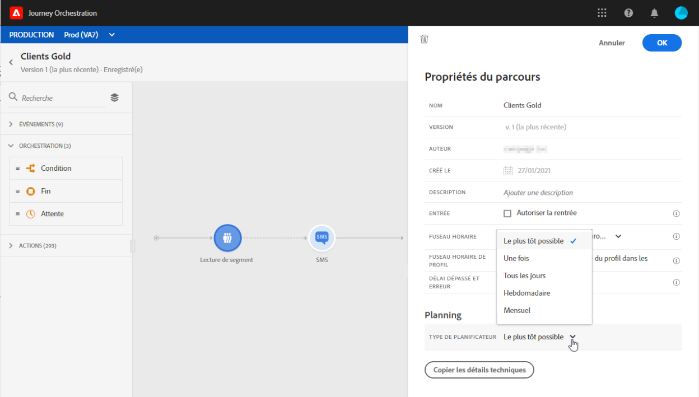
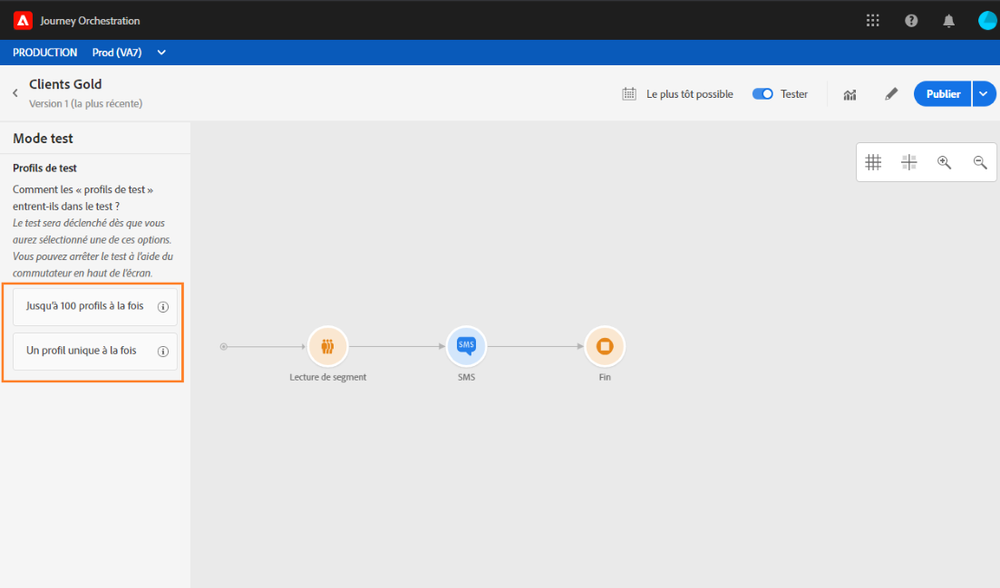
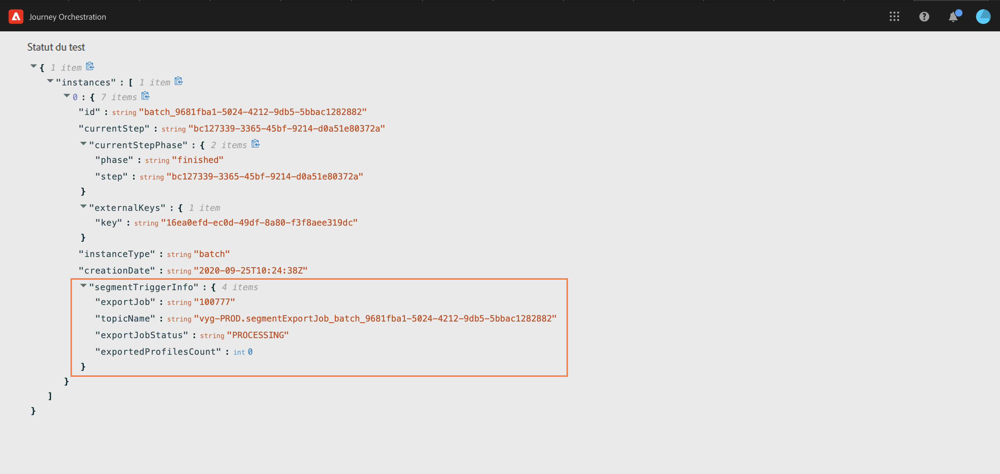

# Activité Lecture de segment {#segment-trigger-activity}

## À propos de l’activité Lecture de segment {#about-segment-trigger-actvitiy}

>[!NOTE]
>
>Si une activité d’action Adobe Campaign Standard d’usine est présente dans la zone de travail au moment de la publication ou de l’activation du mode test, le parcours est limité à 13 entrées par seconde. Sinon, le parcours sera limité à 1 000 événements par seconde.

L’activité Lecture de segment vous permet de faire entrer dans un parcours tous les individus appartenant à un segment Adobe Experience Platform. L’entrée dans un parcours peut être effectuée une fois, ou régulièrement.

Supposons que vous ayez un segment client Gold sur Adobe Experience Platform. Avec l’activité Lecture de segment, vous pouvez faire en sorte que toutes les personnes appartenant au segment client Gold entrent dans un parcours puis se dirigent vers des parcours personnalisés qui exploiteront toutes les fonctionnalités des parcours : conditions, minuteurs, événements, actions.

>[!NOTE]
>
>Un même parcours ne peut pas contenir un saut et une activité **Lecture de segment**. Vous ne pouvez pas effectuer un saut dans un parcours commençant par un événement **Lecture de segment**.

## Configurer l’activité {#configuring-segment-trigger-activity}

>[!NOTE]
>
>En raison des latences d’export de segments, il n’est pas possible de déclencher un parcours basé sur les segments dans un délai inférieur à 1 heure.

1. Développez la catégorie **[!UICONTROL Orchestration]** et déposez une activité **[!UICONTROL Lecture de segment]** dans votre zone de travail.

   L’activité doit être la première étape d’un parcours.

1. Ajoutez un **[!UICONTROL libellé]** à l’activité (facultatif).

1. Dans le champ **[!UICONTROL Segment]**, sélectionnez le segment Adobe Experience Platform qui va rejoindre le parcours, puis cliquez sur **[!UICONTROL Enregistrer]**.

   >[!NOTE]
   >
   >Notez que vous pouvez personnaliser les colonnes affichées dans la liste et les trier.

   

   Une fois le segment ajouté, le bouton **[!UICONTROL Copier]** permet de copier son nom et son ID :

   `{"name":"Gold customers,”id":"8597c5dc-70e3-4b05-8fb9-7e938f5c07a3"}`

   

1. Dans le champ **[!UICONTROL Espace de noms]**, choisissez l’espace de noms à utiliser pour identifier les personnes. Pour plus d’informations sur les espaces de noms, consultez [cette section](../event/selecting-the-namespace.md).

   >[!NOTE]
   >
   >Les personnes appartenant à un segment qui n’a pas l’identité sélectionnée (espace de noms) parmi leurs différentes identités ne peuvent pas entrer dans le parcours.

1. L’activité **[!UICONTROL Lecture de segment]** vous permet de spécifier l’heure à laquelle le segment rejoindra le parcours. Pour cela, cliquez sur le lien **[!UICONTROL Modifier le planning du parcours]** pour accéder aux propriétés du parcours, puis configurez le champ **[!UICONTROL Type de Planificateur]**.

   

   Par défaut, les segments rejoignent le parcours **[!UICONTROL Dès que possible]**, c’est-à-dire 1 heure après la publication de celui-ci. Si vous souhaitez que le segment rejoigne le parcours à une date/heure spécifique ou de façon récurrente, sélectionnez la valeur de votre choix dans la liste.

   >[!NOTE]
   >
   >Notez que la section **[!UICONTROL Planificateur]** n’est disponible que lorsqu’une activité **[!UICONTROL Lecture de segment]** a été déposée dans la zone de travail.

   

## Test et publication du parcours {#testing-publishing}

L’activité **[!UICONTROL Lecture de segment]** vous permet de tester le parcours sur un profil unitaire ou sur 100 profils de test aléatoires sélectionnés parmi les profils qualifiés pour le segment.

Pour cela, activez le mode test, puis sélectionnez l’option de votre choix dans le volet de gauche.

Vous pouvez ensuite configurer et exécuter le mode test comme vous le faites habituellement. Les étapes détaillées pour tester un parcours sont présentées dans [cette section](../building-journeys/testing-the-journey.md).

Une fois le test en cours d’exécution, le bouton **[!UICONTROL Afficher les journaux]** vous permet d’afficher les résultats du test en fonction de l’option de test sélectionnée :

* **[!UICONTROL Profil unique à la fois]** : les journaux de test affichent les mêmes informations que lors de l’utilisation du mode test unitaire. Voir à ce propos [cette section](../building-journeys/testing-the-journey.md#viewing_logs)

* **[!UICONTROL Jusqu’à 100 profils à la fois]** : les journaux de test vous permettent de suivre l’avancement de l’export des segments à partir d’Adobe Experience Platform, ainsi que la progression individuelle de toutes les personnes ayant rejoint le parcours.

   Notez que tester le parcours en utilisant jusqu’à 100 profils à la fois ne vous permet pas de suivre la progression des individus dans le parcours à l’aide du flux visuel.

   

Une fois les tests réussis, vous pouvez publier votre parcours (voir [Publication du parcours](../building-journeys/publishing-the-journey.md)). Les personnes appartenant au segment rejoindront le parcours à la date/heure spécifiée dans la section **[!UICONTROL Planificateur]** des propriétés du parcours.

>[!NOTE]
>
>Lors de la création d’une nouvelle version d’un parcours basé sur des segments qui n’est pas récurrent (commençant le plus tôt possible ou « une fois »), tous les individus ayant rejoint précédemment le parcours ne rejoindront pas de nouveau la nouvelle version lorsque vous la publierez. Si vous voulez leur permettre de rejoindre de nouveau le parcours, vous devrez le dupliquer.
