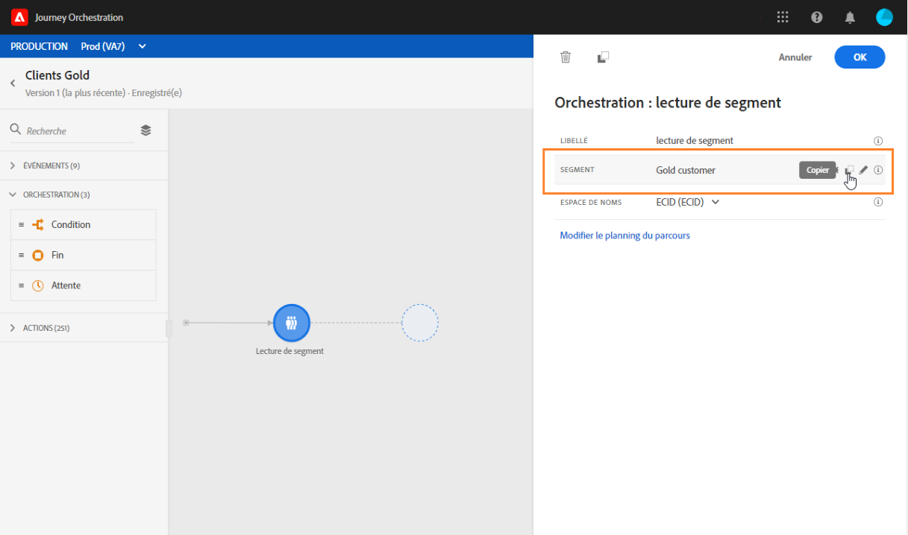
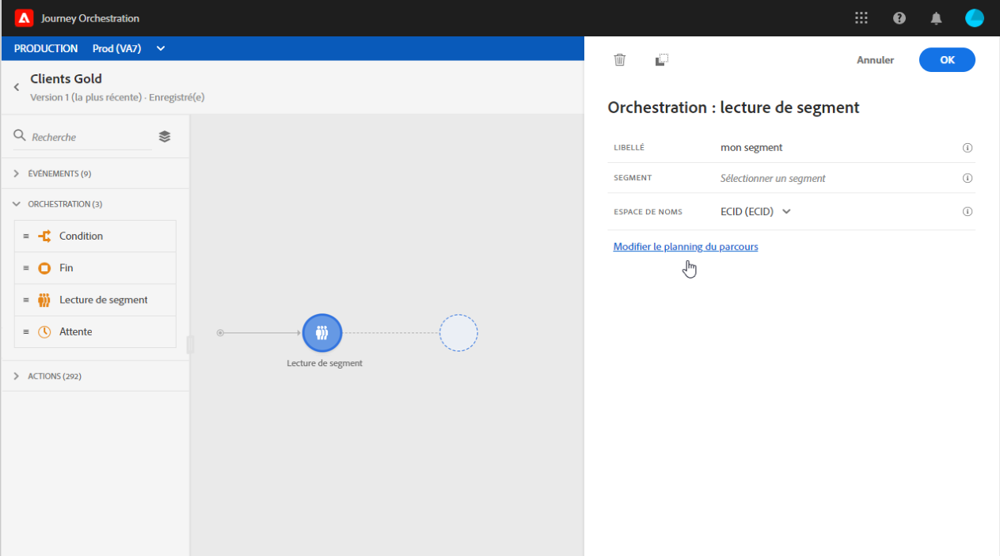

# Lire l’activité de segment {#segment-trigger-activity}

## A propos de l’activité de segment de lecture {#about-segment-trigger-actvitiy}

>[!NOTE]
>
>Si une activité d’action Adobe Campaign Standard d’usine est présente dans la zone de travail au moment de la publication ou de l’activation du mode test, le parcours est limité à 13 entrées par seconde. Sinon, le trajet sera limité à 1000 événements par seconde.

L’activité Lire le segment vous permet de faire entrer un voyage pour toutes les personnes appartenant à un segment Adobe Experience Platform. L’entrée dans un parcours peut être effectuée une fois, ou régulièrement.

Supposons que vous ayez un segment client Gold sur Adobe Experience Platform. Grâce à l’activité Lire le segment, vous pouvez faire en sorte que toutes les personnes appartenant au segment de clients Gold entrent dans un voyage et les faire s’enchaîner dans des voyages personnalisés qui exploiteront toutes les fonctionnalités du voyage : conditions, minuteries, événements, actions.

## Configurer l’activité {#configuring-segment-trigger-activity}

>[!NOTE]
>
>En raison des latences d’export de segments, il n’est pas possible de déclencher un parcours basé sur les segments dans un délai inférieur à 1 heure.

1. Unfold the **[!UICONTROL Orchestration]** category and drop a **[!UICONTROL Read Segment]** activity into your canvas.

   L’activité doit être la première étape d’un parcours.

1. Add a **[!UICONTROL Label]** to the activity (optional).

1. Dans le champ **[!UICONTROL Segment]**, sélectionnez le segment Adobe Experience Platform qui va rejoindre le parcours, puis cliquez sur **[!UICONTROL Enregistrer]**.

   >[!NOTE]
   >
   >Notez que vous pouvez personnaliser les colonnes affichées dans la liste et les trier.

   

   Une fois le segment ajouté, le bouton **[!UICONTROL Copier]** permet de copier son nom et son ID :

   `{"name":"Gold customers,”id":"8597c5dc-70e3-4b05-8fb9-7e938f5c07a3"}`

   

1. Dans le champ **[!UICONTROL Espace de noms]**, choisissez l’espace de noms à utiliser pour identifier les personnes. Pour plus d’informations sur les espaces de noms, consultez [cette section](../event/selecting-the-namespace.md).

   >[!NOTE]
   >
   >Les personnes appartenant à un segment qui n’a pas l’identité sélectionnée (espace de noms) parmi leurs différentes identités ne peuvent pas entrer dans le parcours.

1. L’activité de segment **** lu vous permet de spécifier l’heure à laquelle le segment entrera dans le parcours. Pour ce faire, cliquez sur le lien **[!UICONTROL Modifier la planification]** du voyage pour accéder aux propriétés du voyage, puis configurez le champ Type **[!UICONTROL de]** Planificateur.

   

   By default, segments enter the journey **[!UICONTROL As soon as possible]**, meaning 1 hour after the journey is published. Si vous souhaitez que le segment entre dans le parcours à une date/heure spécifique ou sur une base récurrente, sélectionnez la valeur souhaitée dans la liste.

   >[!NOTE]
   >
   >Notez que la section **[!UICONTROL Planification]** n’est disponible que lorsqu’une activité de segment **[!UICONTROL de]** lecture a été supprimée dans le canevas.

   

## Test et publication du parcours {#testing-publishing}

L’activité **[!UICONTROL Lire le segment]** vous permet de tester le parcours soit sur un profil unitaire, soit sur 100 profils de test aléatoire sélectionnés parmi les profils qualifiés pour le segment.

Pour ce faire, activez le mode de test, puis sélectionnez l’option de votre choix dans le volet de gauche.

Vous pouvez ensuite configurer le mode de test comme d’habitude. Les étapes détaillées de test d&#39;un voyage sont présentées dans [cette section](../building-journeys/testing-the-journey.md).

Notez que tester le parcours en utilisant jusqu&#39;à 100 profils à la fois ne vous permet pas de suivre la progression des individus dans le parcours en utilisant le flux visuel.

Une fois les tests réussis, vous pouvez publier votre parcours (voir [Publication du parcours](../building-journeys/publishing-the-journey.md)). Individuals belonging to the segment will enter the journey on the date/time specified in the journey&#39;s properties **[!UICONTROL Scheduler]** section.

>[!IMPORTANT]
>
>Gardez à l’esprit que les segments Adobe Experience Platform sont calculés une fois par jour (segments **par lot**) ou en temps réel (segments **en flux continu**).
>
>Si le segment sélectionné est diffusé en continu, les individus appartenant à ce segment peuvent éventuellement entrer dans le voyage en temps réel. Si le segment est par lot, les personnes nouvellement qualifiées pour ce segment peuvent éventuellement rejoindre le parcours lorsque le calcul du segment est exécuté sur Adobe Experience Platform.
