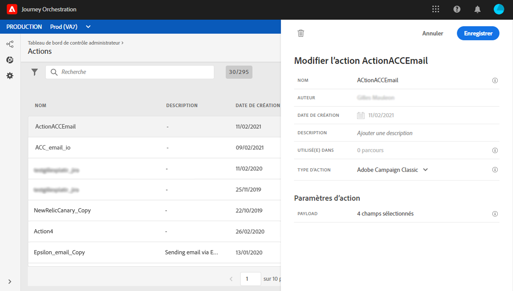
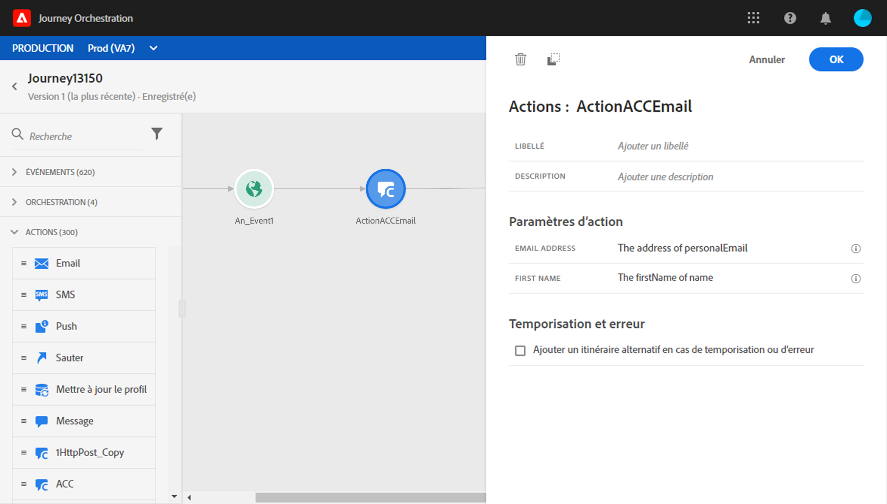

# Intégration à Adobe Campaign Classic {#integrating-with-adobe-campaign-classic}

Cette intégration vous permet d&#39;envoyer des courriers électroniques, des notifications Push et des SMS à l&#39;aide des fonctionnalités de messagerie transactionnelle Adobe Campaign Classic.

La connexion entre les instances de Journey Orchestration et de Campaign Classic est configurée par Adobe au moment de la mise en service.

>[!CAUTION]
>
> Cette intégration est publiée en tant que version bêta privée. Il n’est pas disponible pour tous les clients Journey Orchestration.

## Remarques importantes        

* Il n&#39;y a pas de limitation des messages. Nous plafonnons le nombre de messages pouvant être envoyés à 50 000/heure en fonction de notre contrat de niveau de service Campaign Classic actuel. C&#39;est pourquoi l&#39;orchestration du Parcours ne devrait être utilisée que dans les cas d&#39;utilisation unitaire (événements individuels, et non segments).

* Vous devez configurer une action sur la trame par modèle à utiliser.

* Nous vous recommandons d’utiliser une instance de Centre de messages dédiée qui est hébergée pour cette intégration afin d’éviter d’avoir d’incidence sur toute autre opération de Campaign Classic en cours. Le serveur marketing peut être hébergé ou sur site. La version requise est la version 21.1 Candidate.

* Il n’existe aucune validation indiquant que la charge utile ou le message du Campaign Classic est correct.

* Vous ne pouvez pas utiliser une action de Campaign Classic avec une qualification de segment.

## Conditions préalables requises

Dans le Campaign Classic, vous devez créer et publier un message transactionnel et son événement associé. Consultez la [documentation de Adobe Campaign Classic](https://experienceleague.adobe.com/docs/campaign-classic/using/transactional-messaging/introduction/about-transactional-messaging.html#transactional-messaging).

Contactez l’Adobe pour obtenir la charge utile JSON correspondant à chaque message. Vous allez ensuite coller cette charge utile lors de la configuration de l’action dans le Journey Orchestration (voir ci-dessous).

Voici un exemple :

```
{
    "channel": "email",
    "eventType": "welcome",
    "email": "example@adobe.com",
    "ctx": {
        "firstName": "John"
    }
}
```

## Configuration de l’action

Dans le Journey Orchestration, vous devez configurer une action par message transactionnel. Procédez comme suit :

1. Créez une action. Consultez cette [section](../action/action.md).
1. Entrez un nom et une description.
1. Dans le champ **Type d’action**, sélectionnez **Adobe Campaign Classic**.
1. Cliquez dans le champ **Charge utile** et collez un exemple de charge utile JSON correspondant au message du Campaign Classic. Contactez l’Adobe pour obtenir cette charge utile.
1. Ajustez les différents champs. Certains champs, tels que les paramètres de canal et les champs de personnalisation (ctx), doivent être définis comme des variables.
1. Cliquez sur **Enregistrer**.



Pour chaque action configurée, une activité d’action est disponible dans la palette Concepteur de parcours.

## Ajouter un message dans un parcours

1. Concevez votre parcours, en commençant par un événement. Consultez cette [section](../building-journeys/journey.md).
1. Dans la section **Action** de la palette, sélectionnez une action de Campaign Classic et ajoutez-la à votre parcours.
1. Dans les **paramètres d&#39;action**, tous les champs attendus dans la charge utile du message s&#39;affichent. Vous devez faire correspondre chacun de ces champs avec celui que vous souhaitez utiliser, et ce, depuis l’événement ou la source de données. Cette opération est similaire aux actions personnalisées. Consultez cette [section](../building-journeys/using-custom-actions.md).



