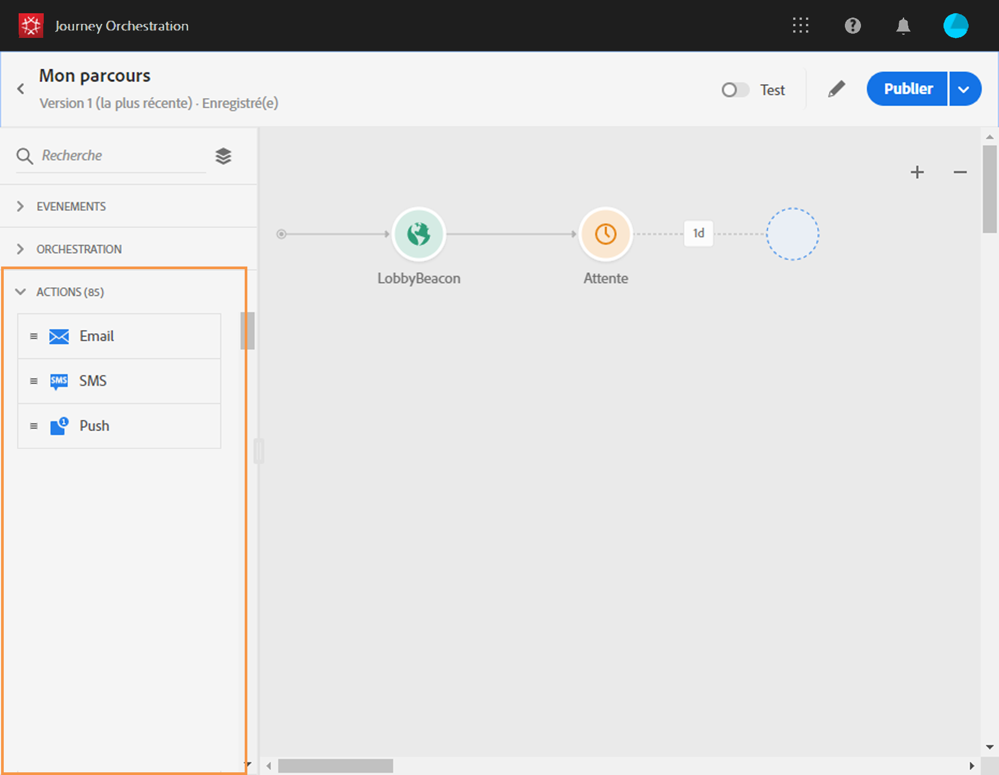

# À propos des activités d’action {#concept_hbj_hrt_52b}

La catégorie **[!UICONTROL Actions]** se trouve dans la palette située dans la partie gauche de l’écran, sous **[!UICONTROL Événements]** et **[!UICONTROL Orchestration]**.

Ces activités représentent les différents canaux de communication disponibles. Vous pouvez les combiner pour créer un scénario cross-canal.

Si vous utilisez Adobe Campaign Standard, les activités d’action d’usine suivantes sont disponibles : **[!UICONTROL Email]**, **[!UICONTROL Push]** et **[!UICONTROL SMS]**. Voir .

Si vous avez configuré des actions personnalisées, elles s’affichent également à cet emplacement (voir ).

Lorsque vous déposez une activité d’action dans la zone de travail, vous pouvez définir un **[!UICONTROL libellé]**. Vous pouvez ainsi ajouter un suffixe au nom de l’action, lequel apparaîtra sous votre activité dans la zone de travail. Cela s’avère utile si vous utilisez plusieurs fois la même action dans votre parcours et souhaitez faciliter son identification. Les rapports seront également plus faciles à lire. Vous pouvez, en outre, ajouter une **[!UICONTROL description]** facultative.

Lorsqu’une erreur se produit dans une action ou une condition, le parcours d’une personne s’arrête. La seule façon de le faire continuer est de cocher la case **[!UICONTROL Ajouter un autre chemin en cas de dépassement de délai ou d&#39;erreur]**. Voir .
