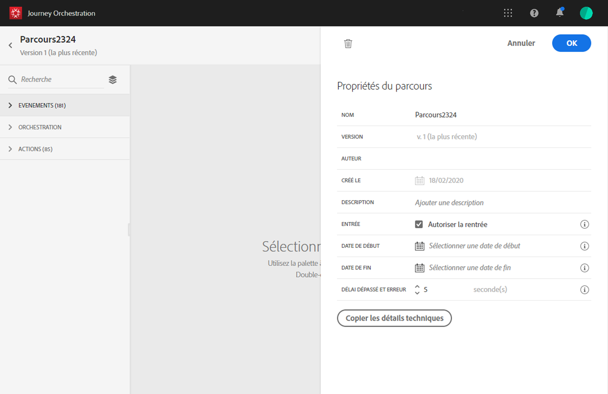

# Modification des propriétés {#concept_prq_wqt_52b}

Cliquez sur l’icône en forme de crayon en haut à droite pour accéder aux propriétés du parcours.

Vous pouvez modifier le nom du parcours, ajouter une description, autoriser une rentrée, choisir les dates de début et de fin, et définir une durée **[!UICONTROL Délai dépassé et erreur]** si vous êtes administrateur.

## Entrée{#entrance}

Par défaut, les nouveaux parcours autorisent une rentrée. Vous pouvez désélectionner cette option pour les parcours « uniques » ; c’est le cas, par exemple, si vous souhaitez offrir un cadeau à un utilisateur qui effectue sa première visite dans la boutique. Dans ce cas, vous ne voulez pas que le client puisse effectuer une rentrée dans le parcours et bénéficier à nouveau de l’offre.

Lorsqu’un parcours « prend fin », l’état **[!UICONTROL Fermé (aucune entrée)]** lui est attribué. Il n’est alors plus accessible aux nouveaux individus. En revanche, la procédure suit son cours normal pour les personnes qui ont déjà intégré le parcours.

## Délai dépassé et erreur dans les activités du parcours {#timeout_and_error}

Lorsque vous modifiez une action ou une activité de condition, vous pouvez définir un autre chemin en cas d’erreur ou de dépassement du délai. Si la durée de traitement de l’activité qui interroge un système tiers dépasse le délai défini dans les propriétés du parcours (champ **[!UICONTROL Délai dépassé et erreur]**), le deuxième chemin d’accès est choisi pour effectuer une éventuelle action de remplacement.

Les valeurs autorisées sont comprises entre 1 et 30 secondes.

Nous vous recommandons de définir une valeur très basse pour **[!UICONTROL Délai dépassé et erreur]** si votre parcours est sensible au temps (c’est le cas, par exemple, lorsqu’il convient de réagir à la position en temps réel d’une personne), car l’action ne peut pas être différée de plus de quelques secondes. Si le facteur temps revêt une importance moindre, vous pouvez définir un délai plus long afin d’accorder davantage de temps au système appelé pour envoyer une réponse valide.

[!DNL Journey Orchestration] utilise également un délai d’expiration global. Pour plus d’informations, consultez la [section suivante](#global_timeout).

## Délai de parcours global {#global_timeout}

Outre le [délai d’expiration](#timeout_and_error) utilisé dans les activités de parcours, il existe un délai d’expiration global qui n’est pas affiché dans l’interface et qui ne peut pas être modifié. Cette valeur mettra fin à la progression des individus dans le parcours 30 jours après leur entrée. En d’autres termes, la durée du parcours d’un individu ne peut pas excéder 30 jours. Après cette période de 30 jours, les données le concernant sont supprimées. Les individus qui sont encore actifs dans le parcours au terme de cette période sont arrêtés et considérés comme des « erreurs » dans le cadre du reporting.

>[!NOTE]
>
>Sur le plan de la confidentialité, [!DNL Journey Orchestration] ne réagit pas directement aux demandes d’opt-out, de suppression ou d’accès. Cependant, le délai d’expiration global limite à 30 jours la durée d’activité d’un individu au sein d’un parcours.

Compte tenu du délai d’expiration de 30 jours, lorsque la rentrée n’est pas autorisée, nous sommes dans l’impossibilité de garantir que le blocage de rentrée fonctionnera plus de 30 jours. En effet, étant donné que nous supprimons toutes les informations sur les personnes qui ont intégré le parcours 30 jours après leur entrée, rien ne nous permet de savoir qu’une personne y a déjà accédé il y a plus de 30 jours.

## Fuseau horaire et fuseau horaire du profil {#timezone}

Les fuseaux horaires sont définis au niveau du parcours.

Vous pouvez entrer un fuseau horaire fixe ou utiliser des profils Adobe Experience Platform pour définir le fuseau horaire du voyage.

Pour plus d’informations sur la gestion des fuseaux horaires, voir .
