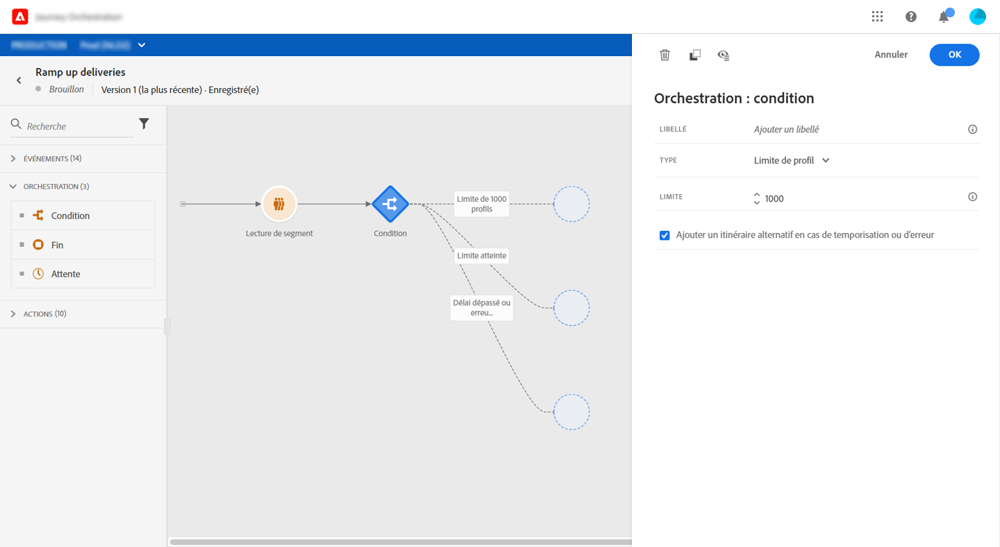

# Activité de condition{#section_e2n_pft_dgb}

Les types de conditions disponibles sont au nombre de quatre :

* [Condition de source de données](#data_source_condition)
* [Condition de temps](#time_condition)
* [Partage en pourcentage](#percentage_split)
* [Condition de date](#date_condition)

## À propos de l’activité de condition {#about_condition}

Lorsque vous utilisez plusieurs conditions dans un parcours, vous pouvez définir des libellés pour chacune d’elles afin de les identifier plus facilement.

Cliquez sur **[!UICONTROL Ajouter un chemin]** si vous souhaitez définir plusieurs conditions. Pour chaque condition, un nouveau chemin est ajouté dans la zone de travail après l’activité.

Notez que la conception de parcours n’est pas sans conséquences sur le plan fonctionnel. Lorsque plusieurs chemins sont définis après une condition, seul le premier chemin éligible est exécuté. Cela signifie que vous pouvez modifier la priorité des chemins en les plaçant les uns au-dessus ou en dessous des autres.

Prenons l’exemple de la condition « La personne est un VIP » d’un premier chemin et la condition « La personne est un homme » d’un second chemin. Si une personne répondant aux deux conditions (à savoir, un VIP de sexe masculin) franchit cette étape, le premier chemin est choisi, même s’il est également éligible au second, compte tenu de sa position hiérarchique supérieure. Pour modifier cette priorité, déplacez vos activités verticalement.

Vous pouvez créer un autre chemin pour les audiences qui ne sont pas éligibles aux conditions définies en cochant la case **[!UICONTROL Afficher le chemin pour d’autres cas que celui ou ceux ci-dessus]**. Notez que cette option n’est pas disponible dans les conditions de division. Voir [Division en pourcentage](#percentage_split).

Le mode simple vous permet d’exécuter des requêtes simples en fonction d’une combinaison de champs. Tous les champs disponibles s’affichent dans la partie gauche de l’écran. Faites glisser des champs dans la zone principale. Pour combiner les différents éléments, imbriquez-les afin de créer différents groupes et/ou niveaux de groupes. Vous pouvez alors sélectionner un opérateur logique afin de combiner les éléments de même niveau :

* ET : intersection de deux critères. Seuls les éléments répondant à tous les critères sont pris en compte.
* OU : union de deux critères. Les éléments répondant à au moins l’un des deux critères sont pris en compte.

Si vous utilisez le [service de segmentation Adobe Experience Platform](https://experienceleague.adobe.com/docs/experience-platform/segmentation/home.html?lang=fr) pour créer vos segments, vous pouvez les exploiter dans vos conditions de parcours. Pour plus d&#39;informations, consultez la section [Utilisation de segments dans des conditions](../segment/using-a-segment.md).

>[!NOTE]
>
>Vous ne pouvez pas effectuer de requêtes sur des séries temporelles (une liste d’achats ou des clics précédents sur des messages, par exemple) à l’aide de l’éditeur simple. Pour cela, vous devez utiliser l’éditeur avancé. Voir [cette page](../expression/expressionadvanced.md).

Lorsqu&#39;une erreur se produit dans une action ou une condition, le parcours d&#39;un individu s&#39;arrête. La seule façon de le faire continuer est de cocher la case **[!UICONTROL Ajouter un itinéraire alternatif en cas de temporisation ou d&#39;erreur]**. Consultez [cette section](../building-journeys/using-the-journey-designer.md#paths).

Dans l’éditeur simple, vous trouverez la catégorie Propriétés du parcours, sous les catégories d’événement et de source de données. Cette catégorie contient des champs techniques liés au parcours d’un profil donné. Il s’agit des informations récupérées par le système à partir de parcours dynamiques, telles que l’identifiant du parcours ou les erreurs spécifiques rencontrées. Pour plus d’informations, consultez [cette page](../expression/journey-properties.md)

## Condition de source de données {#data_source_condition}

Vous pouvez définir une condition en fonction de champs issus des sources de données ou des événements positionnés précédemment dans le parcours. Pour savoir comment utiliser l’éditeur d’expression, voir [cette page](../expression/expressionadvanced.md). L’éditeur d’expression avancé vous permet de configurer des conditions plus sophistiquées pour manipuler des collections ou utiliser des sources de données nécessitant la transmission de paramètres. Voir [cette page](../datasource/external-data-sources.md).

## Condition de temps{#time_condition}

Cette condition vous permet d’effectuer des actions différentes en fonction de l’heure et/ou du jour. Par exemple, les jours de semaine, vous pouvez choisir d’envoyer des SMS pendant la journée et des e-mails la nuit.

>[!NOTE]
>
>Le fuseau horaire n’est plus spécifique à une condition et est maintenant défini au niveau du parcours dans les propriétés de celui-ci. Voir [cette page](../building-journeys/timezone-management.md).

## Partage en pourcentage {#percentage_split}

Cette option vous permet de fractionner l’audience de manière aléatoire afin de définir une action différente pour chaque groupe. Définissez le nombre de divisions, ainsi que la répartition pour chaque chemin. La division est un calcul statistique, dans la mesure où le système ne peut pas prévoir le nombre de personnes qui suivront cette activité du parcours. Par conséquent, la marge d’erreur de la division est très faible. Cette fonction est basée sur un mécanisme Java aléatoire (pour en savoir plus, consultez cette [page](https://docs.oracle.com/javase/7/docs/api/java/util/Random.html)).

En mode test, lorsqu&#39;un partage est atteint, la branche supérieure est toujours choisie. Vous pouvez réorganiser la position des branches partagées si vous souhaitez que le test choisisse un autre chemin. Voir [cette page](../building-journeys/testing-the-journey.md)

>[!NOTE]
>
>Notez qu’il n’existe aucun bouton permettant d’ajouter un chemin dans la condition de division en pourcentage. Le nombre de chemins dépend du nombre de divisions. Dans les conditions de division, vous ne pouvez pas ajouter de chemin pour d’autres cas, car cela ne peut pas se produire. Les utilisateurs se trouveront toujours dans l’un des chemins de division.

## Condition de date {#date_condition}

Cette condition vous permet de définir un flux différent en fonction de la date. Par exemple, si la personne accède à l’étape pendant la période de soldes, vous lui enverrez un message spécifique. Le reste de l’année, vous lui enverrez un autre message.

>[!NOTE]
>
>Le fuseau horaire n’est plus spécifique à une condition et est maintenant défini au niveau du parcours dans les propriétés de celui-ci. Voir [cette page](../building-journeys/timezone-management.md).

<!--
## Profile cap {#profile_cap}

Use this condition type to set a maximum number of profiles for a journey path. When this limit is reached, the selected profiles take a second path.

You can use this condition type to ramp up the volume of your deliveries. For example, you might have recently moved to another email service provider, IP address, or email domain or subdomain. Using this feature, you can establish your reputation as a sender and avoid that your deliveries be blocked or moved to the spam folder of the recipients' mailbox. Learn how to increase your email reputation with IP warming in the [Deliverability Best Practice Guide](https://experienceleague.adobe.com/docs/deliverability-learn/deliverability-best-practice-guide/additional-resources/generic-resources/increase-reputation-with-ip-warming.html){target="_blank"}.

The default cap is 1000. You must set an integer value that is greater than or equal to 1.

The counter applies only to the selected journey version. By default, the counter is reset to zero after 180 days. After a reset, the selected profiles take the first path again until the counter limit is reached. You can gradually increase this limit up to the total number of your subscribers. After your IP has warmed up, you can remove this condition.

The first path always has priority over the second path, even if you move the second path above the first path on the journey canvas.

-->