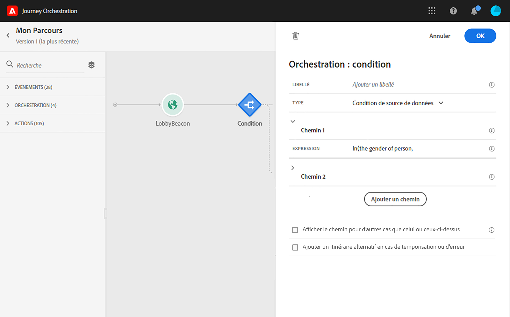

# Activité de condition{#section_e2n_pft_dgb}

Les types de conditions disponibles sont au nombre de quatre :

* [Condition de source de données](#data_source_condition)
* [Condition de temps](#time_condition)
* [Division en pourcentage](#percentage_split)
* [Condition de date](#date_condition)

## À propos de l’activité Condition {#about_condition}

Cliquez sur **[!UICONTROL Ajouter un chemin]** si vous souhaitez définir plusieurs conditions. Pour chaque condition, un nouveau chemin est ajouté dans la zone de travail après l’activité.

Notez que la conception de parcours n’est pas sans conséquences sur le plan fonctionnel. Lorsque plusieurs chemins sont définis après une condition, seul le premier chemin éligible est exécuté. Cela signifie que vous pouvez modifier la priorité des chemins en les plaçant les uns au-dessus ou en dessous des autres. Par exemple, si la condition du premier chemin est « Le client est un VIP » et la condition du deuxième chemin est « Le client est un homme ». Si une personne répondant aux deux conditions (à savoir, un VIP de sexe masculin) franchit cette étape, le premier chemin est choisi, même s’il est également éligible au second, compte tenu de sa position hiérarchique supérieure. Pour modifier cette priorité, déplacez vos activités verticalement.

Vous pouvez créer un autre chemin pour les audiences qui ne sont pas éligibles aux conditions définies en cochant la case **[!UICONTROL Afficher le chemin pour d’autres cas que celui ou ceux ci-dessus]**. Notez que cette option n’est pas disponible dans les conditions de division. Voir [Division en pourcentage](#percentage_split).

Le mode simple vous permet d’exécuter des requêtes simples en fonction d’une combinaison de champs. Tous les champs disponibles s’affichent dans la partie gauche de l’écran. Faites glisser des champs dans la zone principale. Pour combiner les différents éléments, imbriquez-les afin de créer différents groupes et/ou niveaux de groupes. Vous pouvez alors sélectionner un opérateur logique afin de combiner les éléments de même niveau :

* ET : intersection de deux critères. Seuls les éléments répondant à tous les critères sont pris en compte.
* OU : union de deux critères. Les éléments répondant à au moins l’un des deux critères sont pris en compte.

Si vous utilisez le [service de segmentation Adobe Experience Platform](https://docs.adobe.com/content/help/fr-FR/experience-platform/segmentation/home.html) pour créer vos segments, vous pouvez les exploiter dans vos conditions de parcours. Voir la section [Utilisation de segments dans des conditions](../segment/using-a-segment.md).

>[!NOTE]
>
>Vous ne pouvez pas effectuer de requêtes sur des séries temporelles (une liste d’achats ou des clics précédents sur des messages, par exemple) à l’aide de l’éditeur simple. Pour cela, vous devez utiliser l’éditeur avancé. Voir .

Lorsqu’une erreur se produit dans une action ou une condition, le parcours d’un individu s’arrête. La seule façon de le faire continuer est de cocher la case **[!UICONTROL Ajouter un autre chemin en cas de dépassement de délai ou d&#39;erreur]**. Voir .

## Condition de source de données {#data_source_condition}

Vous pouvez définir une condition en fonction de champs issus des sources de données ou des événements positionnés précédemment dans le parcours. Pour savoir comment utiliser l’éditeur d’expression, voir . L’éditeur d’expression avancé vous permet de configurer des conditions plus sophistiquées pour manipuler des collections ou utiliser des sources de données nécessitant la transmission de paramètres. Voir .

## Condition de temps{#time_condition}

Cette condition vous permet d’effectuer des actions différentes en fonction de l’heure et/ou du jour. Par exemple, les jours de semaine, vous pouvez choisir d’envoyer des SMS pendant la journée et des emails la nuit.

>[!NOTE]
>
>Le fuseau horaire n’est plus spécifique à une condition et est maintenant défini au niveau du parcours dans les propriétés de celui-ci. Voir .

## Division en pourcentage {#percentage_split}

Cette option vous permet de fractionner l’audience de manière aléatoire afin de définir une action différente pour chaque groupe. Définissez le nombre de divisions, ainsi que la répartition pour chaque chemin. La division est un calcul statistique, dans la mesure où le système ne peut pas prévoir le nombre de personnes qui suivront cette activité du parcours. Par conséquent, la marge d’erreur de la division est très faible. Cette fonction est basée sur un mécanisme Java aléatoire (pour en savoir plus, consultez cette [page](https://docs.oracle.com/javase/7/docs/api/java/util/Random.html)).

>[!NOTE]
>
>Notez qu’il n’existe aucun bouton permettant d’ajouter un chemin dans la condition de division en pourcentage. Le nombre de chemins dépend du nombre de divisions. Dans les conditions de division, vous ne pouvez pas ajouter de chemin pour d’autres cas, car cela ne peut pas se produire. Les utilisateurs se trouveront toujours dans l’un des chemins de division.

## Condition de date {#date_condition}

Cette condition vous permet de définir un flux différent en fonction de la date. Par exemple, si la personne accède à l’étape pendant la période de soldes, vous lui enverrez un message spécifique. Le reste de l’année, vous lui enverrez un autre message.

>[!NOTE]
>
>Le fuseau horaire n’est plus spécifique à une condition et est maintenant défini au niveau du parcours dans les propriétés de celui-ci. Voir .

