# Création de profils de test {#create-test-profiles}

Les profils de test sont requis lors de l&#39;utilisation du mode test dans un parcours. Pour savoir comment utiliser le mode test, consultez [cette section](../building-journeys/testing-the-journey.md).

Il existe différentes manières de créer un profil de test dans Adobe Experience Platform. Dans cette documentation, nous nous concentrons sur deux méthodes : le téléchargement d&#39;un [fichier CSV](../building-journeys/creating-test-profiles.md#create-test-profiles-csv) et l&#39;utilisation d&#39;[appels d&#39;API](../building-journeys/creating-test-profiles.md#create-test-profiles-api). Vous pouvez également télécharger un fichier json dans un jeu de données. Pour ce faire, reportez-vous à la [documentation sur l&#39;ingestion de données](https://experienceleague.adobe.com/docs/experience-platform/ingestion/tutorials/ingest-batch-data.html?lang=fr#add-data-to-dataset).

Ces méthodes d’import vous permettent également de mettre à jour les attributs de profil. Vous pouvez ainsi transformer un profil existant en profil de test. Il vous suffit d’utiliser un fichier ou un appel d’API similaire et d’inclure uniquement le champ « testProfile » avec la valeur « true ».

La création d&#39;un profil de test est similaire à la création de profils classiques dans Adobe Experience Platform. Pour plus d&#39;informations, consultez la [documentation du profil client en temps réel](https://experienceleague.adobe.com/docs/experience-platform/profile/home.html?lang=fr).

## Conditions préalables{#test-profile-prerequisites}

Pour pouvoir créer des profils, il vous faut d’abord créer un schéma ainsi qu’un jeu de données dans Adobe Experience Platform.

Tout d&#39;abord, vous devez **créer un schéma**. Procédez de la façon suivante :

1. Dans Adobe Experience Platform, cliquez sur **[!UICONTROL Schémas]**, dans le menu de gauche.
   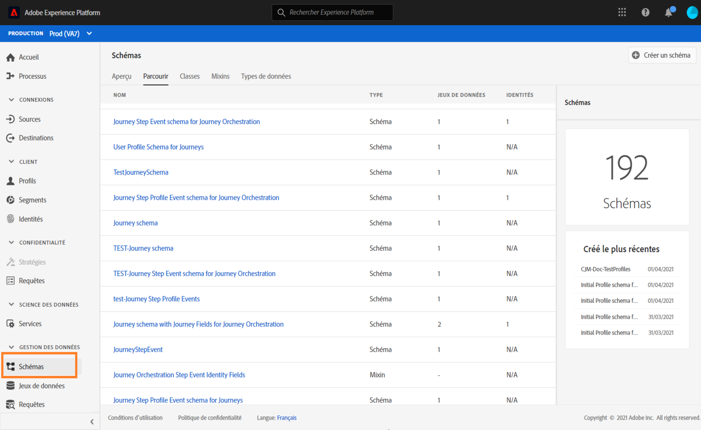
1. Cliquez sur **[!UICONTROL Créer un schéma]** dans le coin supérieur droit, puis sélectionnez un type de schéma, par exemple **[!UICONTROL Profil individuel XDM]**.
   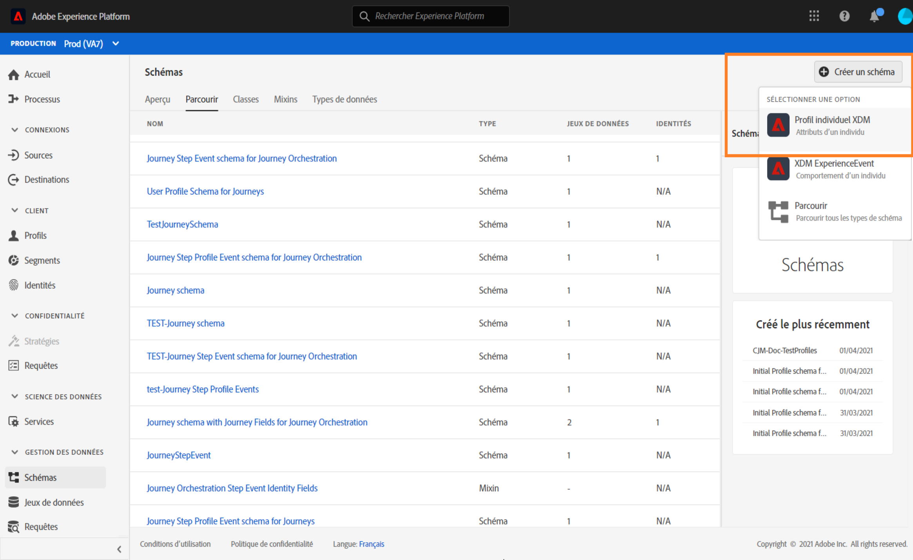
1. Attribuez un nom à votre schéma.
1. Dans la section **[!UICONTROL Mixins]**, cliquez sur **[!UICONTROL Ajouter]**.
   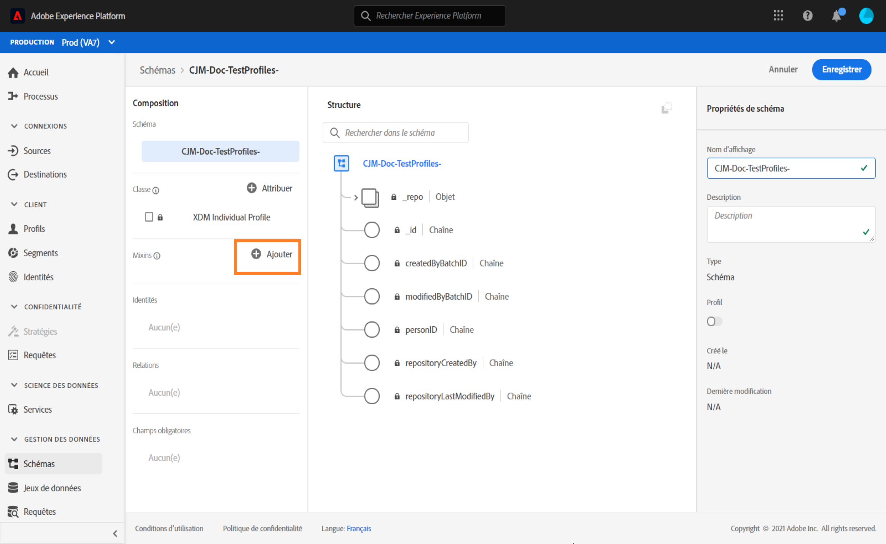
1. Sélectionnez les mixins appropriés. Veillez à ajouter le mixin **[!UICONTROL Détails du profil de test]**. Cliquez sur **[!UICONTROL Ajouter un mixin]**.
   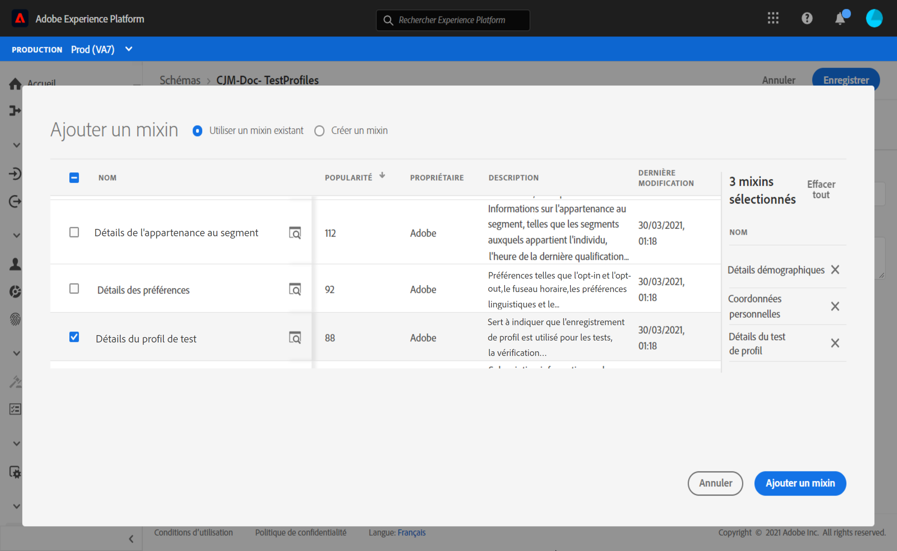
La liste des mixins s’affiche dans l’écran de vue d’ensemble du schéma.

   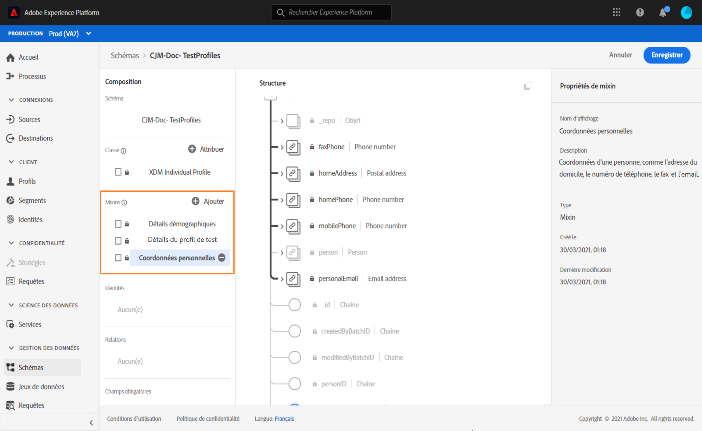
1. Dans la liste des champs, cliquez sur le champ que vous souhaitez définir comme l&#39;identité principale.
   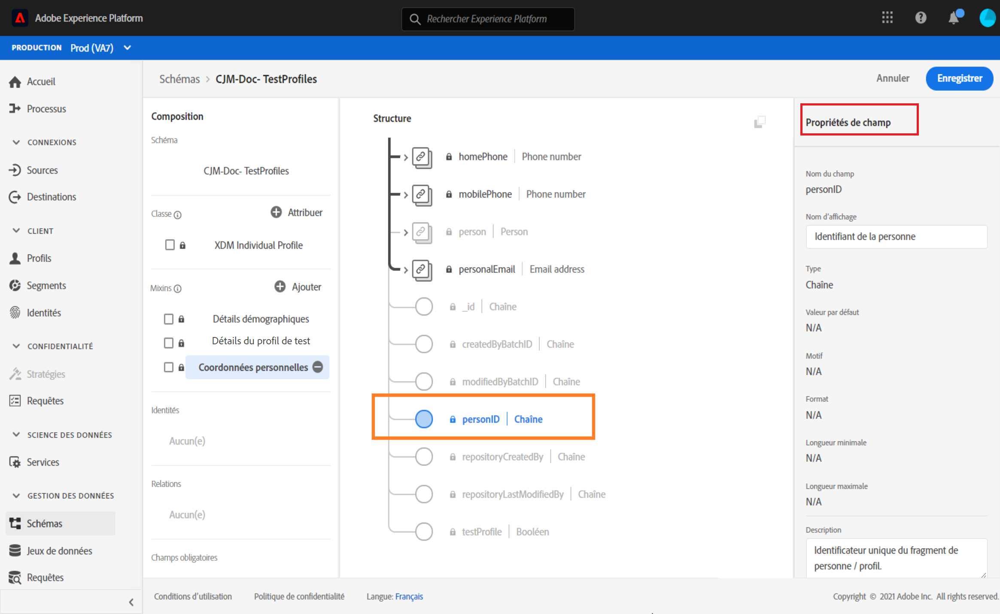
1. Dans le panneau de droite **[!UICONTROL Propriétés du champ]**, vérifiez les options **[!UICONTROL Identité]** et **[!UICONTROL Identité principale]**, puis sélectionnez un espace de noms. Si vous souhaitez que l&#39;identité principale soit une adresse e-mail, choisissez l&#39;espace de noms **[!UICONTROL E-mail]**. Cliquez sur **[!UICONTROL Appliquer]**.
   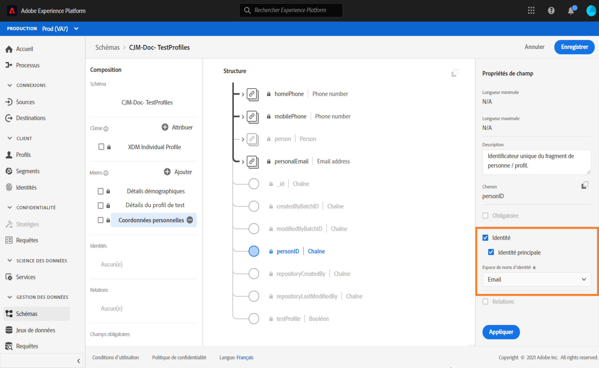
1. Sélectionnez le schéma et activez l&#39;option **[!UICONTROL Profil]** dans les **[!UICONTROL Propriétés du schéma]**.
   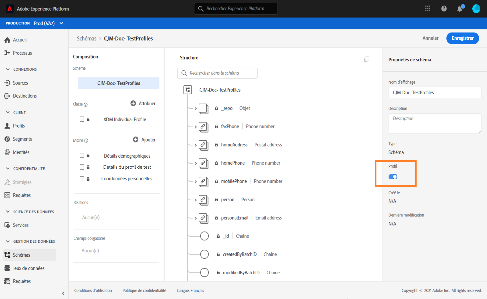
1. Cliquez sur **[!UICONTROL Enregistrer]**.

>[!NOTE]
>
>Pour plus d&#39;informations sur la création de schémas, consultez la [documentation XDM](https://experienceleague.adobe.com/docs/experience-platform/xdm/ui/resources/schemas.html?lang=fr#prerequisites).

Vous devez ensuite **créer le jeu de données** dans lequel les profils seront importés. Procédez de la façon suivante :

1. Dans Adobe Experience Platform, cliquez sur **[!UICONTROL Jeux de données]**, dans le menu de gauche, puis sur **[!UICONTROL Créer un jeu de données]**.
   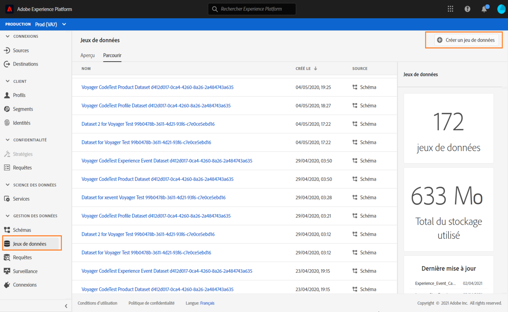
1. Choisissez **[!UICONTROL Créer un jeu de données à partir d&#39;un schéma]**.
   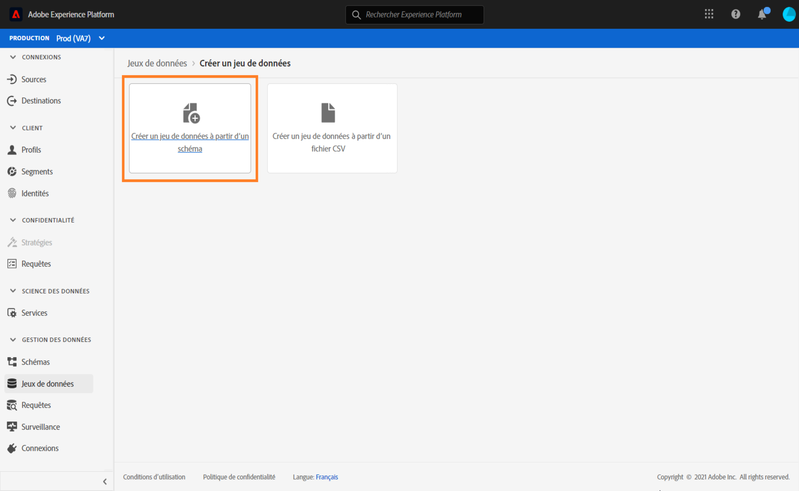
1. Sélectionnez le schéma créé précédemment, puis cliquez sur **[!UICONTROL Suivant]**.
   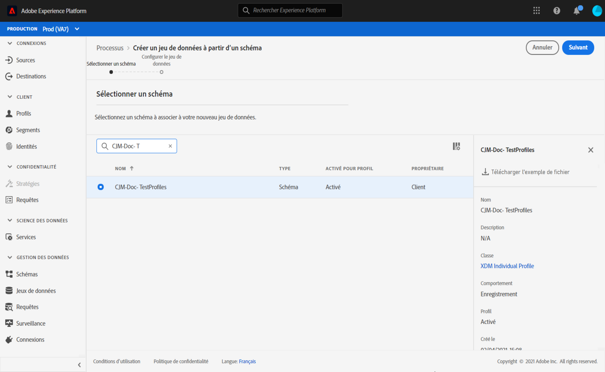
1. Choisissez un nom, puis cliquez sur **[!UICONTROL Terminer]**.
   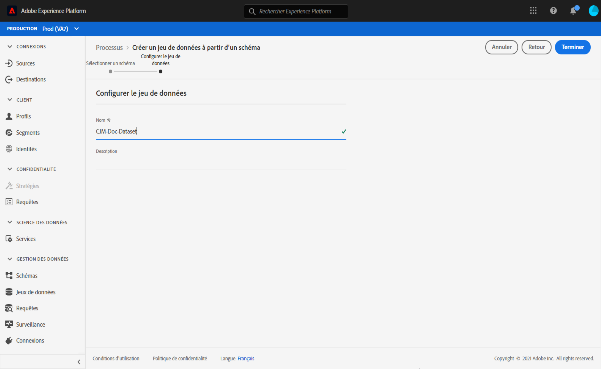
1. Activez l&#39;option **[!UICONTROL Profil]**.
   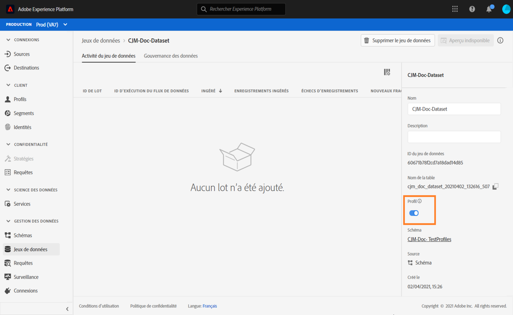

>[!NOTE]
>
> Pour plus d&#39;informations sur la création de jeux de données, consultez la [documentation du service de catalogue](https://experienceleague.adobe.com/docs/experience-platform/catalog/datasets/user-guide.html?lang=fr#getting-started).

## Création d’un profil de test à l’aide d’un fichier CSV{#create-test-profiles-csv}

Dans Adobe Experience Platform, vous pouvez créer des profils en téléchargeant un fichier CSV contenant les différents champs de profil dans votre jeu de données. Cette méthode est la plus simple.

1. Créez un fichier CSV simple à l&#39;aide d&#39;un tableur.
1. Ajoutez une colonne pour chaque champ nécessaire. Assurez-vous d&#39;ajouter le champ de l&#39;identité principale (« personID » dans l&#39;exemple ci-dessus) et le champ « testProfile » défini sur « true ».
   
1. Ajoutez une ligne par profil et remplissez les valeurs de chaque champ.
   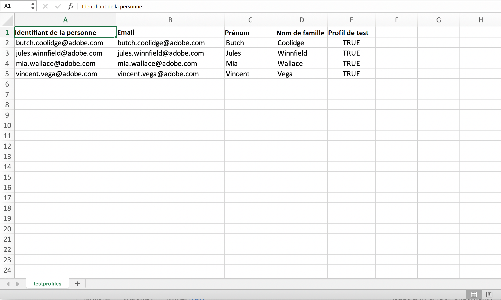
1. Enregistrez la feuille de calcul au format CSV. Assurez-vous que les virgules sont utilisées comme séparateurs.
1. Dans Adobe Experience Platform, cliquez sur **[!UICONTROL Workflows]**, dans le menu de gauche.
   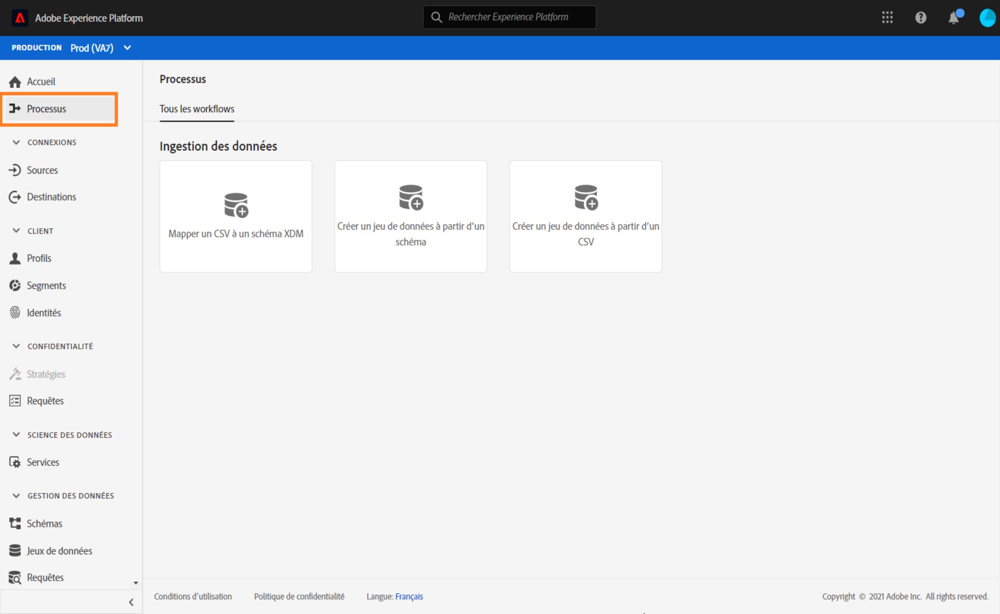
1. Sélectionnez **[!UICONTROL Mapper un CSV à un schéma XDM]**, puis cliquez sur **[!UICONTROL Lancer]**.
   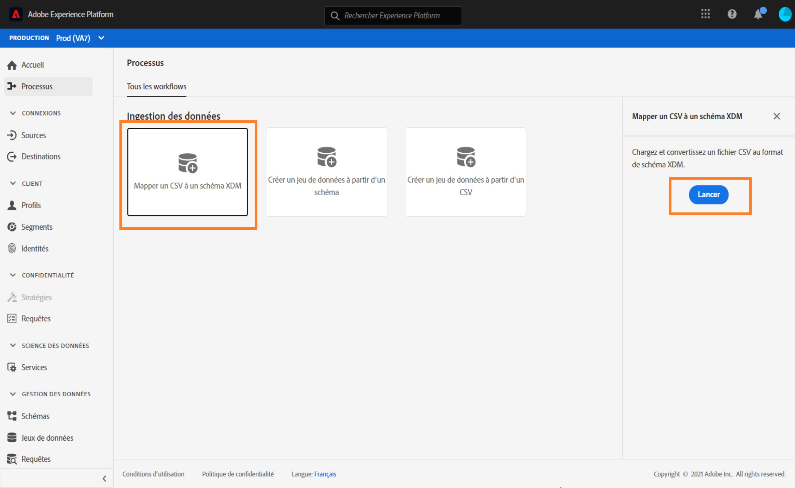
1. Sélectionnez le jeu de données dans lequel vous souhaitez importer les profils. Cliquez sur **[!UICONTROL Suivant]**.
   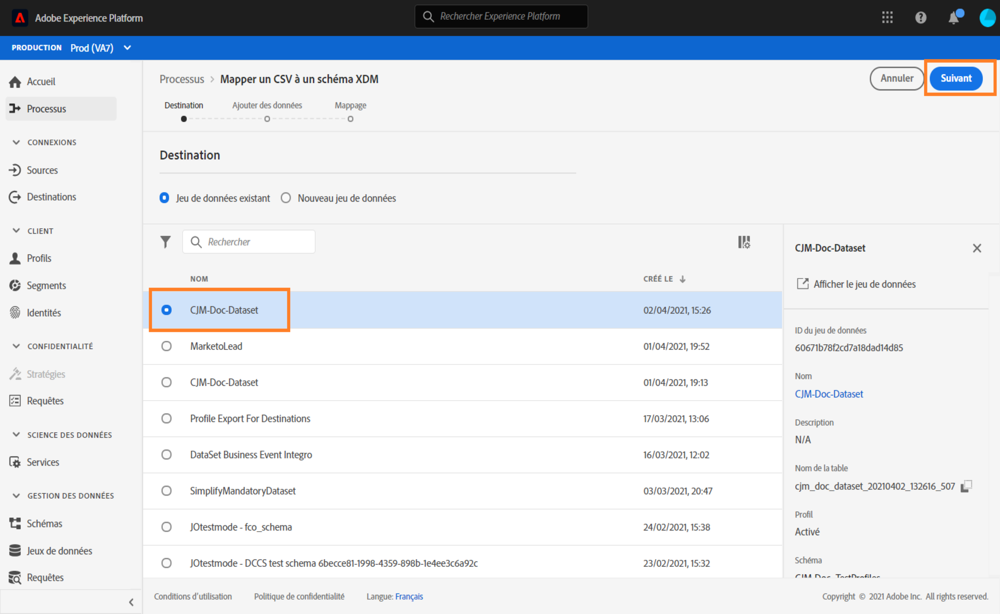
1. Cliquez sur **[!UICONTROL Choisir les fichiers]** et sélectionnez votre fichier CSV. Une fois le fichier téléchargé, cliquez sur **[!UICONTROL Suivant]**.
   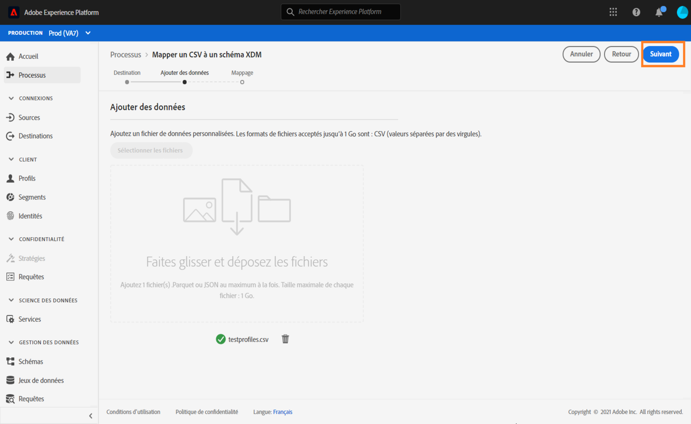
1. Mappez les champs CSV source aux champs du schéma, puis cliquez sur **[!UICONTROL Terminer]**.
   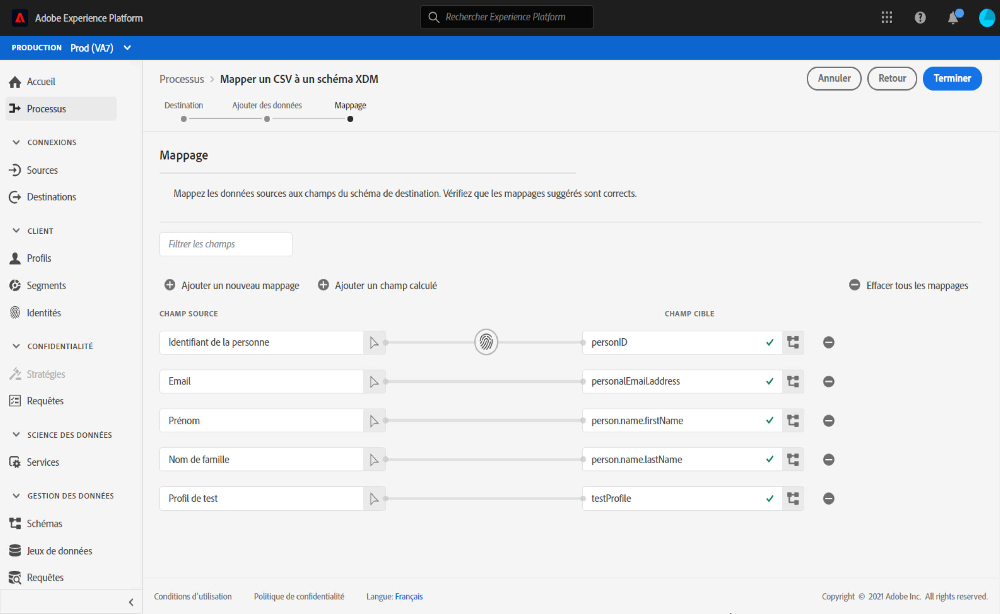
1. L&#39;import de données démarre. Le statut passe de **[!UICONTROL Traitement]** à **[!UICONTROL Succès]**. Cliquez sur **[!UICONTROL Aperçu du jeu de données]**, dans le coin supérieur droit.
   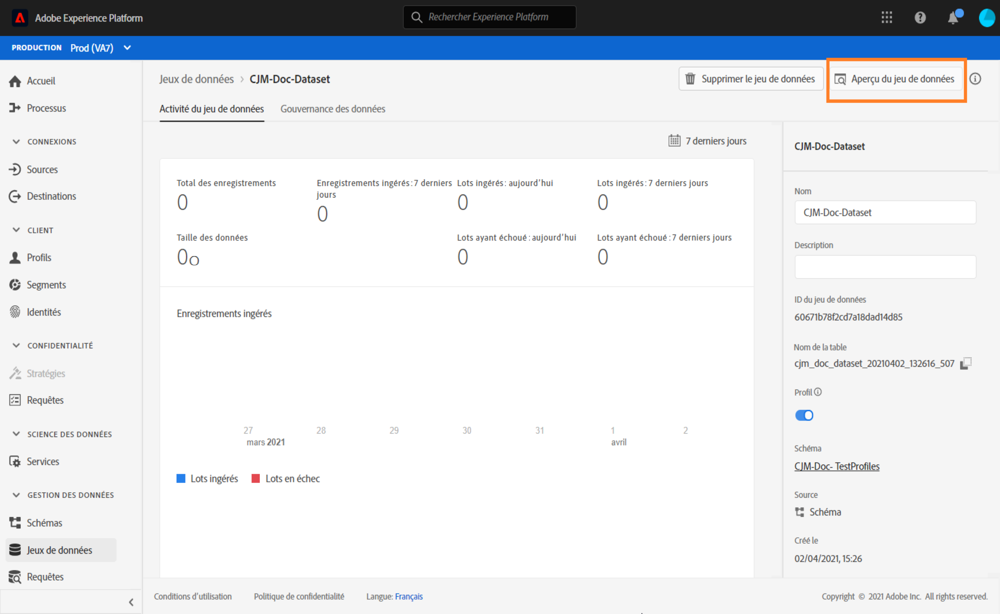
1. Vérifiez que les profils de test ont été correctement ajoutés.
   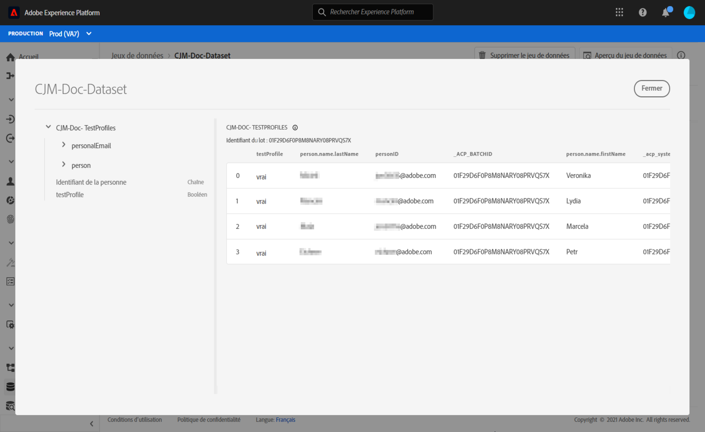

Vos profils de test sont ajoutés et peuvent désormais être utilisés lors du test d&#39;un parcours. Reportez-vous à [cette section](../building-journeys/testing-the-journey.md).
>[!NOTE]
>
> Pour plus d&#39;informations sur les imports de fichiers CSV, consultez la [documentation sur l&#39;ingestion de données](https://experienceleague.adobe.com/docs/experience-platform/ingestion/tutorials/map-a-csv-file.html?lang=fr#tutorials).

## Création de profils de test à l’aide d’appels d’API {#create-test-profiles-api}

Vous pouvez également créer des profils de test au moyen d&#39;appels d&#39;API. Consultez cette [page](https://experienceleague.adobe.com/docs/experience-platform/profile/home.html?lang=fr).

Vous devez utiliser un schéma de profil contenant le mixin « Détails du test de profil ». L&#39;indicateur testProfile fait partie de ce mixin.

Lors de la création d&#39;un profil, veillez à transmettre la valeur : testProfile = true.

Veuillez noter que vous pouvez également mettre à jour un profil existant pour remplacer son indicateur testProfile par « true ».

Voici un exemple d&#39;appel API pour créer un profil de test :

```
curl -X POST \
'https://dcs.adobedc.net/collection/xxxxxxxxxxxxxx' \
-H 'Cache-Control: no-cache' \
-H 'Content-Type: application/json' \
-H 'Postman-Token: xxxxx' \
-H 'cache-control: no-cache' \
-H 'x-api-key: xxxxx' \
-H 'x-gw-ims-org-id: xxxxx' \
-d '{
"header": {
"msgType": "xdmEntityCreate",
"msgId": "xxxxx",
"msgVersion": "xxxxx",
"xactionid":"xxxxx",
"datasetId": "xxxxx",
"imsOrgId": "xxxxx",
"source": {
"name": "Postman"
},
"schemaRef": {
"id": "https://example.adobe.com/mobile/schemas/xxxxx",
"contentType": "application/vnd.adobe.xed-full+json;version=1"
}
},
"body": {
"xdmMeta": {
"schemaRef": {
"contentType": "application/vnd.adobe.xed-full+json;version=1"
}
},
"xdmEntity": {
"_id": "xxxxx",
"_mobile":{
"ECID": "xxxxx"
},
"testProfile":true
}
}
}'
```
