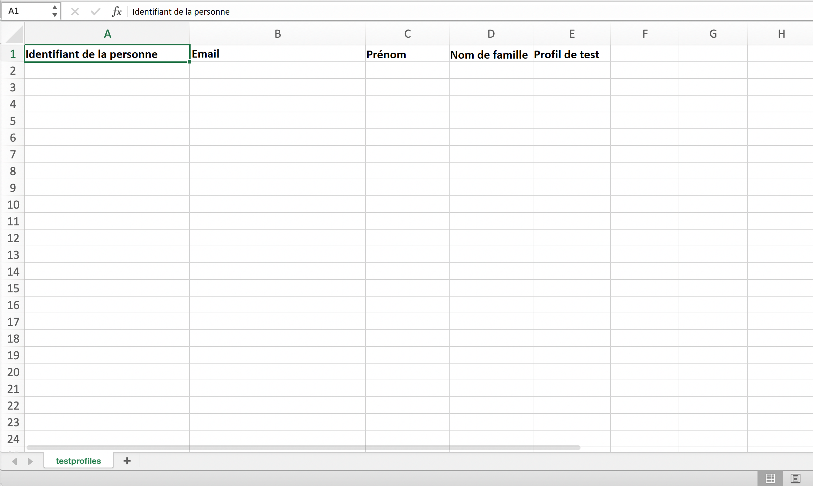

# Créer des profils de test {#create-test-profiles}


Les profils de test sont requis lors de l’utilisation du mode de test dans un parcours. Pour savoir comment utiliser le mode test, consultez [cette section](../building-journeys/testing-the-journey.md).

Il existe différentes manières de créer un profil de test dans Adobe Experience Platform. Dans cette documentation, nous nous concentrons sur deux méthodes : transfert d’un fichier [csv](../building-journeys/creating-test-profiles.md#create-test-profiles-csv) et utilisation d’appels d’API [](../building-journeys/creating-test-profiles.md#create-test-profiles-api). Vous pouvez également télécharger un fichier json dans un jeu de données, reportez-vous à la [documentation sur l&#39;importation de données](https://experienceleague.adobe.com/docs/experience-platform/ingestion/tutorials/ingest-batch-data.html#add-data-to-dataset).

Ces méthodes d’importation vous permettent également de mettre à jour les attributs de profil. Vous pouvez ainsi transformer un profil existant en profil de test. Il vous suffit d’utiliser un fichier ou un appel d’API similaire et d’inclure uniquement le champ &quot;testProfile&quot; avec la valeur &quot;true&quot;.

La création d’un profil de test est similaire à la création de profils réguliers dans Adobe Experience Platform. Pour plus d&#39;informations, consultez la [documentation du Profil client en temps réel](https://experienceleague.adobe.com/docs/experience-platform/profile/home.html).

## Prérequis{#test-profile-prerequisites}

Pour pouvoir créer des profils, vous devez d&#39;abord créer un schéma et un jeu de données dans Adobe Experience Platform.

Tout d&#39;abord, vous devez **créer un schéma**. Procédez comme suit :

1. Dans Adobe Experience Platform, cliquez sur **Schémas**, dans le menu de gauche.
   
1. Cliquez sur **Créer un schéma** dans le coin supérieur droit, puis sélectionnez un type de schéma, par exemple **Profil individuel XDM**.
   
1. Choisissez un nom pour votre schéma.
1. Dans la section **Mixins**, cliquez sur **Ajouter**.
   
1. Sélectionnez les mixins appropriés. Veillez à ajouter le mixin **détails du test de Profil**. Cliquez sur **Ajouter le mixin**.
   
La liste des mixins s’affiche dans l’écran d’aperçu du schéma.

   
1. Dans la liste des champs, cliquez sur le champ que vous souhaitez définir comme Principale identité.
   
1. Dans le panneau de droite **Propriétés de champ**, vérifiez les options **Identité** et **Identité Principal** et sélectionnez un espace de nommage. Si vous souhaitez que l&#39;identité Principale soit une adresse électronique, choisissez l&#39;espace de nommage **Courriel**. Cliquez sur **Appliquer**.
   
1. Sélectionnez le schéma et activez l&#39;option **Profil** dans les propriétés **Schéma**.
   
1. Cliquez sur **Enregistrer**.

>[!NOTE]
>
>Pour plus d&#39;informations sur la création de schéma, consultez la [documentation XDM](https://experienceleague.adobe.com/docs/experience-platform/xdm/ui/resources/schemas.html#prerequisites).

Vous devez ensuite **créer le jeu de données** dans lequel les profils seront importés. Procédez comme suit :

1. Dans Adobe Experience Platform, cliquez sur **Datasets**, dans le menu de gauche, puis cliquez sur **Créer un jeu de données**.
   
1. Sélectionnez **Créer un jeu de données à partir du schéma**.
   
1. Sélectionnez le schéma créé précédemment, puis cliquez sur **Suivant**.
   
1. Choisissez un nom, puis cliquez sur **Terminer**.
   
1. Activez l&#39;option **Profil**.
   

>[!NOTE]
>
> Pour plus d&#39;informations sur la création de jeux de données, consultez la [documentation du service de catalogue](https://experienceleague.adobe.com/docs/experience-platform/catalog/datasets/user-guide.html#getting-started).

## Création d’un profil de test à l’aide d’un fichier csv{#create-test-profiles-csv}

Dans Adobe Experience Platform, vous pouvez créer des profils en téléchargeant un fichier CSV contenant les différents champs de profil dans votre jeu de données. C&#39;est la méthode la plus facile.

1. Créez un fichier CSV simple à l’aide d’un tableur.
1. Ajoutez une colonne pour chaque champ nécessaire. Assurez-vous d’ajouter le champ d’identité Principal (&quot;personID&quot; dans l’exemple ci-dessus) et le champ &quot;testProfile&quot; défini sur &quot;true&quot;.
   
1. Ajoutez une ligne par profil et remplissez les valeurs de chaque champ.
   
1. Enregistrez la feuille de calcul au format CSV. Assurez-vous que les virgules sont utilisées comme séparateurs.
1. Dans Adobe Experience Platform, cliquez sur **Workflows**, dans le menu de gauche.
   
1. Sélectionnez **Mapper le fichier CSV au schéma XDM**, puis cliquez sur **Lancer**.
   
1. Sélectionnez le jeu de données dans lequel vous souhaitez importer les profils. Cliquez sur **Suivant**.
   
1. Cliquez sur **Choisir les fichiers** et sélectionnez votre fichier csv. Une fois le fichier téléchargé, cliquez sur **Suivant**.
   
1. Faites correspondre les champs csv source aux champs de schéma, puis cliquez sur **Terminer**.
   
1. L&#39;importation des données commence. L’état passe de **Traitement** à **Succès**. Cliquez sur **jeu de données de Prévisualisation**, dans le coin supérieur droit.
   
1. Vérifiez que les profils de test ont été correctement ajoutés.
   

Vos profils de test sont ajoutés et peuvent désormais être utilisés lors du test d’un parcours. Consultez [cette section](../building-journeys/testing-the-journey.md).
>[!NOTE]
>
> Pour plus d&#39;informations sur les importations de csv, consultez la [documentation sur l&#39;importation de données](https://experienceleague.adobe.com/docs/experience-platform/ingestion/tutorials/map-a-csv-file.html#tutorials).

## Création de profils de test à l’aide d’appels d’API {#create-test-profiles-api}

Vous pouvez également créer des profils de test au moyen d’appels d’API. Voir cette [page](https://docs.adobe.com/content/help/fr-FR/experience-platform/profile/home.html).

Vous devez utiliser un schéma de Profil contenant le mixin &quot;Détails du test de Profil&quot;. L’indicateur testProfile fait partie de ce mixin.

Lors de la création d’un profil, veillez à transmettre la valeur : testProfile = true.

Veuillez noter que vous pouvez également mettre à jour un profil existant pour remplacer son indicateur testProfile par « true ».

Voici un exemple d’appel API pour créer un profil de test :

```
curl -X POST \
'https://dcs.adobedc.net/collection/xxxxxxxxxxxxxx' \
-H 'Cache-Control: no-cache' \
-H 'Content-Type: application/json' \
-H 'Postman-Token: xxxxx' \
-H 'cache-control: no-cache' \
-H 'x-api-key: xxxxx' \
-H 'x-gw-ims-org-id: xxxxx' \
-d '{
"header": {
"msgType": "xdmEntityCreate",
"msgId": "xxxxx",
"msgVersion": "xxxxx",
"xactionid":"xxxxx",
"datasetId": "xxxxx",
"imsOrgId": "xxxxx",
"source": {
"name": "Postman"
},
"schemaRef": {
"id": "https://example.adobe.com/mobile/schemas/xxxxx",
"contentType": "application/vnd.adobe.xed-full+json;version=1"
}
},
"body": {
"xdmMeta": {
"schemaRef": {
"contentType": "application/vnd.adobe.xed-full+json;version=1"
}
},
"xdmEntity": {
"_id": "xxxxx",
"_mobile":{
"ECID": "xxxxx"
},
"testProfile":true
}
}
}'
```

