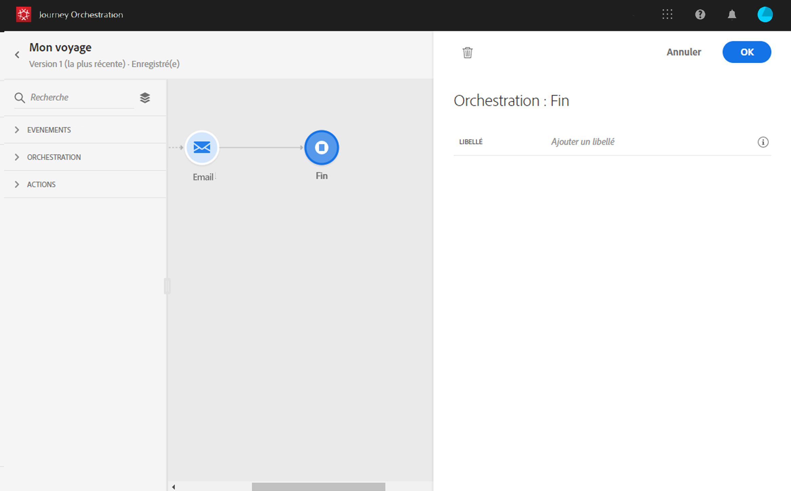

# Activité de fin {#section_vqp_4ft_dgb}

L’activité **[!UICONTROL Fin]** vous permet de marquer la fin de chaque chemin du parcours. Elle n’est pas obligatoire, mais recommandée pour assurer une meilleure clarté visuelle. En effet, si le parcours comporte plusieurs activités de fin, il est conseillé d’ajouter un libellé à chaque fin pour faciliter la lecture des rapports. Voir [cette page](../reporting/about-journey-reports.md).

