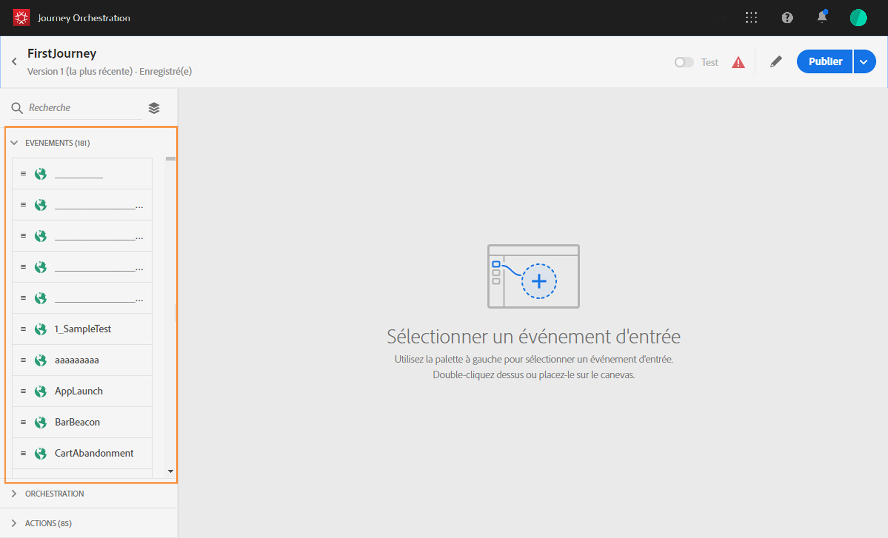
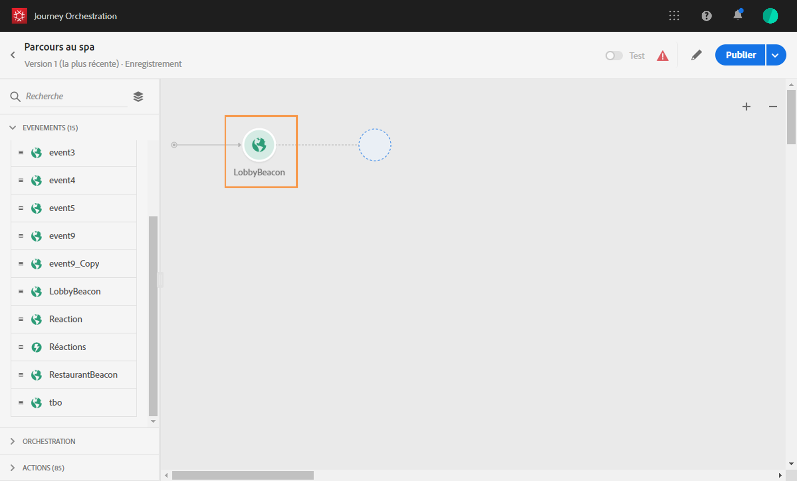
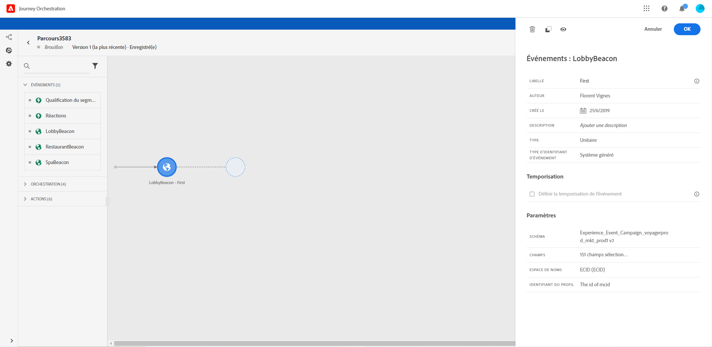
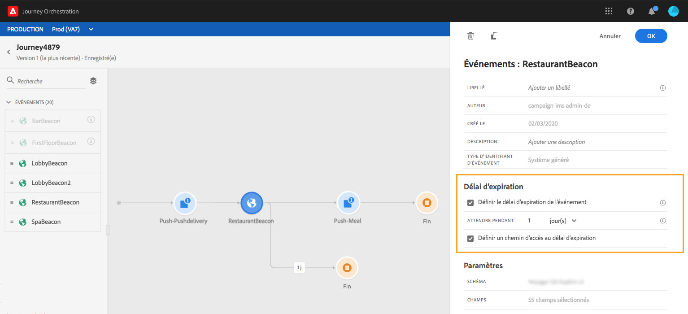
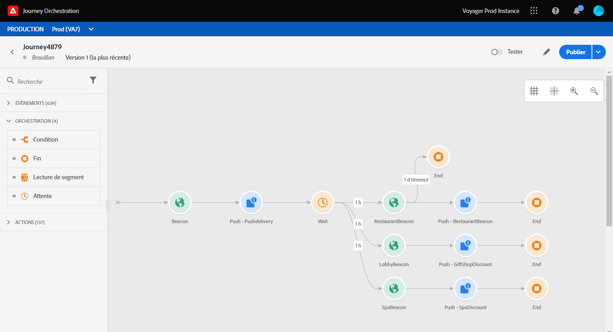

# À propos des activités d’événement {#concept_rws_1rt_52b}

Les événements configurés par l’utilisateur technique (voir [cette page](../event/about-events.md)) sont tous affichés dans la première catégorie de la palette, dans la partie gauche de l’écran.

Commencez toujours votre parcours en faisant glisser une activité d’événement. Vous pouvez également double-cliquer sur celle-ci.

Lorsque vous cliquez sur l’activité d’événement dans la zone de travail, le volet de configuration correspondant s’affiche. Par défaut, lorsque vous utilisez plusieurs fois un même événement, un nombre incrémenté est ajouté à son nom dans la zone de travail. Vous pouvez, en outre, utiliser le champ **[!UICONTROL Libellé]** pour ajouter au nom de l’événement un suffixe qui apparaîtra sous votre activité dans la zone de travail. Cela s’avère utile pour identifier vos événements dans la zone de travail, notamment si vous utilisez le même événement à plusieurs reprises. Cela facilite également le débogage lorsque des erreurs se produisent et permet une lecture plus facile des rapports.

## Écoute d’événements au cours d’une période spécifique

Une activité d’événement située sur le parcours va écouter les événements indéfiniment. Pour écouter un événement uniquement pendant une certaine période, vous devez configurer une temporisation pour l’événement.

Ce faisant, le parcours écoutera l’événement au cours de la période définie dans la temporisation. Si un événement est reçu au cours de cette période, le client sera intégré dans le chemin de l’événement. Si ce n’est pas le cas, le client va, au choix, s’engager dans un chemin de temporisation ou terminer son parcours.

Pour configurer une temporisation d’événement, procédez comme suit :

1. Activez l’option **[!UICONTROL Définir la temporisation de l’événement]** dans les propriétés de l’événement.

1. Définissez la durée pendant laquelle le parcours attendra l’événement.

1. Si vous souhaitez orienter les individus vers un chemin de temporisation, alors qu’aucun événement n’est reçu au cours de la temporisation spécifiée, activez l’option **[!UICONTROL Ajouter un itinéraire de temporisation]**. Si cette option n’est pas activée, le parcours se termine pour l’individu une fois le délai de temporisation atteint.

   

Dans cet exemple, le parcours envoie un premier message de bienvenue à un client. Il n’envoie ensuite un message d’offre de réduction sur un repas que si le client entre dans le restaurant le lendemain. Nous avons donc configuré l’événement « restaurant » avec une temporisation d’un jour :

* Si l’événement « restaurant » est reçu moins d’une journée après la notification push de bienvenue, l’activité push de réduction sur un repas est envoyée.
* Si aucun événement « restaurant » n’est reçu dans la journée qui suit, le client s’engage dans l’itinéraire de temporisation.

Notez que si vous souhaitez configurer une temporisation pour plusieurs événements placés après une activité d’**[!UICONTROL Attente]**, vous ne devez configurer ce délai que pour un seul de ces événements.

La temporisation s’applique à tous les événements postérieurs à l’activité **[!UICONTROL Attente]**. Si aucun événement n’est reçu après la temporisation spécifiée, les individus s’engagent dans un itinéraire de temporisation unique ou terminent leur parcours.

