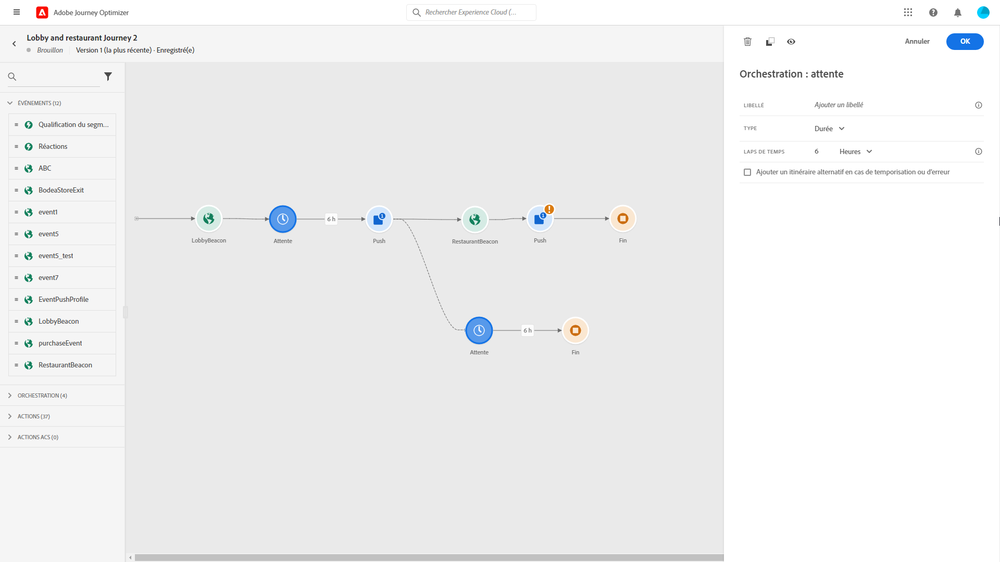

# Activités d’événements {#concept_rws_1rt_52b}

Les événements configurés par l’utilisateur technique (voir la section  sont tous affichés dans la première catégorie de la palette, sur le côté gauche de l’écran.

Commencez toujours votre voyage en faisant glisser une activité d’événement. Vous pouvez également cliquer deux fois dessus.

Lorsque vous cliquez sur l’activité d’événement dans la trame, le volet de configuration de l’activité s’affiche. Par défaut, lorsque vous utilisez plusieurs fois le même événement, un nombre incrémenté est ajouté au nom de l’événement dans la trame. En outre, vous pouvez utiliser le champ **[!UICONTROL Etiquette]**pour ajouter un suffixe au nom de l’événement qui apparaîtra sous votre activité dans le canevas. Cela s’avère utile pour identifier vos événements dans la trame, en particulier si vous utilisez le même événement plusieurs fois. Cela facilitera également le débogage en cas d’erreur et facilitera la lecture des rapports.

## Evénements généraux {#section_ofg_jss_dgb}

Pour ce type d’événement, vous pouvez uniquement ajouter une étiquette et une description. Le reste de la configuration ne peut pas être modifié. Elle a été effectuée par l’utilisateur technique. Voir la section .

## Evénements de réaction {#section_dhx_gss_dgb}

Parmi les différentes activités d’événement disponibles dans la palette, vous trouverez l’événement **Réactions** intégré. Cette activité vous permet de réagir au suivi des données liées à un message envoyé avec un courrier électronique, un SMS ou des activités push au cours du même parcours. Ces informations proviennent de la messagerie transactionnelle dans Adobe Campaign Standard. Nous capturons ces informations en temps réel au moment où elles sont partagées avec la plateforme de données. Pour les notifications Push, vous pouvez réagir aux messages sur lesquels vous avez cliqué, envoyés ou ayant échoué. Pour les messages SMS, vous pouvez réagir aux messages envoyés ou ayant échoué. Pour les courriers électroniques, vous pouvez réagir aux messages sur lesquels vous avez cliqué, envoyés, ouverts ou ayant échoué.

Vous pouvez également utiliser ce mécanisme pour effectuer une action lorsqu’il n’y a aucune réaction à vos messages. Pour ce faire, créez un second chemin parallèle à l’activité de réaction et ajoutez une activité d’attente. S’il n’y a pas de réaction pendant la période définie dans l’activité d’attente, la deuxième voie sera choisie. Vous pouvez choisir d’envoyer, par exemple, un message de suivi.

Notez que vous ne pouvez utiliser une activité de réaction dans le canevas que s’il existe une activité de courrier électronique, de message push ou de SMS auparavant.

Voir la section .

Voici les différentes étapes de configuration des événements de réaction :

1. Ajoutez une **[!UICONTROL étiquette]**à la réaction. Cette étape est facultative.
1. Dans la liste déroulante, sélectionnez l’activité à laquelle vous souhaitez réagir. Vous pouvez sélectionner toute activité d’action positionnée dans les étapes précédentes du chemin.
1. Selon l’action que vous avez sélectionnée (un courriel, un SMS ou une notification Push), choisissez ce à quoi vous souhaitez réagir.
1. Vous pouvez définir une condition comme une étape facultative. Par exemple, après une action par courrier électronique, vous pouvez décider de créer deux chemins, l’un avec un événement de réaction pour suivre uniquement les clics des clients VIP et l’autre avec un événement de réaction pour suivre les clics effectués par les femmes.

>[!NOTE]
>
>Les événements de réaction ne peuvent pas suivre les courriels, les SMS ou les actions push qui se produisent dans un autre voyage.
>
>Les événements de réaction effectuent le suivi des clics sur des liens de type &quot;suivi&quot; (voir cette [page](https://docs.adobe.com/content/help/en/campaign-standard/using/designing-content/links.html#about-tracked-urls)). Les liens de désabonnement et de page miroir ne sont pas pris en compte.

>[!CAUTION]
>
>Les clients de messagerie tels que Gmail autorisent le blocage des images. Les courriers électroniques ouverts sont suivis à l’aide d’une image de 0 pixel incluse dans le courrier électronique. Si les images sont bloquées, les ouvertures des courriels ne seront pas prises en compte.

## Utilisation avancée : événements avec une attente en parallèle{#section_vxv_h25_pgb}

**Comment pouvez-vous écouter un événement pendant un certain temps ?**

Une activité événementielle positionnée dans le parcours écoute les événements indéfiniment. Pour écouter un événement uniquement pendant une certaine période, vous devez ajouter une activité d’attente parallèle au chemin d’accès de l’événement. Le parcours écoute ensuite l’événement pendant la durée spécifiée dans l’activité d’attente. Si un événement est reçu au cours de cette période, la personne suit le chemin de l’événement. Si ce n’est pas le cas, le client s’enfoncera dans la trajectoire d’attente.

Par exemple, vous avez envoyé une première notification Push de bienvenue à un client et vous souhaitez envoyer une notification Push de réduction de repas uniquement si le client arrive au restaurant dans les 6 heures qui suivent. Pour ce faire, vous allez créer un second chemin (parallèle à l’événement de restaurant 1) avec une activité d’attente de 6 heures. Si l’événement de restaurant est reçu moins de 6 heures après la notification Push d’accueil, l’activité Push de réduction de repas est envoyée. Si aucun événement de restaurant n’est reçu dans les 6 heures qui suivent, la personne passe par le chemin d’attente.

