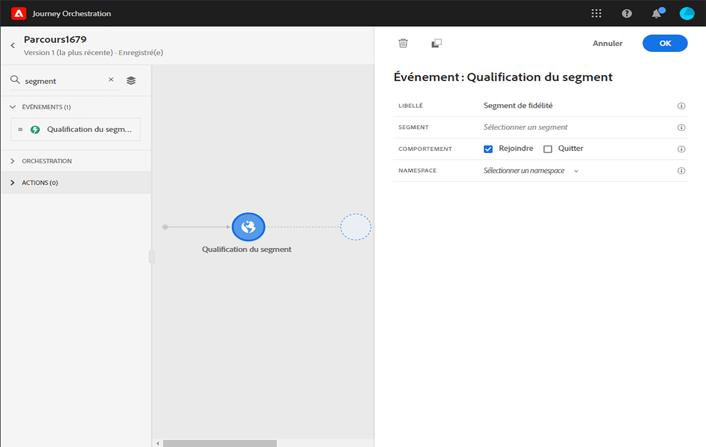
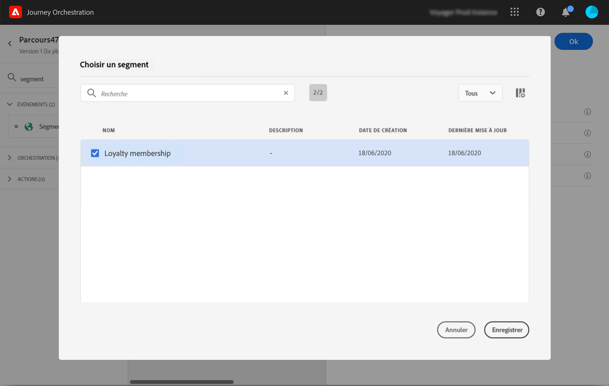
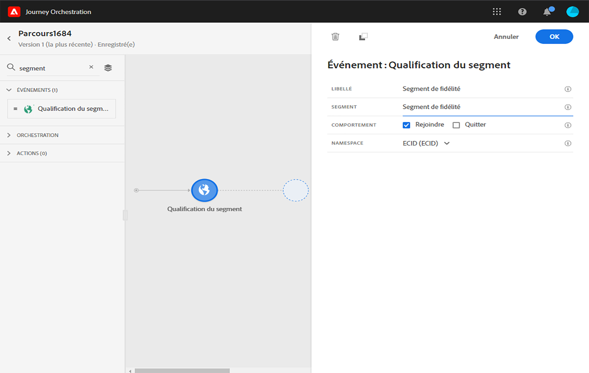

# Activités d’événement {#concept_rws_1rt_52b}

Les événements configurés par l’utilisateur technique (voir la section ) sont tous affichés dans la première catégorie de la palette, dans la partie gauche de l’écran.

Commencez toujours votre parcours en faisant glisser une activité d’événement. Vous pouvez également double-cliquer sur celle-ci.

Lorsque vous cliquez sur l’activité d’événement dans la zone de travail, le volet de configuration correspondant s’affiche. Par défaut, lorsque vous utilisez plusieurs fois un même événement, un nombre incrémenté est ajouté à son nom dans la zone de travail. Vous pouvez, en outre, utiliser le champ **[!UICONTROL Libellé]** pour ajouter au nom de l’événement un suffixe qui apparaîtra sous votre activité dans la zone de travail. Cela s’avère utile pour identifier vos événements dans la zone de travail, notamment si vous utilisez le même événement à plusieurs reprises. Cela facilite également le débogage lorsque des erreurs se produisent et permet une lecture plus facile des rapports.

## Événements généraux {#section_ofg_jss_dgb}

Pour ce type d’événement, vous pouvez uniquement ajouter un libellé et une description. Le reste de la configuration ne peut pas être modifié. C’est l’utilisateur technique qui s’en charge. Voir .

## Événements de réaction {#section_dhx_gss_dgb}

Parmi les différentes activités d’événement disponibles dans la palette, vous trouverez l’événement **Réactions** intégré. Cette activité vous permet de réagir aux données de suivi liées à un message envoyé avec des activités de type email, SMS ou Push au sein du même parcours. Ces informations proviennent de la messagerie transactionnelle d’Adobe Campaign Standard. Elles sont collectées en temps réel au moment de leur partage avec Data Platform. Dans le cas des notifications push, vous pouvez réagir aux messages envoyés, aux messages en échec et à ceux sur lesquels un utilisateur a cliqué. Pour les SMS, vous pouvez réagir aux messages envoyés ou en échec. Dans le cas des emails, vous pouvez réagir aux messages envoyés, ouverts et en échec, ainsi qu’à ceux sur lesquels un utilisateur a cliqué.

Vous pouvez également utiliser ce mécanisme pour effectuer une action en l’absence de réaction à vos messages. Pour ce faire, créez un deuxième chemin parallèlement à l’activité de réaction et ajoutez une activité d’attente. En l’absence de réaction au cours de la période définie dans l’activité d’attente, ce deuxième chemin sera choisi. Vous pouvez opter, par exemple, pour l’envoi d’un message de relance.

Notez que vous ne pouvez utiliser une activité de réaction dans la zone de travail que s’il existe, au préalable, une activité de type email, Push ou SMS.

Voir .

La procédure de configuration des événements de réaction comprend les étapes suivantes :

1. Ajoutez un **[!UICONTROL libellé]** à la réaction. Cette étape est facultative.
1. Dans la liste déroulante, sélectionnez l’activité d’action à laquelle vous souhaitez réagir. Vous pouvez sélectionner toute activité d’action figurant dans les étapes précédentes du chemin.
1. Choisissez l’événement auquel vous souhaitez réagir en fonction de l’action sélectionnée (un email, un SMS ou une notification push).
1. Vous pouvez définir une condition en tant qu’étape facultative. Par exemple, après une action de type email, vous pouvez choisir de créer deux chemins : l’un avec un événement de réaction pour effectuer uniquement le suivi des clics pour les clients VIP et un autre avec un événement de réaction pour effectuer le suivi des clics effectués par des femmes.

>[!NOTE]
>
>Les événements de réaction ne peuvent pas effectuer le suivi des actions de type email, SMS ou Push qui se produisent dans un autre parcours.
>
>Ils effectuent le suivi des clics sur les liens de type « tracké » (pour plus d’informations, consultez cette [page](https://docs.adobe.com/content/help/fr-FR/campaign-standard/using/designing-content/links.html#about-tracked-urls)). Les liens de désabonnement et de page miroir ne sont pas pris en compte.

>[!CAUTION]
>
>Les clients de messagerie tels que Gmail autorisent le blocage d’images. Le suivi des ouvertures d’email est effectué à l’aide d’une image de 0 pixel incluse dans l’email. Si les images sont bloquées, les ouvertures d’email ne sont pas prises en compte.

## Événements de qualification de segment {#segment-qualification}

Cette activité permet à votre parcours d’écouter les entrées et les sorties des profils dans les segments Platform pour faire entrer ou avancer les individus dans le parcours. Pour plus d’informations sur la création de segments, consultez cette [section](../segment/about-segments.md).

Supposons que vous ayez un segment « client Silver ». Avec cette activité, vous pouvez faire entrer tous les nouveaux clients Silver dans un parcours et leur envoyer une série de messages personnalisés.

Il est possible de positionner ce type d’événement dès la première étape, ou plus tard dans le parcours.

Si le segment est diffusé en continu avec l’option des audiences haute fréquence de Platform, les entrées et les sorties sont écoutées en temps réel. Si le segment n’est pas en flux continu, les entrées et les sorties sont prises en compte au moment du calcul du segment.

1. Développez la catégorie **Événements** et déposez une activité de **qualification de segment** dans la zone de travail.

   

1. Ajoutez un **libellé** à l’activité. Cette étape est facultative.

1. Cliquez dans le champ **Segment** et sélectionnez les segments à exploiter.

   

1. Dans le champ **Comportement**, choisissez d’écouter les entrées de segments, les sorties ou les deux.

1. Sélectionnez un espace de noms. Cela n’est nécessaire que si l’événement est considéré comme la première étape du parcours.

   

La payload contient les informations contextuelles suivantes, utilisables dans des conditions et des actions :

* le comportement (entrée, sortie)
* l’horodatage de la qualification
* l’identifiant de segment

## Utilisation avancée : événements avec une activité d’attente en parallèle{#section_vxv_h25_pgb}

**Comment faire pour écouter un événement pendant une certaine période ?**

Une activité d’événement située dans le parcours « écoute » les événements pendant une durée indéterminée. Pour limiter la durée d’écoute à une période bien définie, vous devez ajouter une activité d’attente parallèlement au chemin de l’événement. Ce faisant, le parcours écoutera l’événement au cours de la période définie dans l’activité d’attente. Si un événement est reçu au cours de cette période, le client sera intégré dans le chemin de l’événement. Dans le cas contraire, il sera placé dans le chemin d’attente.

Supposons, par exemple, que vous ayez envoyé une première notification push de bienvenue à un client et que vous souhaitiez lui envoyer une notification push de remise sur un repas, uniquement s’il se rend dans le restaurant dans les 6 prochaines heures. Pour ce faire, vous allez créer un deuxième chemin (parallèlement à l’événement « restaurant » numéro 1) avec une activité d’attente de 6 heures. Si l’événement « restaurant » est reçu moins de 6 heures après la notification push de bienvenue, l’activité push de remise sur un repas est envoyée. Si aucun événement « restaurant » n’est reçu sous 6 heures, le client passe par le chemin d’attente.

