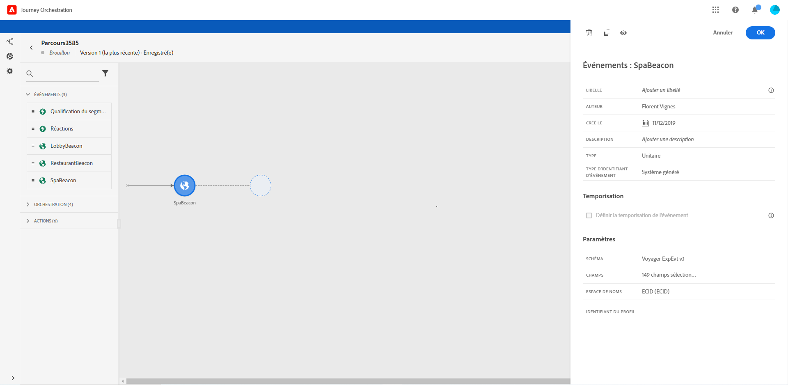

# Événements généraux {#section_ofg_jss_dgb}

Pour ce type d’événement, vous pouvez uniquement ajouter un libellé et une description. Le reste de la configuration ne peut pas être modifié. C’est l’utilisateur technique qui s’en charge. Voir [cette page](../event/about-events.md).

