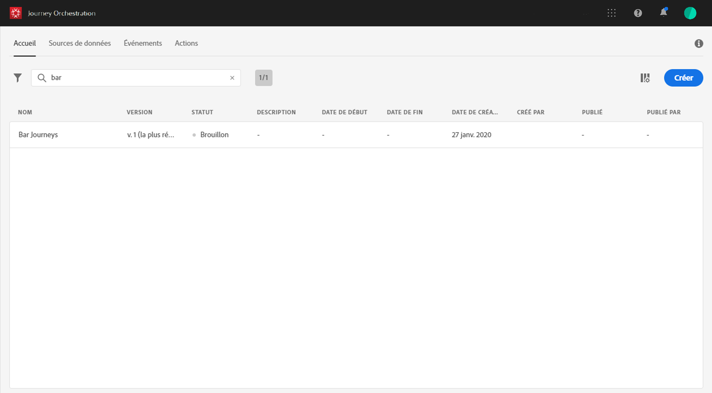
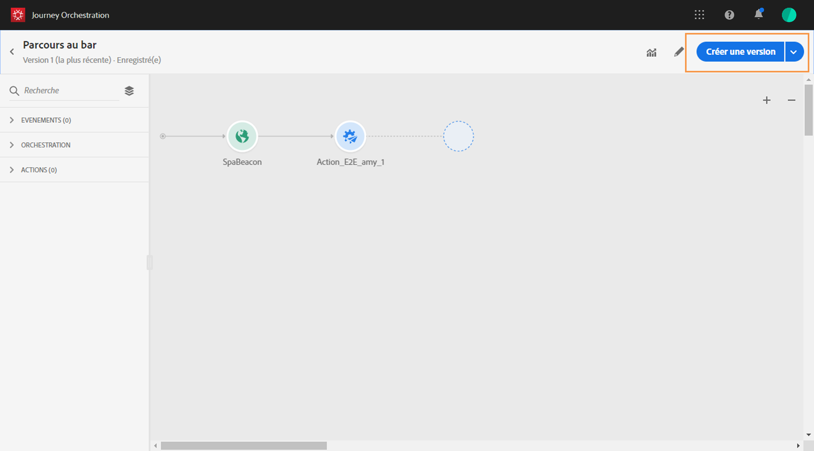
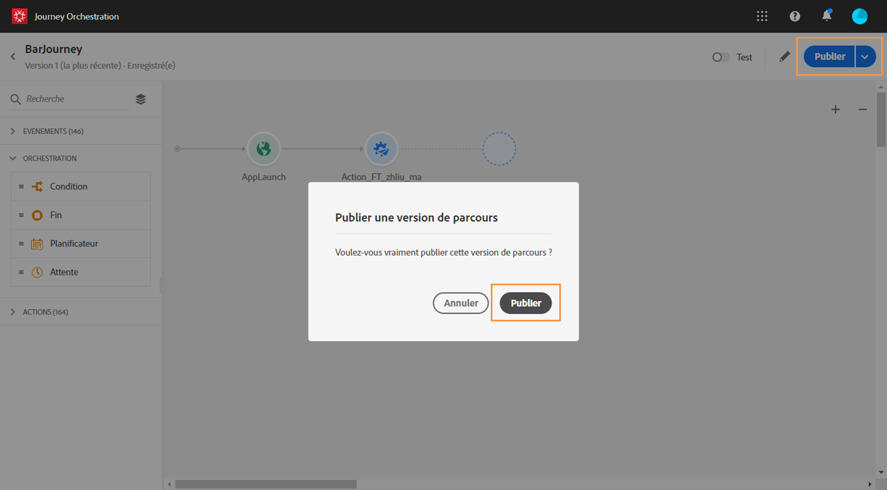

# Versions de voyage{#concept_ldc_k55_zgb}

Dans la liste des trajets, toutes les versions du voyage sont affichées avec le numéro de version. Voir la section . Lorsque vous recherchez un voyage, les nouvelles versions apparaissent en haut de la liste la première fois que l’application s’ouvre. Ensuite, vous pouvez définir le tri souhaité et l’application le conserve comme une préférence utilisateur. La version du voyage est également affichée en haut de l&#39;interface de l&#39;édition du voyage, au-dessus du canevas.

Si vous devez effectuer un voyage en direct, vous devez créer une nouvelle version de votre voyage.

1. Ouvrez la dernière version de votre parcours en direct, cliquez sur **[!UICONTROL Créer une nouvelle version]**et confirmez.

   

   >[!NOTE]
   >
   >Vous pouvez uniquement créer une nouvelle version à partir de la dernière version d’un voyage.

1. Effectuez vos modifications, cliquez sur **[!UICONTROL Publier]**et confirmez.

   

Dès que le voyage sera publié, les individus commenceront à s&#39;introduire dans la dernière version du voyage. Les personnes qui sont déjà entrées dans une version précédente y restent jusqu&#39;à ce qu&#39;elles finissent le voyage. S&#39;ils reviennent plus tard dans le même voyage, ils entreront dans la dernière version.

Les versions de voyage peuvent être arrêtées individuellement. Toutes les versions des voyages portent le même nom.

>[!NOTE]
>
>Si vous disposez de plusieurs versions en direct et que vous arrêtez la dernière, les utilisateurs ne reviendront pas à une version précédente. Aucune entrée dans le voyage n&#39;aura lieu.
