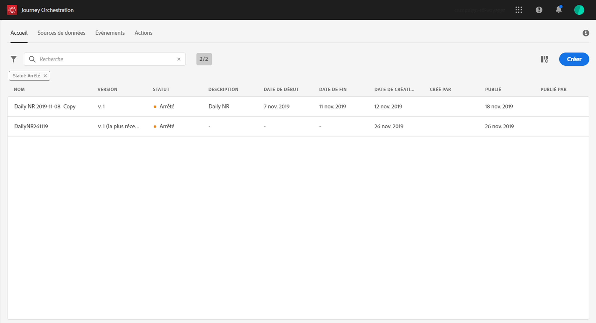
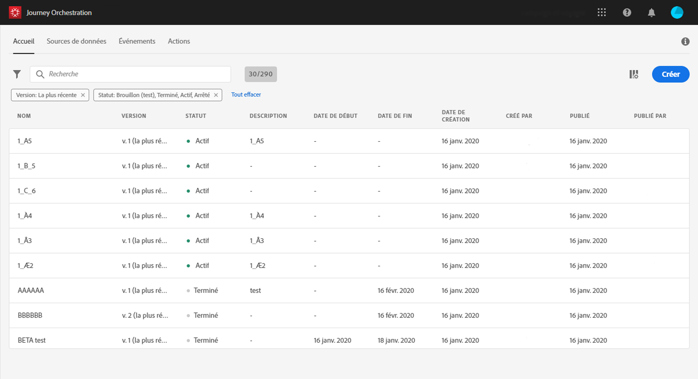
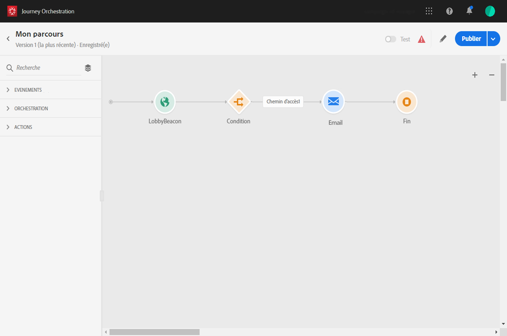
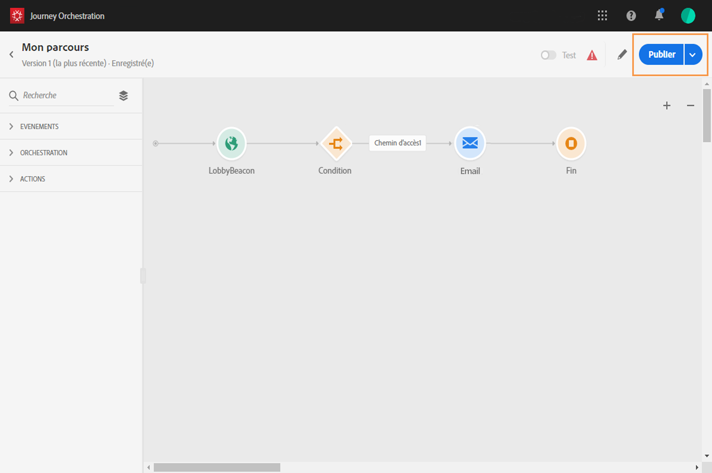

# Création d’un parcours {#concept_gq5_sqt_52b}

Cette étape est effectuée par l’**utilisateur chargé de la conception de parcours**. C’est là que vous créez vos parcours. Combinez les différentes activités d’événement, d’orchestration et d’action afin de créer des scénarios cross-canal à plusieurs étapes.

L’interface de parcours vous permet de faire glisser facilement des activités de la palette vers la zone de travail. Vous pouvez également double-cliquer sur une activité pour l’ajouter dans la zone de travail à la prochaine étape disponible. Chaque activité possède un rôle et un emplacement précis dans le processus. Les activités sont séquencées. Cela signifie que lorsqu’une activité est terminée, le flux se poursuit et traite l’activité suivante, et ainsi de suite.

Un seul espace de noms est autorisé par parcours. Lorsque vous déposez le premier événement, ceux dont les espaces de noms sont différents sont grisés. Si le premier événement est dépourvu d’espace de noms, tous ceux qui en sont pourvus sont grisés. Voir . En outre, les groupes de champs Adobe Experience Platform apparaissent en grisé si le parcours contient des événements sans espace de noms. Ajoutons encore que si vous utilisez plusieurs événements dans le même parcours, tous doivent utiliser le même espace de noms.

## Démarrage rapide {#creating_journey}

Les principales étapes nécessaires pour créer et publier un parcours sont les suivantes :

1. Dans le menu supérieur, cliquez sur l’onglet **[!UICONTROL Accueil]**.

   La liste des parcours s’affiche. Pour plus d’informations sur l’interface, voir .

   

1. Cliquez sur **[!UICONTROL Créer]** pour créer un parcours.

   

1. Modifiez les propriétés du parcours dans le volet de configuration qui s’affiche dans la partie droite. Voir .

   

1. Commencez par faire glisser une activité d’événement de la palette vers la zone de travail. Vous pouvez également double-cliquer sur une activité pour l’ajouter à la zone de travail.

   

1. Faites glisser vos autres activités et configurez-les. Reportez-vous aux sections ,  et .

   

1. Votre parcours est automatiquement enregistré. Testez-le et publiez-le. Voir  et .

   

## Fin d’un parcours {#ending_a_journey}

Vous pouvez mettre fin à un parcours de deux façons différentes :

* Le client arrive à la dernière activité d’un chemin. Il ne doit pas nécessairement s’agir d’une activité de fin. De plus, le chemin ne doit pas obligatoirement se terminer par une activité de fin. Voir .
* Le client arrive à une activité de condition (ou à une activité d’attente avec une condition) et ne répond à aucune des conditions.

Il peut alors réintégrer le parcours si la rentrée est autorisée. Voir .
