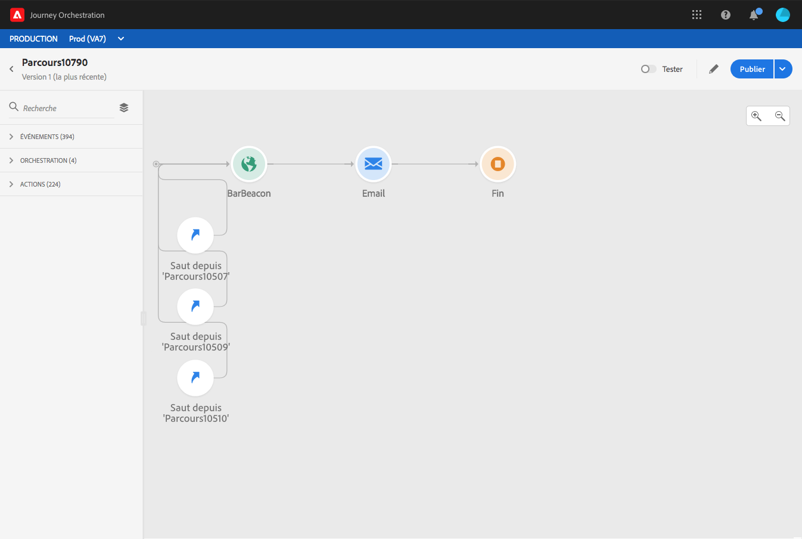

# Passage d’un parcours à un autre {#jump}

L’activité d’action **[!UICONTROL Saut]** permet d’inviter des individus à passer d’un parcours à un autre. Cette fonctionnalité permet d’effectuer les opérations suivantes :

* simplifier la conception de parcours très complexes en les divisant en plusieurs autres ;
* créer des parcours basés sur des schémas de parcours communs et réutilisables.

Dans le parcours d&#39;origine, il vous suffit d&#39;ajouter une activité **[!UICONTROL Sauter]** et de sélectionner un parcours de cible. Lorsque l&#39;individu entre dans l&#39;étape **[!UICONTROL Sauter]**, un événement interne est envoyé au premier événement du parcours de la cible. Si l&#39;action **[!UICONTROL Sauter]** réussit, l&#39;individu continue à progresser dans le parcours. Le comportement est similaire aux autres actions.

Dans le parcours de cible, le premier événement déclenché en interne par l&#39;activité **[!UICONTROL Sauter]** fera couler l&#39;individu dans le parcours.

## Cycle de vie

Supposons que vous ayez ajouté une activité **[!UICONTROL Sauter]** dans un voyage A à un voyage B. Le voyage A est le **voyage d&#39;origine** et le voyage B, le **voyage de cible**.
Voici les différentes étapes du processus d’exécution :

Le **parcours A** est déclenché par un événement externe :

1. Le parcours A reçoit un événement externe lié à un individu.
1. L&#39;individu atteint l&#39;étape **[!UICONTROL Sauter]**.
1. L&#39;individu est poussé au voyage B et passe aux étapes suivantes du voyage A, après l&#39;étape **[!UICONTROL Sauter]**.

Dans le voyage B, le premier événement est déclenché en interne, par l&#39;activité **[!UICONTROL Sauter]** du voyage A :

1. Le parcours B a reçu un événement interne du parcours A.
1. L’individu commence à effectuer le parcours B.

>[!NOTE]
>
>Le trajet B peut également être déclenché par un événement externe.

## Meilleures pratiques et limites

### Création

* L&#39;activité **[!UICONTROL Sauter]** n&#39;est disponible que dans les voyages utilisant un espace de nommage.
* Vous ne pouvez accéder qu’à un parcours qui utilise le même espace de noms que le parcours d’origine.
* Vous ne pouvez pas accéder à un parcours commençant par un événement de **qualification de segment**.
* Vous ne pouvez pas avoir une activité **[!UICONTROL Sauter]** et un événement **Segment** dans le même parcours.
* Vous pouvez inclure autant d&#39;activités **[!UICONTROL Sauter]** que nécessaire dans un voyage. Après un **[!UICONTROL saut]**, vous pouvez ajouter toute activité nécessaire.
* Vous pouvez avoir autant de niveaux de saut que nécessaire. Par exemple, le parcours A passe au parcours B, qui passe au parcours C, etc.
* Le parcours de la cible peut également inclure autant d&#39;activités **[!UICONTROL Sauter]** que nécessaire.
* Les schémas de boucle ne sont pas pris en charge. Il n’y a aucun moyen de relier deux parcours, ou plus, qui créeraient une boucle infinie. L’écran de configuration de l’activité **[!UICONTROL Saut]** vous empêche de le faire.

### Exécution

* Lorsque l&#39;activité **[!UICONTROL Sauter]** est exécutée, la dernière version du parcours de cible est déclenchée.
* Comme à l’accoutumée, un individu donné ne peut être présent qu’une seule fois dans un même parcours. Ainsi, si un individu provenant d’un parcours d’origine est déjà engagé dans le parcours cible, il ne rejoindra pas le parcours cible. Aucune erreur ne sera signalée sur l&#39;activité **[!UICONTROL Sauter]** car il s&#39;agit d&#39;un comportement normal.

## Configuration de l’activité de vidage

1. Concevez votre **voyage d&#39;origine**.

   

1. À chaque étape du parcours, ajoutez une activité **[!UICONTROL Sauter]**, à partir de la catégorie **[!UICONTROL ACTIONS]**. Ajoutez un libellé et une description.

   

1. Cliquez dans le champ **Parcours cible**.
La liste contient toutes les versions de parcours en version brouillon, version active ou en mode test. Les parcours qui utilisent un autre espace de noms ou commençant par un événement de **qualification de segment** ne sont pas disponibles. Les parcours cible qui créeraient un schéma de boucle sont également filtrés.

   

   >[!NOTE]
   >
   >Vous pouvez cliquer sur l’icône **Ouvrir le parcours cible**, sur le côté droit, pour ouvrir le parcours cible dans un nouvel onglet.

1. Sélectionnez le parcours cible auquel vous souhaitez accéder.
Le champ **Premier événement** est prérenseigné avec le nom du premier événement du parcours cible. Si votre parcours de cible comprend plusieurs événements, le saut **[!UICONTROL sauter]** n&#39;est autorisé que le premier événement.

   

1. La section **Paramètres d’action** affiche tous les champs de l’événement cible. De la même manière que pour les autres types d’actions, mappez chaque champ avec les champs de l’événement ou de la source de données d’origine. Ces informations seront transmises au parcours cible au moment de l’exécution.
1. Ajoutez les activités suivantes pour terminer le parcours d’origine.

   

   >[!NOTE]
   >
   >L&#39;identité de l&#39;individu est automatiquement cartographiée. Ces informations ne sont pas visibles dans l’interface.

Votre activité **[!UICONTROL Sauter]** est configurée. Dès que votre voyage est en direct ou en mode test, les personnes qui atteignent l&#39;étape **[!UICONTROL Sauter]** seront poussées du voyage jusqu&#39;au voyage de cible.

Lorsqu&#39;une activité **[!UICONTROL Sauter]** est configurée dans un parcours, une icône **[!UICONTROL Sauter]** est automatiquement ajoutée au début du parcours de cible. Cela vous permet d’identifier que le voyage peut être déclenché en externe mais aussi en interne à partir d’une activité **[!UICONTROL Sauter]**.

## Résolution des problèmes

Lorsque le parcours est publié ou en mode test, des erreurs se produisent dans les cas suivants :
* le parcours cible n’existe plus ;
* le parcours cible est en version brouillon, fermé ou arrêté ;
* le premier événement du parcours cible a changé et le mappage est interrompu.

