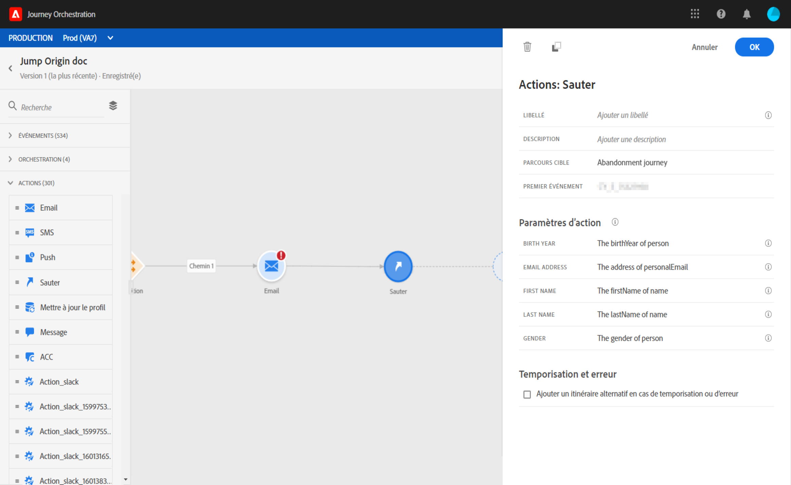

# Passage d’un parcours à un autre {#jump}

L’activité d’action **[!UICONTROL Saut]** permet d’inviter des individus à passer d’un parcours à un autre. Cette fonctionnalité permet d’effectuer les opérations suivantes :

* simplifier la conception de parcours très complexes en les divisant en plusieurs autres ;
* créer des parcours basés sur des schémas de parcours communs et réutilisables.

Dans le parcours d’origine, il suffit d’ajouter une activité **[!UICONTROL Saut]** et de sélectionner un parcours cible. Lorsque l’individu parvient à l’étape de **[!UICONTROL saut]**, un événement interne est envoyé au premier événement du parcours cible. Si l’action **[!UICONTROL Saut]** réussit, l’individu continue à progresser dans le parcours. Le comportement est similaire aux autres actions.

Dans le parcours cible, le premier événement déclenché en interne par l’activité **[!UICONTROL Saut]** permettra à chaque individu de s’insérer dans le parcours.

## Cycle de vie

Supposons que vous ayez ajouté une activité **[!UICONTROL Saut]** d’un parcours A à un parcours B. Le parcours A est le **parcours d’origine** et le parcours B, le **parcours cible**.
Voici les différentes étapes du processus d’exécution :

Le **parcours A** est déclenché par un événement externe :

1. Le parcours A reçoit un événement externe lié à un individu.
1. L’individu atteint l’étape du **[!UICONTROL saut]**.
1. L’individu est amené au parcours B et passe aux étapes suivantes du parcours A, suite à l’étape du **[!UICONTROL saut]**.

Dans le parcours B, le premier événement est déclenché en interne, via l’activité **[!UICONTROL Saut]** depuis le parcours A :

1. Le parcours B a reçu un événement interne du parcours A.
1. L’individu commence à effectuer le parcours B.

>[!NOTE]
>
>Le parcours B peut également être déclenché par un événement externe.

## Bonnes pratiques et limites

### Création

* L’activité **[!UICONTROL Saut]** n’est disponible que dans les parcours utilisant un espace de noms.
* Vous ne pouvez accéder qu’à un parcours qui utilise le même espace de noms que le parcours d’origine.
* Vous ne pouvez pas accéder à un parcours commençant par un événement de **qualification de segment**.
* Un même parcours ne peut pas contenir une activité **[!UICONTROL Saut]** et un événement de **qualification du segment**.
* Vous pouvez inclure autant d’activités **[!UICONTROL Saut]** que nécessaire dans un parcours. Après un **[!UICONTROL saut]**, vous pouvez ajouter toutes les activités nécessaires.
* Vous pouvez avoir autant de niveaux de saut que nécessaire. Par exemple, le parcours A passe au parcours B, qui passe au parcours C, etc.
* Le parcours cible peut également comporter autant d’activités **[!UICONTROL Saut]** que nécessaire.
* Les schémas de boucle ne sont pas pris en charge. Il n’y a aucun moyen de relier deux parcours, ou plus, qui créeraient une boucle infinie. L’écran de configuration de l’activité **[!UICONTROL Saut]** vous empêche de le faire.

### Exécution

* Lorsque l’activité **[!UICONTROL Saut]** est exécutée, la dernière version du parcours cible est déclenchée.
* Comme à l’accoutumée, un individu donné ne peut être présent qu’une seule fois dans un même parcours. Ainsi, si un individu provenant d’un parcours d’origine est déjà engagé dans le parcours cible, il ne rejoindra pas le parcours cible. Aucune erreur ne sera signalée lors de l’activité **[!UICONTROL Saut]**, car il s’agit d’un comportement normal.

## Configuration de l’activité Saut

1. Concevez votre **parcours d’origine**.

   

1. À chaque étape du parcours, ajoutez une activité **[!UICONTROL Saut]**, depuis la catégorie **[!UICONTROL ACTIONS]**. Ajoutez un libellé et une description.

   

1. Cliquez dans le champ **Parcours cible**.
La liste contient toutes les versions de parcours en version brouillon, version active ou en mode test. Les parcours qui utilisent un autre espace de noms ou commençant par un événement de **qualification de segment** ne sont pas disponibles. Les parcours cible qui créeraient un schéma de boucle sont également filtrés.

   

   >[!NOTE]
   >
   >Vous pouvez cliquer sur l’icône **Ouvrir le parcours cible**, sur le côté droit, pour ouvrir le parcours cible dans un nouvel onglet.

1. Sélectionnez le parcours cible auquel vous souhaitez accéder.
Le champ **Premier événement** est prérenseigné avec le nom du premier événement du parcours cible. Si votre parcours cible comporte plusieurs événements, le **[!UICONTROL saut]** n’est autorisé que pour le premier.

   

1. La section **Paramètres d’action** affiche tous les champs de l’événement cible. De la même manière que pour les autres types d’actions, mappez chaque champ avec les champs de l’événement ou de la source de données d’origine. Ces informations seront transmises au parcours cible au moment de l’exécution.
1. Ajoutez les activités suivantes pour terminer le parcours d’origine.

   

   >[!NOTE]
   >
   >L’identité de l’individu est automatiquement mappée. Ces informations ne sont pas visibles dans l’interface.

Votre activité **[!UICONTROL Saut]** est configurée. Dès que votre parcours est actif ou en mode test, les individus qui atteignent l’étape de **[!UICONTROL saut]** sont amenés au parcours cible.

Lorsqu’une activité **[!UICONTROL Saut]** est configurée dans un parcours, une icône d’entrée **[!UICONTROL Saut]** est automatiquement ajoutée au début du parcours cible. Vous pouvez ainsi identifier que le parcours peut être déclenché depuis l’extérieur mais aussi en interne par le biais d’une activité **[!UICONTROL Saut]**.

## Résolution des problèmes

Lorsque le parcours est publié ou en mode test, des erreurs se produisent dans les cas suivants :
* le parcours cible n’existe plus ;
* le parcours cible est en version brouillon, fermé ou arrêté ;
* le premier événement du parcours cible a changé et le mappage est interrompu.

