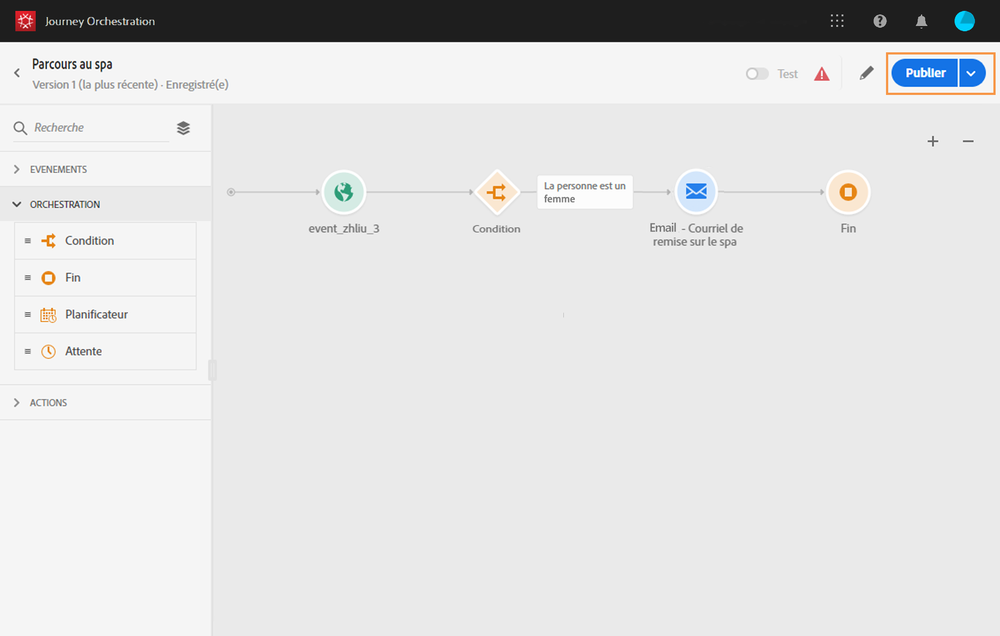

# Publication du parcours{#concept_mtc_lrt_52b}

>[!CAUTION]
>
>**Vous recherchez Adobe Journey Optimizer** ? Cliquez [ici](https://experienceleague.adobe.com/fr/docs/journey-optimizer/using/ajo-home){target="_blank"} pour accéder à la documentation de Journey Optimizer.
>
>
>_Cette documentation se rapporte aux anciens contenus de Journey Orchestration qui ont été remplacés par Journey Optimizer. Pour toute question concernant votre accès à Journey Orchestration ou Journey Optimizer, veuillez contacter votre équipe de compte._

Vous pouvez publier un parcours après avoir testé sa validité.

Si vous devez apporter des modifications à un parcours publié, vous devez en créer une nouvelle version. Voir [cette page](../building-journeys/journey-versions.md). Lorsqu’un parcours est en lecture seule, vous ne pouvez modifier que les libellés et descriptions d’activité, ainsi que le nom et la description du parcours.

Si vous arrêtez un parcours, il l’est définitivement. Toutes les personnes figurant dans le parcours seront définitivement arrêtées et les nouvelles entrées ne seront plus autorisées. Si vous devez réutiliser le parcours, vous devez le dupliquer et le publier.

1. Avant de publier votre parcours, vérifiez qu’il est valide et qu’il ne comporte aucune erreur. sans quoi toute publication s’avérera impossible. Consultez [cette section](../about/troubleshooting.md#section_h3q_kqk_fhb). Il est également recommandé de tester votre parcours avant de le publier. Voir [cette page](../building-journeys/testing-the-journey.md).
1. Pour publier le parcours, cliquez sur l’option **[!UICONTROL Publier]** située dans le menu déroulant qui se trouve en haut à droite.

   

Une fois le parcours publié, il est en lecture seule.
