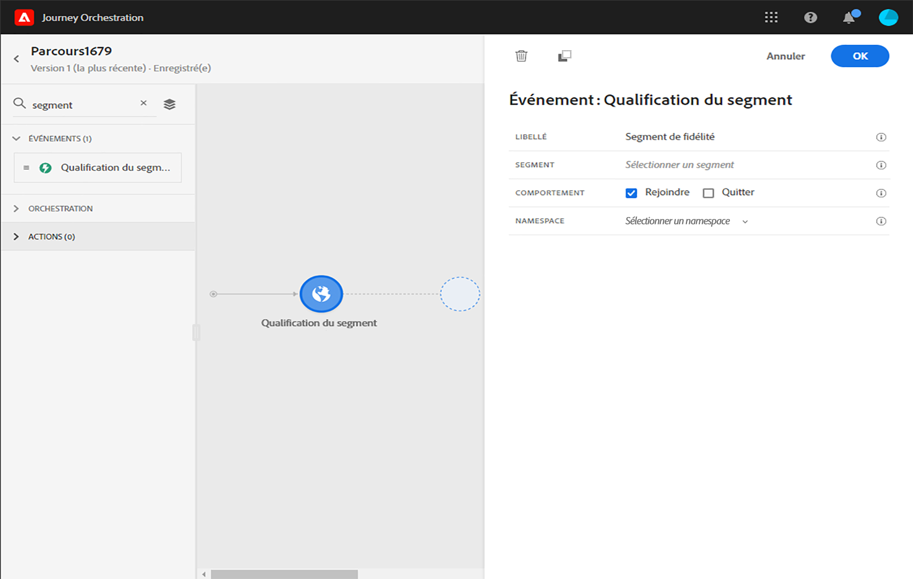
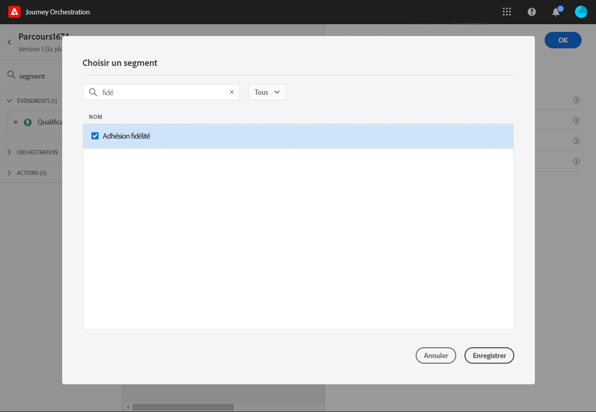
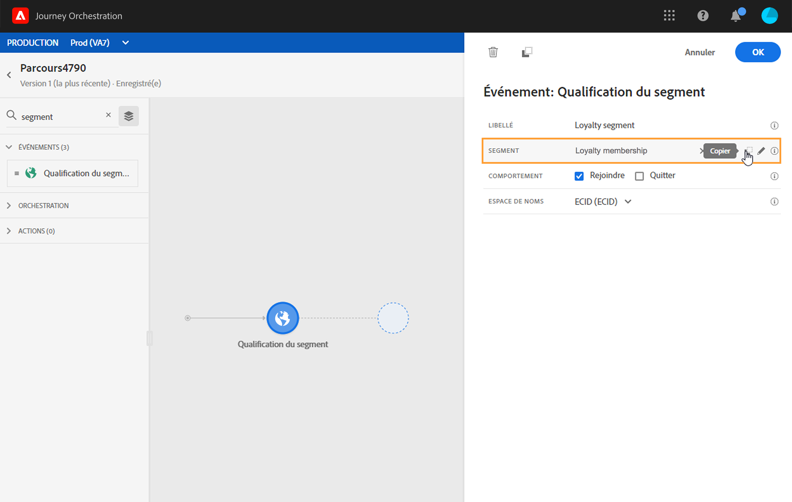
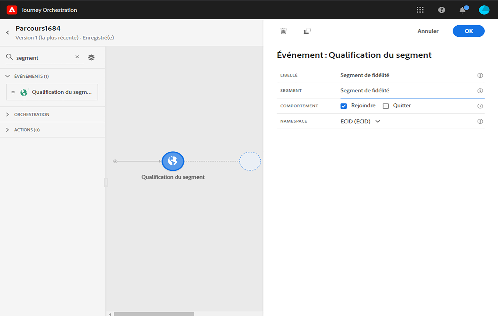
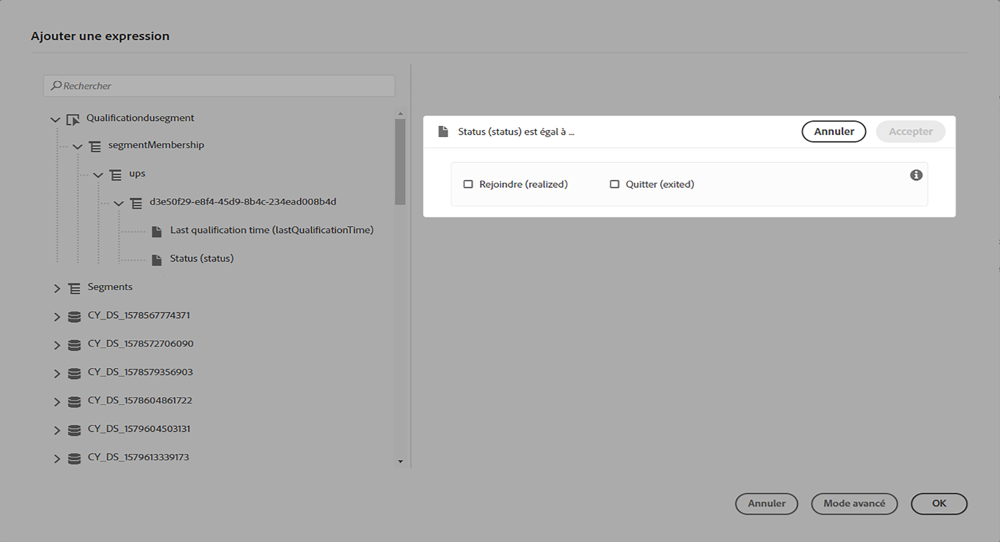
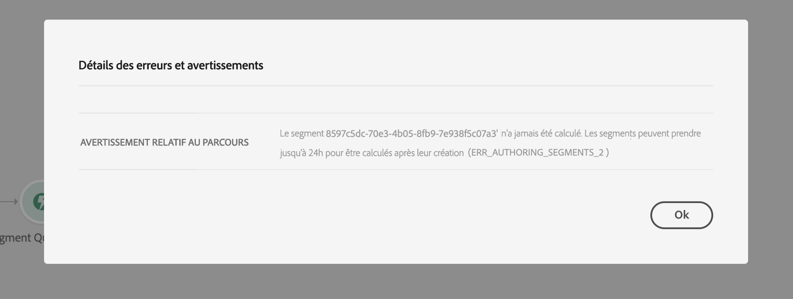
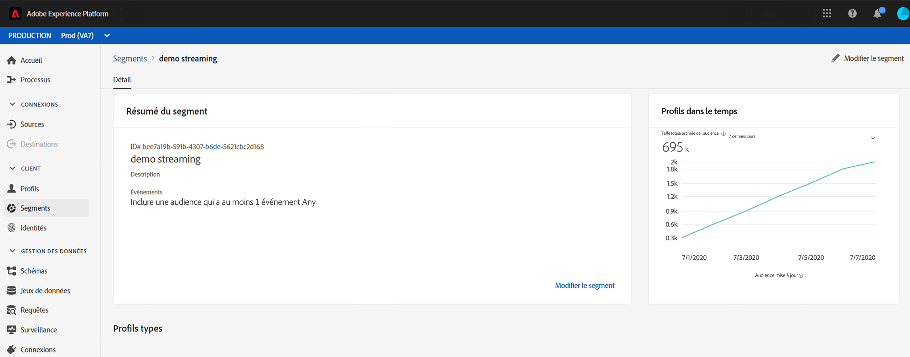

# Événements de qualification de segment {#segment-qualification}

## À propos des événements de qualification de segment{#about-segment-qualification}

Cette activité permet à votre parcours d’écouter les entrées et les sorties des profils dans les segments Adobe Experience Platform pour faire entrer ou avancer les particuliers dans le parcours. Pour plus d’informations sur la création de segments, consultez cette [section](../segment/about-segments.md).

Supposons que vous ayez un segment « client Silver ». Avec cette activité, vous pouvez faire entrer tous les nouveaux clients Silver dans un parcours et leur envoyer une série de messages personnalisés.

Il est possible de positionner ce type d’événement dès la première étape, ou plus tard dans le parcours.

>[!IMPORTANT]
>
>N’oubliez pas que les segments Adobe Experience Platform sont calculés une fois par jour (segments **par lot**) ou en temps réel (segments **diffusés**, à l’aide de l’option Audiences haute fréquence d’Adobe Experience Platform).
>
>Si le segment sélectionné est en flux continu, les individus appartenant à ce segment peuvent éventuellement rejoindre le parcours en temps réel. Si le segment est par lot, les personnes nouvellement qualifiées pour ce segment peuvent éventuellement rejoindre le parcours lorsque le calcul du segment est exécuté sur Adobe Experience Platform.

1. Développez la catégorie **[!UICONTROL Événements]** et déposez une activité de **[!UICONTROL qualification de segment]** dans la zone de travail.

   

1. Ajoutez un **[!UICONTROL libellé]** à l’activité. Cette étape est facultative.

1. Cliquez dans le champ **[!UICONTROL Segment]** et sélectionnez les segments à exploiter.

   >[!NOTE]
   >
   >Notez que vous pouvez personnaliser les colonnes affichées dans la liste et les trier.

   

   Une fois le segment ajouté, le bouton **[!UICONTROL Copier]** permet de copier son nom et son ID :

   `{"name":"Loyalty membership“,”id":"8597c5dc-70e3-4b05-8fb9-7e938f5c07a3"}`

   

1. Dans le champ **[!UICONTROL Comportement]**, choisissez d’écouter les entrées de segments, les sorties ou les deux.

1. Sélectionnez un espace de noms. Cela n’est nécessaire que si l’événement est considéré comme la première étape du parcours.

   

La payload contient les informations contextuelles suivantes, utilisables dans des conditions et des actions :

* le comportement (entrée, sortie)
* l’horodatage de la qualification
* l’identifiant de segment

Lorsque vous utilisez l’éditeur d’expression dans une condition ou une action qui suit une activité de **[!UICONTROL qualification du segment]**, vous avez accès au nœud **[!UICONTROL Qualification de segment]**. Vous pouvez choisir entre **[!UICONTROL l’heure de la dernière qualification]** et le **[!UICONTROL statut]** (entrée ou sortie).

Voir [Activité de condition](../building-journeys/condition-activity.md#about_condition).

## Bonnes pratiques {#best-practices-segments}

L’activité **[!UICONTROL Qualification du segment]** permet une entrée immédiate dans les parcours des particuliers qualifiés ou disqualifiés d&#39;un segment Adobe Experience Platform.

La vitesse de réception de ces informations est élevée. Les mesures effectuées montrent une vitesse de 10 000 événements reçus par seconde. Par conséquent, vous devez veiller à comprendre comment les pics d’entrée peuvent se produire, comment les éviter et comment y préparer votre parcours.

### Segments par lot{#batch-speed-segment-qualification}

Lorsque vous utilisez la qualification du segment pour un segment par lot, notez qu’un pic d’entrée se produit au moment du calcul quotidien. La taille du pic dépend du nombre de particuliers qui rejoignent (ou quittent) le segment quotidiennement.

De plus, si le segment par lot est créé et utilisé immédiatement dans un parcours, le premier lot de calculs peut faire qu’un très grand nombre de particuliers rejoignent le parcours.

### Segments en flux continu{#streamed-speed-segment-qualification}

Lors de l’utilisation de la qualification du segment pour les segments en flux continu, il y a moins de risque d’obtenir d’importants pics d’entrées/sorties en raison de l’évaluation continue du segment. Néanmoins, si la définition du segment conduit à qualifier un grand volume de clients en même temps, un pic peut également se produire.

For more information on streaming segmentation, refer to this [page](https://experienceleague.adobe.com/docs/experience-platform/segmentation/api/streaming-segmentation.html#api)

### Éviter les surcharges{#overloads-speed-segment-qualification}

Voici quelques bonnes pratiques qui permettront d’éviter la surcharge des systèmes utilisés dans les parcours (sources de données, actions personnalisées, actions Adobe Campaign Standard).

Dans une activité **[!UICONTROL Qualification du segment]**, n’utilisez pas un segment par lot immédiatement après sa création. Il évitera le premier pic de calcul. Notez qu’un avertissement jaune apparaît dans la zone de travail du parcours si vous êtes sur le point d’utiliser un segment qui n’a jamais été calculé.

Mettez en place une règle de limitation pour les sources de données et les actions utilisées dans les parcours pour éviter de les surcharger (consultez cette [section](../api/capping.md)). Notez que la règle de limitation ne permet pas de nouvelle tentative. Si vous avez besoin d’effectuer une nouvelle tentative, vous devez utiliser un autre chemin dans le parcours en cochant la case **[!UICONTROL Ajouter un chemin alternatif en cas de dépassement de délai ou d’erreur]** dans les conditions ou les actions.

Avant d’utiliser le segment dans un parcours en production, évaluez toujours d’abord le volume de particuliers qualifiés pour ce segment tous les jours. Pour ce faire, vous pouvez vérifier la section **[!UICONTROL Segments]** d’Adobe Experience Platform et examiner le graphique sur le côté droit.

