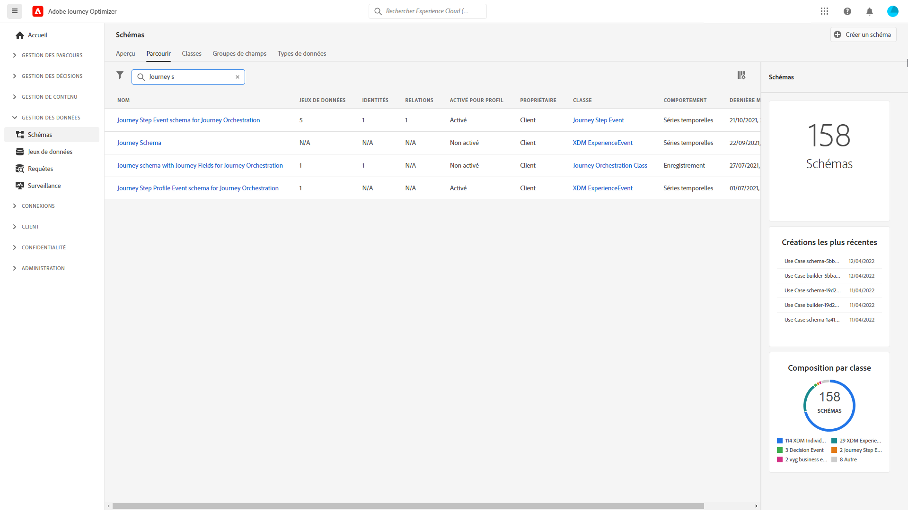
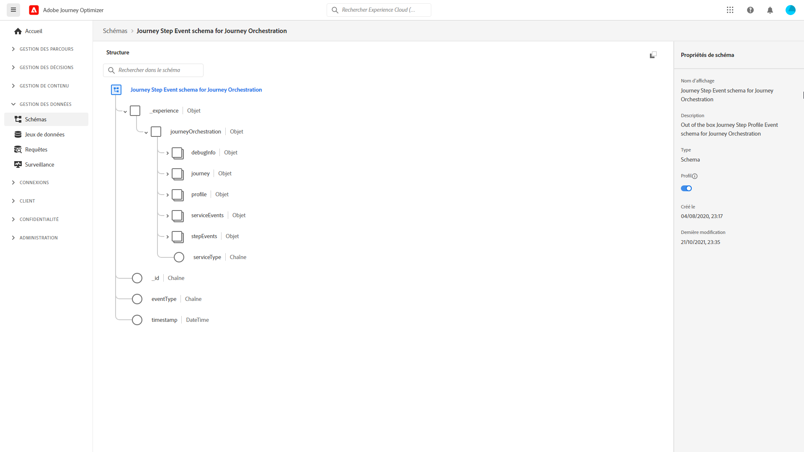
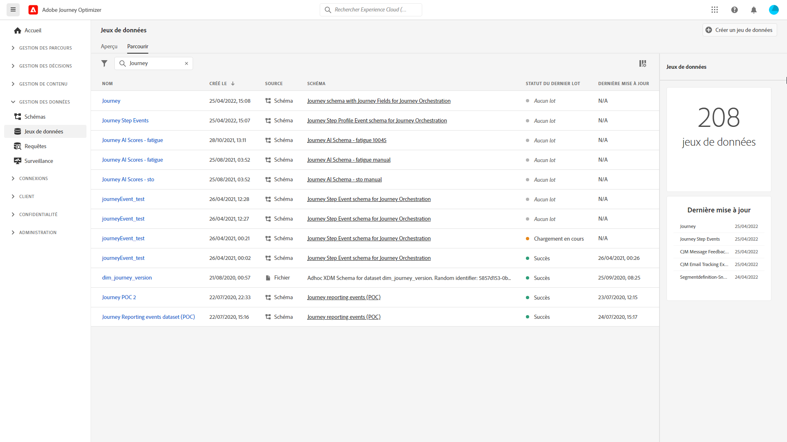

# Présentation du partage des étapes du parcours{#sharing-overview}

[!DNL Journey Orchestration] envoie automatiquement les données de performances du voyage à Adobe Experience Platform afin qu’elles puissent être combinées à d’autres données à des fins d’analyse.

Par exemple, vous avez configuré un voyage qui envoie plusieurs courriers électroniques. Cette fonctionnalité vous permet de combiner [!DNL Journey Orchestration] des données avec des données de événement en aval, telles que le nombre de conversions survenues, le nombre d’interactions survenues sur le site Web ou le nombre de transactions survenues dans le magasin. Les informations de voyage peuvent être combinées avec les données de la plate-forme, que ce soit à partir d&#39;autres propriétés numériques ou de propriétés hors ligne pour offrir une vue plus complète des performances.

[!DNL Journey Orchestration] crée automatiquement les schémas et flux nécessaires dans les jeux de données de la Plateforme pour chaque étape d&#39;un voyage individuel. Un événement d’étape correspond à une personne qui se déplace d’un noeud à un autre au cours d’un voyage. Par exemple, dans le cadre d’un voyage qui comporte un événement, une condition et une action, trois événements d’étape sont envoyés à la Plateforme.

La liste des champs XDM transmis est complète. Certains contiennent des codes générés par le système et d&#39;autres ont des noms conviviaux lisibles. Par exemple, l&#39;étiquette de l&#39;activité de voyage ou l&#39;état de l&#39;étape : nombre de fois où une action a expiré ou s’est terminée par erreur.

>[!CAUTION]
>
>Les jeux de données ne peuvent pas être activés pour le service de profil en temps réel. Assurez-vous que la bascule **Profil** est désactivée.

Les voyages envoient les données au fur et à mesure, en flux continu. Vous pouvez requête ces données à l’aide de Requête Service. Vous pouvez vous connecter à Customer Journey Analytics ou à d’autres outils de BI aux données de vue liées à ces étapes.

Les schémas suivants sont créés :

* schéma de Événement du Profil du parcours [!DNL Journey Orchestration] - Événements d&#39;expérience pour les étapes effectuées dans un voyage avec une carte d&#39;identité à utiliser pour le mappage à un participant individuel du voyage.
* schéma de Événement d&#39;étape du parcours pour [!DNL Journey Orchestration] - événement d&#39;étape du parcours lié à une Métadonnées de parcours.
* schéma de voyage avec champs de voyage pour [!DNL Journey Orchestration] - Métadonnées de voyage pour décrire les voyages.

Les jeux de données suivants sont transmis :

* schéma de Événement du Profil du parcours [!DNL Journey Orchestration]
* Événements de parcours
* Parcours

Les listes des champs XDM transmis à la plateforme sont détaillées ici :

* [Champs communs aux événements de parcoursSteps](../building-journeys/sharing-common-fields.md)
* [Champs d&#39;exécution d&#39;action de événements de parcoursStep](../building-journeys/sharing-execution-fields.md)
* [Champs de récupération des données des événements travelStep](../building-journeys/sharing-fetch-fields.md)
* [Champs d&#39;identité du événement cheminementStep](../building-journeys/sharing-identity-fields.md)
* [Champs de voyage](../building-journeys/sharing-journey-fields.md)

