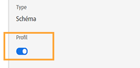

# Présentation du partage des étapes du parcours{#sharing-overview}

L’orchestration du voyage envoie automatiquement les données de performances du voyage à Adobe Experience Platform afin qu’elles puissent être combinées à d’autres données à des fins d’analyse.

Par exemple, vous avez configuré un voyage qui envoie plusieurs courriers électroniques. Cette fonctionnalité vous permet de combiner les données d’orchestration de parcours avec les données de événement en aval, telles que le nombre de conversions survenues, le nombre d’engagements survenues sur le site Web ou le nombre de transactions survenues dans le magasin. Les informations de voyage peuvent être combinées avec les données de la plate-forme, que ce soit à partir d&#39;autres propriétés numériques ou de propriétés hors ligne pour offrir une vue plus complète des performances.

L&#39;orchestration du voyage crée automatiquement les schémas et flux nécessaires dans les ensembles de données de la Plateforme pour chaque étape d&#39;un voyage individuel. Un événement d’étape correspond à une personne qui se déplace d’un noeud à un autre au cours d’un voyage. Par exemple, dans le cadre d’un voyage qui comporte un événement, une condition et une action, trois événements d’étape sont envoyés à la Plateforme.

La liste des champs XDM transmis est complète. Certains contiennent des codes générés par le système et d&#39;autres ont des noms conviviaux lisibles. Par exemple, l&#39;étiquette de l&#39;activité de voyage ou l&#39;état de l&#39;étape : nombre de fois où une action a expiré ou s’est terminée par erreur.

>[!CAUTION]
>
>Par défaut, les jeux de données ne sont pas activés pour le service de profil en temps réel. Si vous souhaitez qu’un jeu de données soit activé dans le service de profil, vous devez l’activer (bascule **Profil** ). Sachez qu&#39;un volume élevé de événements prendra enregistrement dans votre quota. Veuillez procéder avec soin avant d&#39;activer un jeu de données pour les profils
>
>

>[!]
>
>Les voyages ont également la possibilité d&#39;envoyer ou non le événement de Profil du voyage à la plate-forme.  Journeys maintient une technologie pour décider ça.
>
>

Les voyages envoient les données au fur et à mesure, en flux continu. Vous pouvez requête ces données à l’aide de Requête Service. Vous pouvez vous connecter à Customer Journey Analytics ou à d’autres outils de BI aux données de vue liées à ces étapes.

Les schémas suivants sont créés :

* schéma de Événement du Profil du voyage pour l&#39;orchestration du voyage - Événements d&#39;expérience pour les étapes effectuées dans un voyage ainsi qu&#39;une carte d&#39;identité à utiliser pour le mappage à un participant individuel du voyage.
* schéma de Événement d&#39;étape du parcours pour l&#39;orchestration du parcours - événement d&#39;étape du parcours lié à une Métadonnées de parcours.
* schéma de voyage avec les champs de voyage pour l&#39;orchestration du voyage - Métadonnées de voyage pour décrire les voyages.

Les jeux de données suivants sont transmis :

* schéma de Événement du Profil du parcours pour l&#39;orchestration du parcours
* Événements de parcours
* Parcours

Les listes des champs XDM transmis à la plateforme sont détaillées ici :

* [Champs communs aux événements de parcoursSteps](../building-journeys/sharing-common-fields.md)
* [Champs d&#39;exécution d&#39;action de événements de parcoursStep](../building-journeys/sharing-execution-fields.md)
* [Champs de récupération des données des événements travelStep](../building-journeys/sharing-fetch-fields.md)
* [Champs d&#39;identité du événement cheminementStep](../building-journeys/sharing-identity-fields.md)
* [Champs de voyage](../building-journeys/sharing-journey-fields.md)

