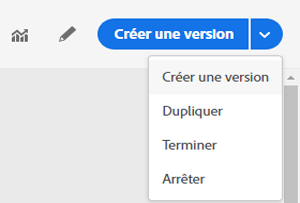

# Arrêt d&#39;un voyage

Les options **[!UICONTROL Arrêter]**et**[!UICONTROL  Terminer]** vous permettent de mettre fin aux voyages en **direct** . Finir un voyage implique **que l&#39;arrivée de nouveaux clients dans le voyage soit bloquée** et que les clients qui sont déjà entrés dans le voyage puissent le ressentir jusqu&#39;à la fin. Il s’agit de la méthode la plus recommandée pour mettre fin à un voyage car elle offre la meilleure expérience pour les clients. L&#39;arrêt d&#39;un voyage implique que les personnes qui sont déjà entrées dans un voyage sont toutes arrêtées dans leur progression. Le voyage est en gros interrompu.

>[!NOTE]
>
>Notez que vous ne pouvez pas reprendre un voyage terminé ou arrêté.

## Terminer un voyage

Vous pouvez terminer un voyage manuellement pour vous assurer que les clients qui sont déjà entrés dans le voyage peuvent terminer leur chemin mais que les nouveaux utilisateurs ne peuvent pas y entrer.

Une version de voyage terminée ne peut pas être redémarrée ni supprimée. Vous pouvez en créer une nouvelle version ou en dupliquer une autre.

Vous pouvez arrêter un voyage en cliquant sur **[!UICONTROL Terminer]**tout en passant la souris sur un voyage dans la liste des voyages.

Vous pouvez également :

1. Dans **[!UICONTROL Accueil]**, cliquez sur le voyage que vous voulez terminer.
1. En haut à droite, cliquez sur la flèche vers le bas.

   

1. Cliquez sur **[!UICONTROL Terminer]**. Une boîte de dialogue s’affiche.
1. Cliquez sur **[!UICONTROL Terminer]**pour valider.

## Arrêt d&#39;un voyage

Vous pouvez arrêter un voyage lorsqu&#39;une urgence s&#39;est produite et tout traitement doit être terminé immédiatement sur un voyage.

Une version de voyage arrêtée ne peut pas être redémarrée.

Vous pouvez arrêter un voyage lorsqu’une urgence s’est produite (par exemple, si un spécialiste du marketing réalise que le voyage cible le mauvais public ou qu’une action personnalisée censée diffuser des messages ne fonctionne pas correctement...) en cliquant sur **[!UICONTROL Arrêter]**alors qu’il survole un voyage dans la liste des voyages.

Vous pouvez également :

1. Dans **[!UICONTROL Home]**, cliquez sur le voyage que vous voulez arrêter.
1. En haut à droite, cliquez sur la flèche vers le bas.

1. Cliquez sur **[!UICONTROL Arrêter]**. Une boîte de dialogue s’affiche.
1. Click **[!UICONTROL Stop]**to confirm.
