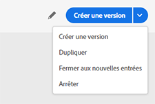

# Terminaison d’un parcours

Les options **[!UICONTROL Arrêter]** et **[!UICONTROL Fermer aux nouvelles entrées]** permettent de terminer les parcours **actifs**. Fermer un parcours suppose le **blocage de tout nouvel accès** et la possibilité, pour les clients ayant déjà rejoints le parcours, de poursuivre l’expérience jusqu’à son terme. Il s’agit de la méthode recommandée pour mettre fin à un parcours, car elle offre la meilleure expérience pour les clients. L’arrêt d’un parcours suppose qu’il soit mis un terme à la progression de toutes les personnes qui y participent. Le parcours est simplement mis à l’arrêt.

>[!NOTE]
>
>Notez que vous ne pouvez pas reprendre un parcours fermé ou arrêté.

## Fermeture d’un parcours

Vous pouvez fermer un parcours manuellement pour vous assurer que les clients qui y sont déjà entrés puissent terminer leur chemin, mais que les nouveaux utilisateurs ne puissent pas y accéder.

La version d’un parcours fermé ne peut pas être redémarrée ni supprimée. Vous pouvez la dupliquer ou en créer une nouvelle version.

Pour fermer un parcours, pointez dessus dans la liste, puis cliquez sur **[!UICONTROL Fermer aux nouvelles entrées]**.

Vous pouvez également procéder comme suit :

1. Dans **[!UICONTROL Accueil]**, cliquez sur le parcours que vous souhaitez fermer.
1. En haut à droite, cliquez sur la flèche vers le bas.

   

1. Cliquez sur **[!UICONTROL Fermer aux nouvelles entrées]**. Une boîte de dialogue s’affiche alors.
1. Cliquez sur **[!UICONTROL Fermer aux nouvelles entrées]** pour confirmer.

## Arrêt d’un parcours

Vous pouvez arrêter un parcours lorsqu’une urgence s’est produite et qu’il doit être mis fin immédiatement à tout processus.

La version d’un parcours arrêté ne peut pas être redémarrée.

Vous pouvez arrêter un parcours (par exemple, un marketeur se rend compte que l’audience ciblée n’est pas la bonne ou qu’une action personnalisée censée diffuser des messages ne fonctionne pas correctement) en cliquant sur **[!UICONTROL Arrêter]** après l’avoir sélectionné dans la liste des parcours.

Vous pouvez également procéder comme suit :

1. Dans **[!UICONTROL Accueil]**, cliquez sur le parcours que vous souhaitez arrêter.
1. En haut à droite, cliquez sur la flèche vers le bas.

1. Cliquez sur **[!UICONTROL Arrêter]**. Une boîte de dialogue s’affiche alors.
1. Cliquez sur **[!UICONTROL Arrêter]** pour confirmer.
