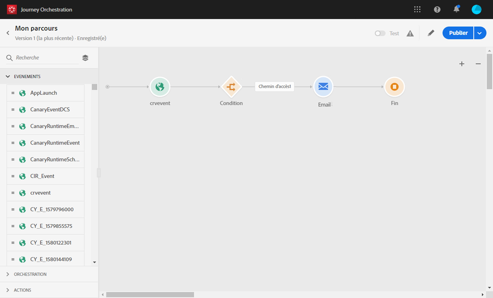
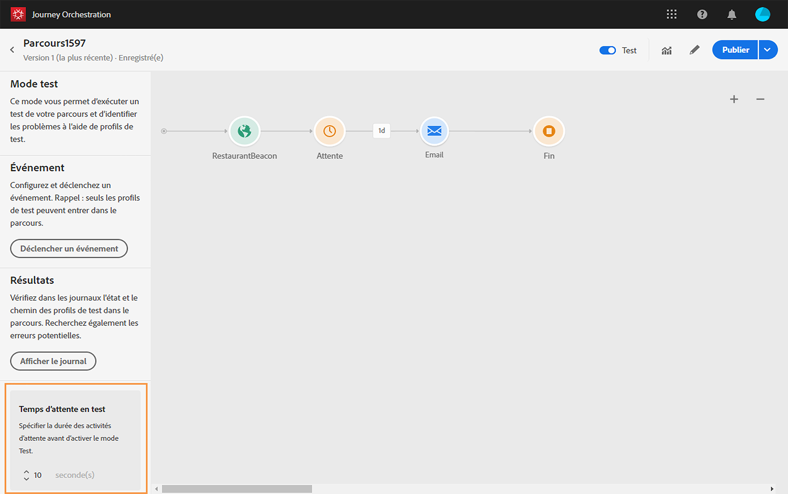
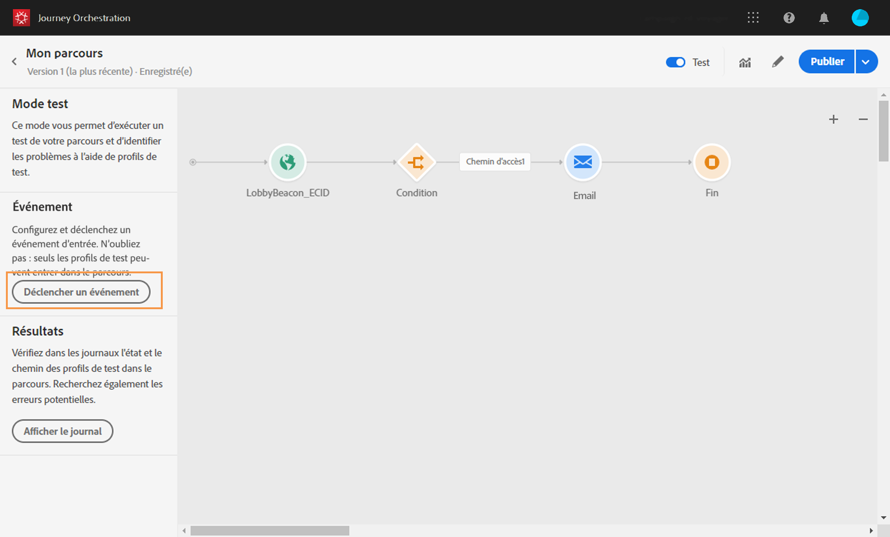
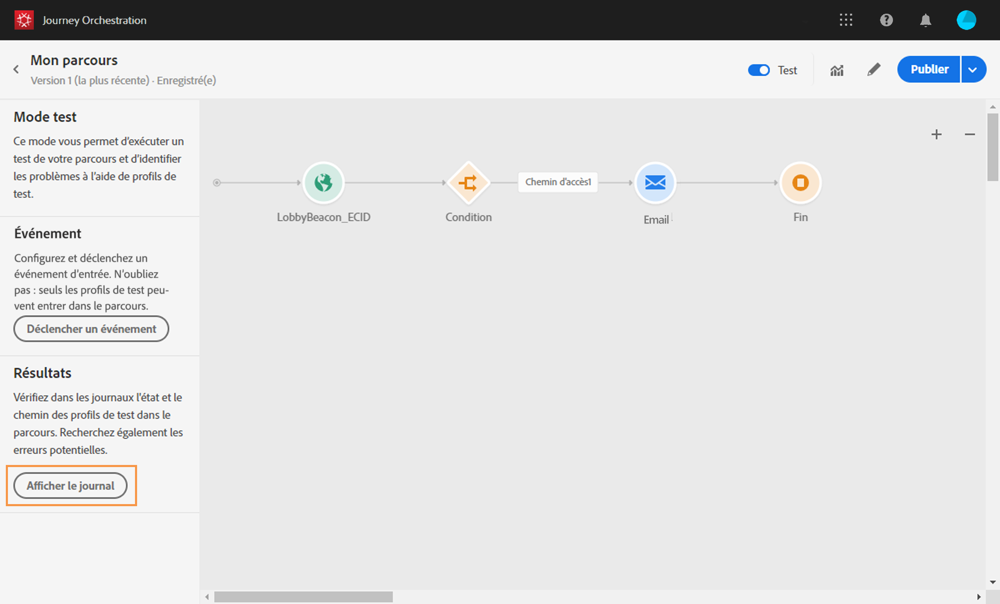
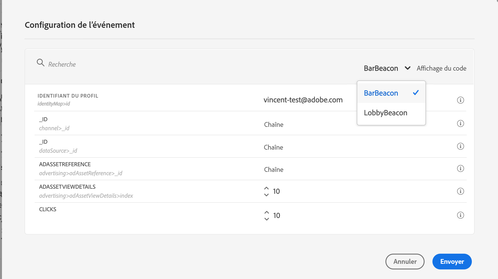
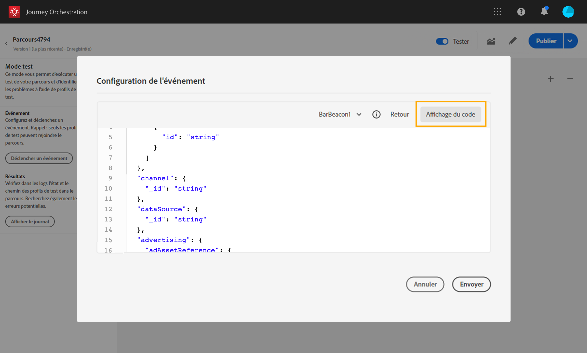
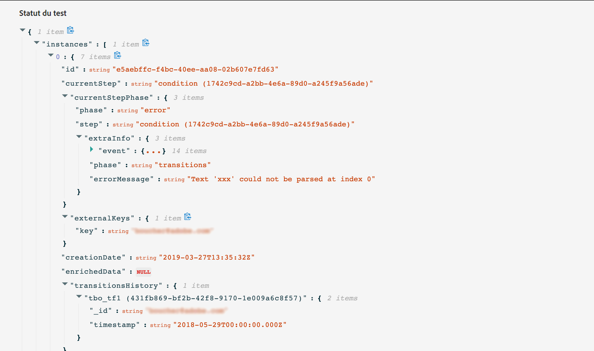

# Test du parcours{#testing_the_journey}

Avant de pouvoir tester votre parcours, vous devez résoudre toutes les erreurs qu’il comporte, le cas échéant. Voir .

Vous avez la possibilité de tester votre parcours avant sa publication, en utilisant des profils de test. Vous pouvez ainsi analyser le flux des clients dans le parcours et résoudre les problèmes avant la publication.

Pour utiliser le mode test, procédez comme suit :

1. Avant de tester votre parcours, vérifiez qu’il est valide et qu’il ne comporte aucune erreur, sans quoi il vous sera impossible de lancer un test. Voir . Un symbole d’avertissement est affiché en cas d’erreur.

1. Pour activer le mode , cliquez sur le bouton bascule **[!UICONTROL Test]** Test dans le coin supérieur droit de l’écran.

   

1. Utilisez le paramètre **Durée d’attente dans le paramètre test** , dans le coin inférieur gauche, pour définir la durée de chaque activité d’attente en mode test. La durée par défaut est de 10 secondes. Vous obtiendrez ainsi rapidement les résultats du test. Ce paramètre n’apparaît que si vous avez abandonné une ou plusieurs activités d’attente dans votre parcours.

   

1. Cliquez sur **[!UICONTROL Trigger an event]** pour configurer et envoyer des événements au voyage. Veillez à envoyer des événements liés aux profils de test. Voir [Déclenchement d’événements](#firing_events).

   

1. After the events are received, click the **[!UICONTROL Show log]** button to view the test result and verify them. Voir [Affichage des journaux](#viewing_logs).

   

1. En cas d’erreur, désactivez le mode test, modifiez votre parcours et lancez un nouveau test. Si le test est concluant, vous pouvez publier votre parcours. Voir .

## Remarques importantes  {#important_notes}

* Une interface permet de déclencher des événements sur le parcours testé. Cependant, des événements peuvent également être envoyés par des systèmes tiers tels que Postman.
* Seules les personnes identifiées comme « profils de test » dans le service Real-time Customer Profile Service sont autorisées à participer au parcours testé. Le processus de création d’un profil de test est identique à celui utilisé pour créer un profil dans Data Platform. Vous devez simplement vous assurer que l’indicateur de profil de test est défini sur « true ». Vous pouvez utiliser la section Segments de l’interface de Data Platform pour créer un segment de profils de test dans Data Platform et afficher une liste non exhaustive. La liste exhaustive ne peut pas être affichée pour l’instant.
* Le mode test n’est disponible que dans les parcours dans un état de brouillon qui utilisent un namespace. En effet, le mode test doit vérifier si une personne qui participe au parcours est un profil de test ou non et doit donc être en mesure d’accéder à Data Platform.
* Le nombre maximum de profils de test pouvant participer à un parcours au cours d’une session de test est de 100.
* Lorsque vous désactivez le mode test, les parcours sont vidés de toutes les personnes qui y ont participé précédemment ou qui y sont actuellement actives.
* Vous pouvez activer/désactiver le mode test autant de fois que nécessaire.
* Vous ne pouvez pas modifier votre parcours lorsque le mode test est activé. En mode test, vous pouvez publier directement le parcours, sans avoir à désactiver ce mode au préalable.

## Déclenchement d’événements {#firing_events}

The **[!UICONTROL Trigger an event]** button allows you to configure an event that will make a person enter the journey.

Vous devez, au préalable, savoir quels profils sont identifiés comme profils de test dans Data Platform. En effet, le mode test autorise uniquement ces profils dans le parcours et l’événement doit contenir un identifiant. L’identifiant attendu dépend de la configuration de l’événement. Il peut s’agir, par exemple, d’un ECID.

Si votre voyage contient plusieurs événements, sélectionnez un événement dans la liste déroulante. Ensuite, pour chaque événement, configurez les champs transmis et l’exécution de l’envoi de l’événement. L’interface vous permet de transmettre les informations appropriées dans la payload de l’événement et de vous assurer que le type d’information est correct. Le mode test enregistre les derniers paramètres utilisés dans une session de test en vue d’une utilisation ultérieure.

L’interface vous permet de transmettre des paramètres d’événement simples. If you want to pass collections or other advanced objects in the event, you can click on **[!UICONTROL Code View]** to see the entire code of the payload and modify it. Vous pouvez, par exemple, copier et coller des informations d’événement préparées par un utilisateur technique.

Un utilisateur technique peut également se servir de cette interface pour composer des payloads d’événement et déclencher des événements sans recourir à un outil tiers.

## Affichage des journaux {#viewing_logs}

The **[!UICONTROL Show log]** button allows you to view the test results. Cette page affiche des informations actuelles sur le parcours au format JSON. Un bouton vous permet de copier des nœuds entiers. Vous devez actualiser manuellement la page pour mettre à jour les résultats de test du parcours.

>[!NOTE]
>
>Dans les journaux de test, en cas d’erreur lors de l’appel d’un système tiers (source de données ou action), le code d’erreur et la réponse à l’erreur s’affichent.

Le nombre de personnes (appelées instances d’un point de vue technique) présentes actuellement à l’intérieur du parcours est affiché. Voici des informations utiles affichées pour chaque individu :

* _Id_ : identifiant interne de la personne dans le parcours. Il peut être utilisé à des fins de débogage.
* _Currentstep_ : étape du parcours à laquelle se trouve la personne. Nous vous recommandons d’ajouter des libellés à vos activités afin de les identifier plus facilement.
* _currentstep_ > phase : statut du parcours de la personne (en cours, terminé, erreur ou délai dépassé). Pour plus d’informations, voir ci-dessous.
* _currentstep_ > _extraInfo_ : description de l’erreur et autres informations contextuelles.
* _externalKeys_ : valeur de la formule de clé définie dans l’événement.
* _enrichedData_ : données récupérées par le parcours si ce dernier utilise des sources de données.
* _transitionHistory_ : liste des étapes suivies par la personne. Pour les événements, la payload est affichée.

