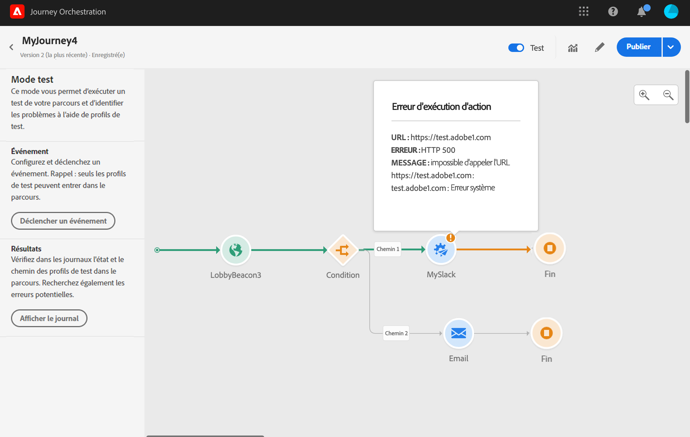
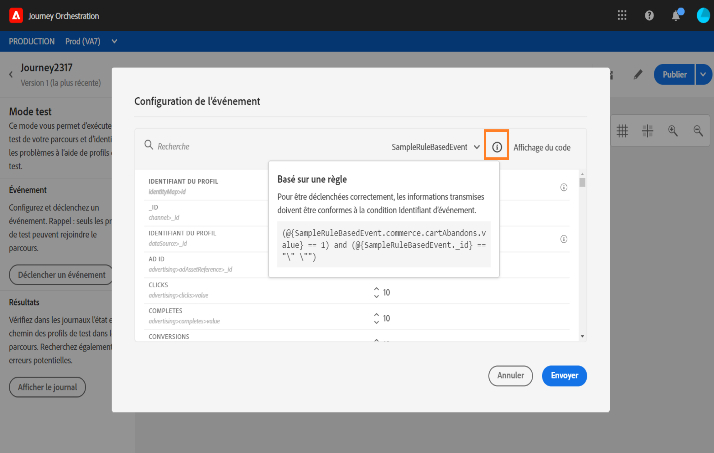

# Test du parcours{#testing_the_journey}

Avant de pouvoir tester votre parcours, vous devez résoudre toutes les erreurs qu’il comporte, le cas échéant. Reportez-vous à [cette section](../about/troubleshooting.md#section_h3q_kqk_fhb).

Vous avez la possibilité de tester votre parcours avant sa publication, en utilisant des profils de test. Vous pouvez ainsi analyser le flux des individus dans le parcours et résoudre les problèmes avant la publication.

Pour utiliser le mode test, procédez comme suit :

1. Avant de tester votre parcours, vérifiez qu’il est valide et qu’il ne comporte aucune erreur, sans quoi il vous sera impossible de lancer un test. Reportez-vous à [cette section](../about/troubleshooting.md#section_h3q_kqk_fhb). Un symbole d’avertissement est affiché en cas d’erreur.

1. Pour activer le mode test, cliquez sur le bouton bascule **[!UICONTROL Test]** dans le coin supérieur droit de l’écran.

   

1. Utilisez le paramètre **[!UICONTROL Temps d’attente en test]**, dans le coin inférieur gauche, pour définir la durée d’attente de chaque activité d’attente en mode test. La durée par défaut est de 10 secondes. Vous obtiendrez ainsi rapidement les résultats du test. Ce paramètre n’apparaît que si vous avez placé une ou plusieurs activités d’attente dans votre parcours.

   

1. Cliquez sur **[!UICONTROL Déclencher un événement]** pour configurer des événements et les envoyer au parcours. Veillez à envoyer des événements liés aux profils de test. Voir [Déclenchement d’événements](#firing_events).

   

1. Une fois les événements reçus, cliquez sur le bouton **[!UICONTROL Afficher le journal]** pour afficher les résultats du test et les valider. Voir [Affichage des journaux](#viewing_logs).

   

1. En cas d’erreur, désactivez le mode test, modifiez votre parcours et lancez un nouveau test. Si le test est concluant, vous pouvez publier votre parcours. Voir [cette page](../building-journeys/publishing-the-journey.md).

## Remarques importantes {#important_notes}

* Une interface permet de déclencher des événements sur le parcours testé. Cependant, des événements peuvent également être envoyés par des systèmes tiers tels que Postman.
* Seuls les individus identifiés comme « profils de test » dans le service de profil client en temps réel sont autorisés à participer au parcours testé. Reportez-vous à [cette section](../building-journeys/testing-the-journey.md#create-test-profile).
* Le mode test n’est disponible que dans les parcours dans un état de brouillon qui utilisent un espace de noms. Le mode test doit vérifier si une personne qui participe au parcours est un profil de test ou non et doit donc être en mesure d’accéder à Adobe Experience Platform.
* Le nombre maximum de profils de test pouvant participer à un parcours au cours d’une session de test est de 100.
* Lorsque vous désactivez le mode test, les parcours sont vidés de toutes les personnes qui y ont participé précédemment ou qui y sont actuellement actives. Il efface aussi les rapports.
* Vous pouvez activer/désactiver le mode test autant de fois que nécessaire.
* Vous ne pouvez pas modifier votre parcours lorsque le mode test est activé. En mode test, vous pouvez publier directement le parcours, sans avoir à désactiver ce mode au préalable.

## Créer un profil de test{#create-test-profile}

Le processus de création d’un profil de test est identique à celui utilisé pour créer un profil dans Adobe Experience Platform. Il est effectué par le biais d’appels API. Voir cette [page](https://docs.adobe.com/content/help/fr-FR/experience-platform/profile/home.html)

Vous devez utiliser un schéma de profil contenant le mixin « Détails du test de profil ». L’indicateur testProfile fait partie de ce mixin.

Lors de la création d’un profil, veillez à transmettre la valeur : testprofile = true.

Veuillez noter que vous pouvez également mettre à jour un profil existant pour remplacer son indicateur testProfile par « true ».

Voici un exemple d’appel API pour créer un profil de test :

```
curl -X POST \
'https://dcs.adobedc.net/collection/xxxxxxxxxxxxxx' \
-H 'Cache-Control: no-cache' \
-H 'Content-Type: application/json' \
-H 'Postman-Token: xxxxx' \
-H 'cache-control: no-cache' \
-H 'x-api-key: xxxxx' \
-H 'x-gw-ims-org-id: xxxxx' \
-d '{
"header": {
"msgType": "xdmEntityCreate",
"msgId": "xxxxx",
"msgVersion": "xxxxx",
"xactionid":"xxxxx",
"datasetId": "xxxxx",
"imsOrgId": "xxxxx",
"source": {
"name": "Postman"
},
"schemaRef": {
"id": "https://example.adobe.com/mobile/schemas/xxxxx",
"contentType": "application/vnd.adobe.xed-full+json;version=1"
}
},
"body": {
"xdmMeta": {
"schemaRef": {
"contentType": "application/vnd.adobe.xed-full+json;version=1"
}
},
"xdmEntity": {
"_id": "xxxxx",
"_mobile":{
"ECID": "xxxxx"
},
"testProfile":true
}
}
}'
```

## Déclenchement d’événements {#firing_events}

Le bouton **[!UICONTROL Déclencher un événement]** vous permet de configurer un événement qui fera entrer une personne dans le parcours.

>[!NOTE]
>
>Lorsque vous déclenchez un événement en mode test, un événement réel est généré, ce qui signifie qu’il sera également utilisé pour un autre parcours qui écoute cet événement.

Vous devez, au préalable, savoir quels profils sont identifiés comme profils de test dans Adobe Experience Platform. En effet, le mode test autorise uniquement ces profils dans le parcours et l’événement doit contenir un identifiant. L’identifiant attendu dépend de la configuration de l’événement. Il peut s’agir, par exemple, d’un ECID.

Si votre parcours contient plusieurs événements, sélectionnez-les dans la liste déroulante. Ensuite, pour chaque événement, configurez les champs transmis et l’exécution de l’envoi de l’événement. L’interface vous permet de transmettre les informations appropriées dans la payload de l’événement et de vous assurer que le type d’information est correct. Le mode test enregistre les derniers paramètres utilisés dans une session de test en vue d’une utilisation ultérieure.


L’interface vous permet de transmettre des paramètres d’événement simples. Si vous souhaitez transmettre des collections ou d’autres objets avancés dans l’événement, vous pouvez cliquer sur **[!UICONTROL Affichage du code]** pour voir l’intégralité du code de la payload et le modifier. Vous pouvez, par exemple, copier et coller des informations d’événement préparées par un utilisateur technique.


Un utilisateur technique peut également se servir de cette interface pour composer des payloads d’événement et déclencher des événements sans recourir à un outil tiers.

Lorsque vous cliquez sur le bouton **[!UICONTROL Envoyer]**, le test commence. La progression de l’individu dans le parcours est représentée par un flux visuel. Le chemin devient progressivement vert à mesure du déplacement de l’individu dans le parcours. Si une erreur se produit, un symbole d’avertissement s’affiche à l’étape correspondante. Vous pouvez y placer le curseur pour afficher des informations plus précises sur l’erreur et accéder aux détails complets (le cas échéant).



Si vous sélectionnez un autre profil de test dans l’écran de configuration d’un événement et que vous exécutez de nouveau le test, le flux visuel est effacé et indique le chemin du nouvel individu.

Lorsque vous ouvrez un parcours en cours de test, le chemin affiché correspond au dernier test exécuté.

Le flux visuel fonctionne que l’événement soit déclenché par l&#39;interface ou de manière externe (à l&#39;aide de Postman, par exemple).

## Test mode for rule-based journeys {#test-rule-based}

Le mode test est également disponible pour les parcours qui utilisent un événement basé sur des règles. For more information on rule-based events, refer to [this page](../event/about-events.md).

Lors du déclenchement d&#39;un événement, l&#39;écran de **configuration de l’événement** permet de définir les paramètres d’événement à transmettre au test. Vous pouvez afficher la condition d’identifiant d’événement en cliquant sur l’icône d’info-bulle située dans le coin supérieur droit. Une info-bulle est également disponible en regard de chaque champ qui fait partie de l’évaluation des règles.



For more information on how to use the test mode, refer to [this page](../building-journeys/testing-the-journey.md).

## Affichage des journaux {#viewing_logs}

Le bouton **[!UICONTROL Afficher le journal]** vous permet d’afficher les résultats du test. Cette page affiche des informations actuelles sur le parcours au format JSON. Un bouton vous permet de copier des nœuds entiers. Vous devez actualiser manuellement la page pour mettre à jour les résultats de test du parcours.


>[!NOTE]
>
>En cas d’erreur lors de l’appel d’un système tiers (source de données ou action), le code d’erreur et la réponse d’erreur s’affichent dans les journaux de test.

Le nombre d’individus (appelés instances d’un point de vue technique) présents actuellement à l’intérieur du parcours est affiché. Voici des informations utiles affichées pour chaque individu :

* _Id_ : identifiant interne de l’individu dans le parcours. Il peut être utilisé à des fins de débogage.
* _Currentstep_ : étape du parcours à laquelle se trouve l’individu. Nous vous recommandons d’ajouter des libellés à vos activités afin de les identifier plus facilement.
* _currentstep_ > phase : statut du parcours de l’individu (en cours, terminé, erreur ou délai dépassé). Pour plus d’informations, voir ci-dessous.
* _currentstep_ > _extraInfo_ : description de l’erreur et autres informations contextuelles.
* _Currentstep_ > _fetchErrors_ : informations sur les erreurs de récupération de données qui se sont produites au cours de cette étape.
* _externalKeys_ : valeur de la formule de clé définie dans l’événement.
* _enrichedData_ : données récupérées par le parcours si ce dernier utilise des sources de données.
* _transitionHistory_ : liste des étapes suivies par l’individu. Pour les événements, la payload est affichée.
* _actionExecutionErrors_ : informations sur les erreurs qui se sont produites.

Les différents statuts du parcours d’un individu sont les suivants :

* _En cours_ : l’individu figure actuellement dans le parcours.
* _Terminé_ : l’individu a atteint la fin du parcours.
* _Erreur_ : le parcours de l’individu a été arrêté en raison d’une erreur.
* _Délai dépassé_ : le parcours de l’individu a été arrêté, car l’exécution d’une étape a pris trop de temps.

Lorsqu’un événement est déclenché en mode test, un jeu de données est automatiquement généré avec le nom de la source.

Lorsqu’un événement est déclenché en mode test, un jeu de données est automatiquement généré avec le nom de la source.

Le mode test crée automatiquement un événement d’expérience et l’envoie à Adobe Experience Platform. Le nom de la source de cet événement d’expérience est « Événements de test Journey Orchestration ».

Dans le cas de plusieurs événements déclenchés par plusieurs parcours

Il existe un scénario où plusieurs événements sont envoyés à partir de plusieurs parcours qui auront des schémas différents. Est-il possible de mapper n schéma sur 1 jeu de données ? Si ce n’est pas possible, plusieurs jeux de données seront nécessaires.

La création automatique et l’attribution d’un nom à ces jeux de données sont effectués si un jeu de données de destination n’est pas inclus dans l’événement d’expérience. C&#39;est pourquoi nous voyons aujourd&#39;hui le « jeu de données créé automatiquement pour Voyager ».

L’attribution d’un nom à notre source entraîne la création automatique. Si nous avons plusieurs événements, nous devrions concaténer et nommer le tout « Événement de test Journey Orchestration - NOM DU SCHÉMA ». Cela se transforme automatiquement en « Jeu de données généré automatiquement pour l’Événement de test Journey Orchestration - NOM DU SCHÉMA ».

