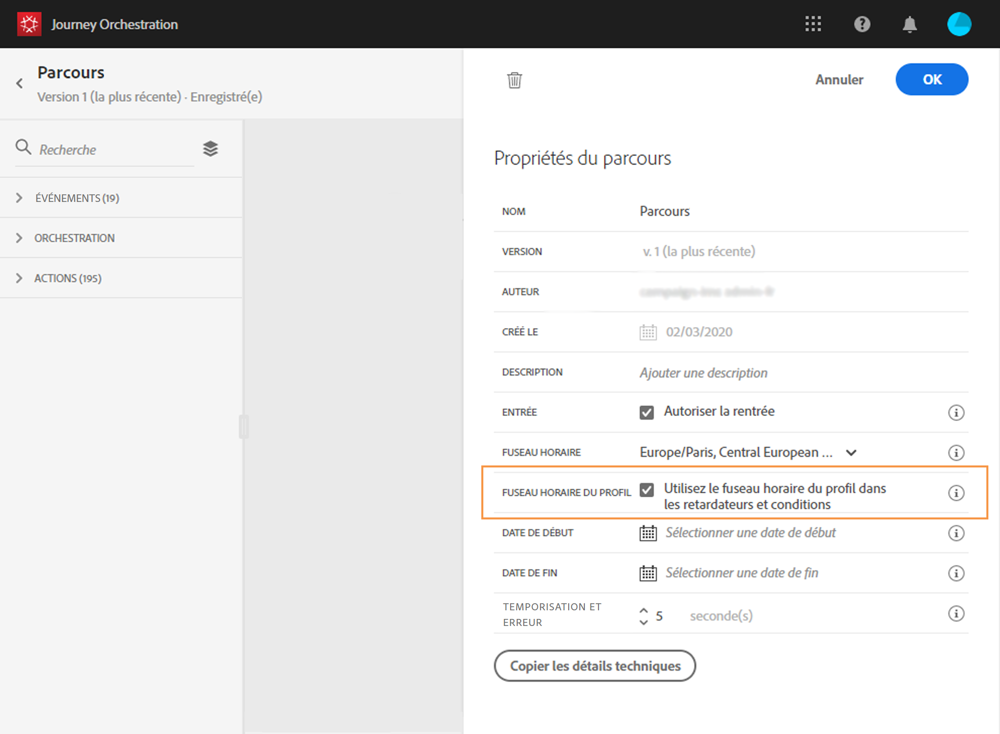
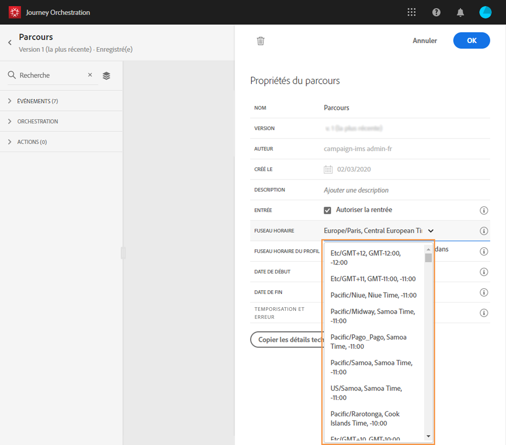

# Gestion des fuseaux horaires {#timezone_management}

La définition de fuseau horaire est disponible dans les activités suivantes :

* 
* 
* 
* 

Si l’événement d’entrée du voyage comporte un espace de noms, ce qui signifie que le voyage peut atteindre le service Profil du client en temps réel de la plateforme de données, le fuseau horaire est prédéfini avec celui spécifié dans le profil de l’individu qui effectue le voyage. Si le profil de la personne ne contient pas de fuseau horaire, celui de l’instance est utilisé. Vous pouvez contacter votre administrateur pour connaître le fuseau horaire de l’instance.

Le fuseau horaire peut également être corrigé. Effacez le fuseau horaire prédéfini et sélectionnez-en un dans la liste déroulante. Si vous utilisez un fuseau horaire fixe, il sera le même pour toutes les personnes qui entrent dans le voyage.

Enfin, le fuseau horaire peut être dynamique pour chaque personne qui entre dans l’étape. Dans ce cas, vous allez utiliser l’éditeur d’expression pour sélectionner l’emplacement où vous souhaitez que le système obtienne ces informations (elles peuvent provenir d’un événement ou d’une source de données). Voir la section .

Les dates de début et de fin d&#39;un voyage ne peuvent pas être liées à un fuseau horaire spécifique. Ils sont automatiquement associés au fuseau horaire de l’instance.
